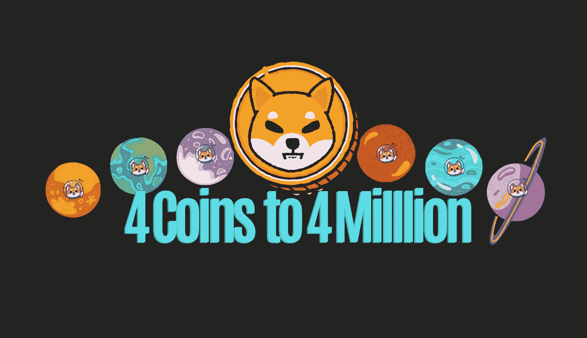

# 4 个硬币到 400 万

> 原文：<https://medium.com/coinmonks/4-coins-to-4-million-fa4aec031443?source=collection_archive---------3----------------------->

## 我的 2023 年 1 月作品集

# **多边形 Matic**

Polygon (MATIC)是一个基于以太坊的平台，旨在解决缩放问题。它以前的名字和现在的符号是 MATIC。

## 1.它是什么时候由谁创立的？

多边形，以前叫 MATIC，是由以太坊区块链网络的一组贡献者创建的…