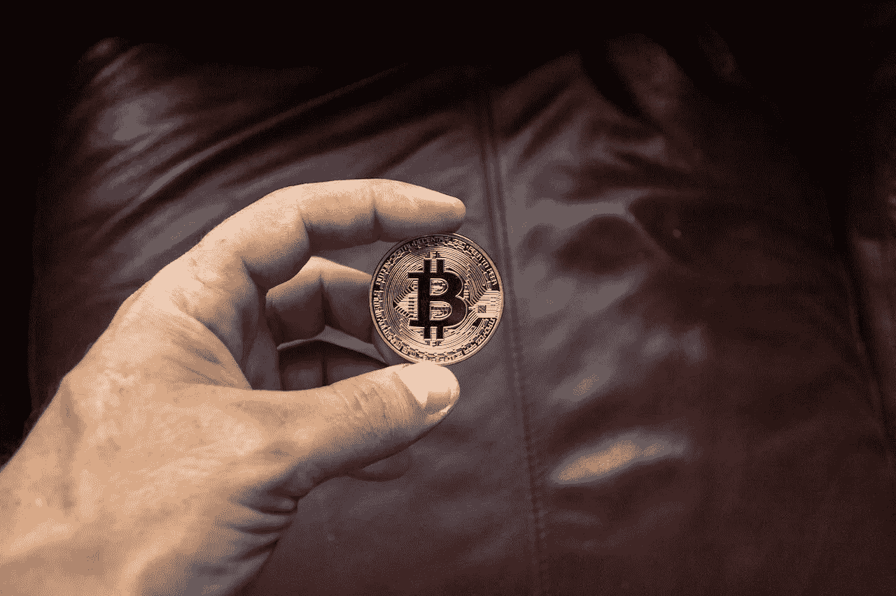

# 4 Cryptos 将在 2022 年第四季度获得巨大回报

> 原文：<https://medium.com/coinmonks/4-cryptos-set-to-reap-massive-return-in-q4-2022-79bf74231706?source=collection_archive---------27----------------------->

Photo by Worldspectrum: [https://www.pexels.com/photo/round-gold-colored-and-black-coin-on-person-s-hand-844125/](https://www.pexels.com/photo/round-gold-colored-and-black-coin-on-person-s-hand-844125/)

比特币市场持续走低，但市场出现转机会怎样？当下一轮牛市开始时，我们可能会投资哪些硬币或代币？

本文研究了预计将在 2022 年第四季度提供巨大利润的三种加密货币。

> **参见:2022 年 10 月前购买的 5 种最佳加密货币。**

# 瑞波(XRP)

**市值:23，990，363，372 美元**

**市值排名** : 6

**现价** : [$0.4808](https://coinmarketcap.com/currencies/xrp/markets/)

**流通供应量:**4990066456 XRP

Ripple (XRP)是一个数字支付网络，使用 Ripple 加密货币进行交易。这些年来，这枚硬币的回报是惊人的。

Ripple platform 是由 Arthur Britto、David Schwartz 和 Ryan Fugger 在 2012 年首次亮相时建立的。全世界有 100 多家银行利用了 Ripple 网络的服务。

无疑是 2022 年短线投资的绝佳选择。Ripple 现在正面临 SEC 的指控，许多投资者预测，一旦此事得到解决，ripple 将迎来一个新的 ATH。

XRP 允许用多种法定货币进行支付。Ripple 有利于国际交易，促进无信任支付。这是下一季度的好机会。

# 恒星流明(XLM)

市值:725，053，085 美元

**市值持仓** : 59

**现价**:741.64 美元

**循环供给:** 977，631.04 MKR

物流、汇款和国际汇款业务广泛使用 Stellar Lumens 及其加密货币 XLM。该技术促进了资产的全球安全、快速和可靠的转移。

与 Ripple 一样，Stellar 的平台专注于国际支付和跨境转移。其日交易量超过 5.31 亿美元，是最受欢迎的加密货币之一。Stellar 肯定是未来几个月的好选择。

加密货币是一种低成本、快速的国际支付解决方案。类似地，以太坊平台允许任何人通过 ico 或代币筹款发行代币。

恒星发展基金会管理恒星。成立于 2014 年的非营利组织。

> **参见:** [**加密期货交易讲解**](/coinmonks/crypto-futures-trading-explained-684598049ba8)

# 币安硬币(BNB)

市值:45326492472 美元

**市值持仓** : 5

**现价** : [$280.94](https://coinmarketcap.com/currencies/bnb/markets/)

**循环供给:** 161，337，261 BNB

币安硬币是由世界上最大的加密货币交易所之一币安建立的加密货币。币安硬币，以前是用来支付减少的交易，现在可以用来支付和购买各种商品和服务。

币安硬币于 2017 年 7 月推出，最初与区块链以太坊的 ERC-20 代币兼容，后来成为币安币安区块链连锁店的本地货币。

每个季度，币安都要花费五分之一的收入来“焚烧”国库中的币安代币。

2021 年 4 月 15 日，币安烧毁了 1，099，888 BNB，相当于价值 595，314，380 美元的代币。

BNB 令牌有多种应用，特别是在 Defi 中。BNB 被用来以极低的交易费用进行煎饼掉期交易。一旦熊市结束，投资者预计代币的价值将达到历史新高(ATH)。

# 雪崩(AAVE)

市值:5053681802 美元

**市值持仓** : 16

**现价:$** [17.08](https://coinmarketcap.com/currencies/avalanche/markets/)

**循环供给:** 295，963，244 AVAX

Avalanche 是众多竞争成为最广泛采用的区块链平台之一的计划之一。雪崩在几个方面堪比以太坊。它属于区块链的一小部分，被最好地描述为平台的平台。

雪崩也是使雪崩网络能够运行的加密货币的名称。该平台的本地货币，有时是 AVAX 或 Avalanche AVAX，用于结算交易费用，并可用于保护网络。它也是主要的投资工具，这意味着典型的加密货币交易商和投资者可以购买和出售它来赚钱。

最近成立了一个 2.2 亿美元的基金，以促进雪崩的发展，雪崩是一种加密货币，其交易速度明显快于以太坊。

Avalanche 的加密货币受到其区块链技术的支持，该技术承诺比以太坊更快的速度、更低的价格和更少的浪费。能和以太坊抗衡的项目之一就是雪崩。

以太坊被认为是区块链行业中最重要的项目之一，因为它有能力主持其他几个项目。然而，在以太坊的竞争对手中，雪崩是最可行的。

如果你正在寻找一个有价值的投资机会，你应该探索雪崩。

> **参见:**[**2022 年最佳 NFT 商场**](/geekculture/the-best-nft-marketplaces-in-2022-bc94ae6270c)

# 结论

比特币的价格不断下跌，但如果以及何时复苏会发生什么？当下一轮牛市开始时，哪些货币或代币可能是不错的投资？

[Ripple (XRP)](https://coinmarketcap.com/currencies/xrp/) 是一个采用 Ripple 加密货币的分散式电子支付系统。随着时间的推移，这枚硬币产生了令人难以置信的回报率。因此，这是一个很好的把握。Stellar Lumens 及其加密货币 XLM 已广泛用于物流、汇款和国际汇款行业。这一创新为在全球范围内安全、快速、可靠地传输资金铺平了道路。

[币安](https://www.binance.com/en)是世界上最大的加密货币交易所之一，它也创造了自己的加密货币币安币。虽然币安硬币最初被设计成仅用于小额购买，但它现在被接受为多种产品和服务的支付方式。BNB 代币也是 10 月份的好去处。

为了成为最普遍接受的区块链平台之一，Avalanche 正在与许多其他企业竞争。雪崩在很多方面类似于以太坊。描述它的最简单的方法是作为一个“平台的平台”，只有少数几个其他的区块链属于这一类。这是 10 月份投资的好项目。

> 交易新手？尝试[加密交易机器人](/coinmonks/crypto-trading-bot-c2ffce8acb2a)或[复制交易](/coinmonks/top-10-crypto-copy-trading-platforms-for-beginners-d0c37c7d698c)