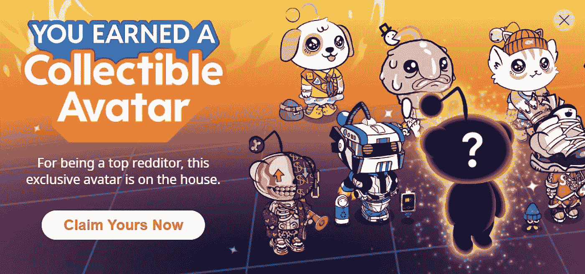

# 4 按交易量排名的免费 Reddit NFT 收藏(2022)

> 原文：<https://medium.com/coinmonks/4-free-reddit-nft-collections-2022-ranked-by-trading-volume-46ca6b8a3442?source=collection_archive---------11----------------------->

## 这些信息可以帮助你决定哪个免费的 Reddit NFT 造币厂。

Photo by [Brett Jordan](https://unsplash.com/@brett_jordan?utm_source=unsplash&utm_medium=referral&utm_content=creditCopyText) on [Unsplash](https://unsplash.com/s/photos/reddit?utm_source=unsplash&utm_medium=referral&utm_content=creditCopyText)

最近，一位 Redditor 通过出售他从该平台免费获得的 Reddit NFT 赚了 510 美元。

如果你也想试试你的运气，并且目前是 Reddit 用户，你可能也有资格免费铸造这些 NFT，并可能出售它们来获利。

虽然 Reddit 没有给出一套具体的标准来证明他们有资格铸造他们的 NFT，但有报道称潜伏者(不活跃的用户)能够铸造这些 NFT。

事实上，我的一岁账户有 1.4k karma 积分(通过参与该平台获得的 Reddit 积分)，有资格铸造一个 NFT。

Reddit NFT banner from Reddit

如果你在首页看到这个横幅，你就会知道你是否有资格制造 NFTs。一旦你点击它，网站会要求你从 4 个收藏中选择你想要的 NFT。

如果你不知道该铸造哪种收藏品，并想最大限度地增加赚钱的机会，这里有一份按交易量排列的 NFT 收藏品清单，可以帮助你做出决定。

## 滴滴小分队 x Reddit 可收藏头像(3.4 ETH)

Drip Squad Collection Logo

滴滴小分队系列目前交易量最高，有 20 万+的独特变化。这个系列中的 NFT 最高售价是 0.25 埃特(约合 400 美元)。

## Meme Team x Reddit 可收藏头像(2.4 ETH)

Meme Team Collection Logo

Meme Team Collection 目前拥有第二高的交易量，有 32 万多种独特的变化。这个系列中的 NFT 最高售价也是 0.25 埃特(约合 400 美元)。

## 奇点 x Reddit 收藏头像(1.7 ETH)

Singularity Collection Logo

奇点系列目前的交易量排名第三，有 767，000 多种独特的变化。这个系列中的 NFT 最高售价也是 0.3 埃特(约 500 美元)。

## Aww 朋友 x Reddit 收藏头像(0.87 ETH)

Aww Friends Collection Logo

Aww Friends Collection 目前的交易量最少，有 48 万+的独特变化。这个系列中的 NFT 最高售价也是 0.06 埃特(约 100 美元)。

> 交易新手？试试[加密交易机器人](/coinmonks/crypto-trading-bot-c2ffce8acb2a)或者[复制交易](/coinmonks/top-10-crypto-copy-trading-platforms-for-beginners-d0c37c7d698c)