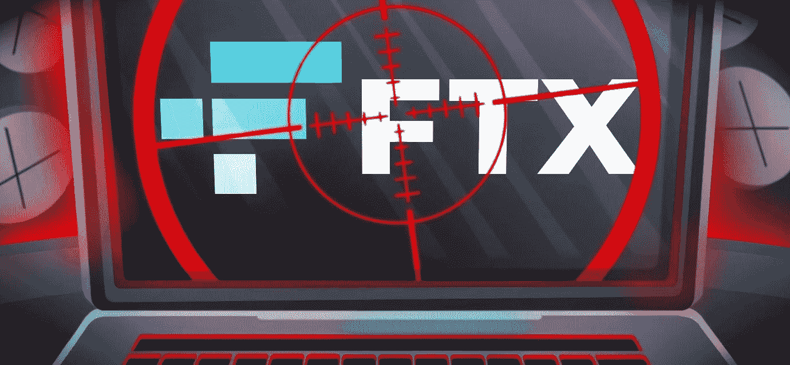

# FTX 崩溃给投资者的 4 个教训

> 原文：<https://medium.com/coinmonks/4-lessons-for-investors-from-ftxs-collapse-b86886784039?source=collection_archive---------26----------------------->

FTX 破产了，SBF 现在是美国的头号通缉犯(至少在加密领域)，其行为留下的漏洞比看起来要大得多。我们可能会看到几家与 FTX 有关的公司破产。

不管你是否在 FTX 及其相关公司有资产，你总能从别人的错误中吸取教训，并将其转化为成为更聪明的投资者的方法。

**第 1 课)了解你持有加密货币的风险**

如果你不是一个狂热的交易者，但实际上 HODL 长期思考你的代币，强烈建议你把你的资产冷藏起来。正如人们所说:“不是你的钥匙，也不是你的硬币。”尽管信任像 FTX 这样价值十亿美元的公司似乎很合理，但考虑到小竞争对手仍在运营，如果你把它们存放在一个冰冷的钱包里，你就不会担心这些天发生的一切。

但是，当然，如果你把它们放在一个冰冷的钱包里，你的资产不会让你马上交易:你的流动性会减少，如果你需要的话，更难更快地卖掉你的资产。

FTX 的崩溃也重新激起了[对冷藏](https://bgqde.clicks.mlsend.com/te/cl/eyJ2Ijoie1wiYVwiOjQ1NTI1LFwibFwiOjcyNDg3MjI5NTU3MDQ5MjYwLFwiclwiOjcyNDg3Mjg1NDY1MDI0MzU0fSIsInMiOiJhZTMzNTNjOTBkODNkNTZmIn0)或让数字货币离线的兴趣，使其不那么容易被黑客攻击。然而，此举降低了资产的流动性，也加大了快速交易的难度。

因此，要理解把你的资产放在冷钱包和热钱包中的风险，让它们与你的战略相一致，并根据你的投资状况做出最佳决策。这里有一篇我几个月前发表的文章，非常适合这个场合:[确保你的密码安全的最佳实践](https://bgqde.clicks.mlsend.com/te/cl/eyJ2Ijoie1wiYVwiOjQ1NTI1LFwibFwiOjcyNDg3MjI5NTY1NDM3ODcwLFwiclwiOjcyNDg3Mjg1NDY1MDI0MzU0fSIsInMiOiI0MGQyZDEwMGRhM2Q2NjdmIn0)。

**第 2 课)备份您的加密交易记录**

无论你在哪里持有数字货币，都要定期下载你的交易历史。收集报告数据是加密税最具挑战性的部分之一，如果交易所关闭业务，你仍然需要记录来提交你的申报表。如果你能证明你的交易，不仅你会有更多的 PnL(利润和损失)，而且你也有资格使用一些税收策略，如[税收损失收获](https://bgqde.clicks.mlsend.com/te/cl/eyJ2Ijoie1wiYVwiOjQ1NTI1LFwibFwiOjcyNDg3MjI5NTcyNzc3OTA0LFwiclwiOjcyNDg3Mjg1NDY1MDI0MzU0fSIsInMiOiI2ZTI2YzUyNzZiNzMwZWI5In0)。

在某种程度上，监管比以往任何时候都更有必要

在 2022 年 6 月 Celsius 崩溃后，我向我们的社区发布了以下内容:

*“我们现在看到的是这个行业完全缺乏监管。显而易见，加密公司(……)应该接受风险管理程序、压力测试以及传统金融公司面临的其他措施和限制。预计同行业的其他公司(……)会格外小心，降低杠杆，更加关注他们以前没有考虑到的风险。”*

显然，FTX 没有，该行业的大多数公司并不认为这种情况在 Celsius 发生时令人担忧。现在，随着前三大全球交易所的惨败，机构投资者预计将推动一定程度的监管进入市场，以避免数十亿美元的损失。

作为一名投资者，你应该始终仔细研究当前公司能提供什么，以及它们储备的保证和完整性:

*   不使用代币作为抵押品的信托公司；
*   有经审计的储备证明且无债务的信托公司。

**像这样的事件以前发生过——而且可能会再次发生。跟着他们的节奏跳舞**

目前市场上的恐慌让人以为混乱是 crypto 独有的，其实不然。FTX 是几起密码丑闻中的最新一起:今年，我们有 3AC、Luna 和 Celsius，八年前，我们有 Mt. Gox 黑客。在传统领域，我们经历了雷曼兄弟、安然公司甚至南海公司(早在 18 世纪)的崩溃。

所有这些案例都有相似之处:它们都是人类贪婪的丑闻，资产负债表膨胀，数据被操纵或隐藏，以维持不可持续的发展。

这些事件将再次发生，并产生下行压力。投资者重新信任数字资产还需要一段时间。市场是周期性的，你的投资策略应该基于这些周期的表现。正如沃伦·巴菲特所说，要“在别人贪婪的时候恐惧，在别人恐惧的时候贪婪”。我们可能会面临一个宝贵的投资机会。

[*乔罗伯特*](https://joerobert.com/) *现任罗伯特风险投资公司首席执行官，拥有超过 20 年的资产管理经验。自创办以来，乔已经为投资者和合伙人创造了可预见的两位数回报。Joe 已经投资了股权和代币的种子轮，以及比特币、以太坊和其他顶级加密货币的投资组合。*

*如果您是合格投资者，并想了解更多关于我们产品的信息，请联系我们。*

> 交易新手？试试[加密交易机器人](/coinmonks/crypto-trading-bot-c2ffce8acb2a)或者[复制交易](/coinmonks/top-10-crypto-copy-trading-platforms-for-beginners-d0c37c7d698c)