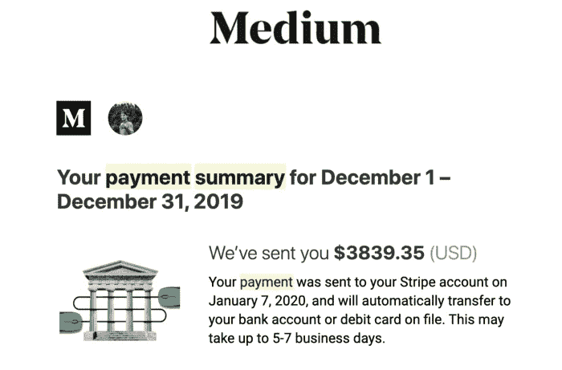

# 2023 年程序员的 4 个被动收入流

> 原文：<https://medium.com/coinmonks/4-passive-income-streams-for-a-programmer-in-2023-4bbf87841d7f?source=collection_archive---------12----------------------->

## 学习如何作为一名程序员产生被动收入。

source: Unsplash

每个人都想赚额外的钱，但由于时间限制和工作，我们不能给额外的时间来赚额外的钱。

想想看，你在睡觉，一些资源只是为你赚钱。这多酷啊！不是吗？这种收入被称为被动收入。有很多被动挣钱的方法，但是就像你是一名程序员一样，所以今天我将向你展示作为一名程序员如何被动挣钱！

# 1.销售软件/程序和数字资产

**卖软件:**卖软件可以是最好的被动赚取方式。慢慢来，构建可以解决特定问题的软件。有很多像 **App Store/Play Store** 、 **Themeforest、CodeCanyon** 这样的市场，你可以在那里出售你的软件/程序。好的软件/程序可以成为你一生被动收入的来源。

**数字资产:**你可以建立自己的数字资产来获取收入，例如电子书。你可以制作一本关于编程技巧、开发者指南和更多包含你的编程经验的主题的电子书。您可以在 **Gumroad (** *或任何其他电子书销售网站* **)** 上推出该电子书，获得被动收入。

> 不知道什么时候买卖，试试[复制交易](http://coincodecap.com/go/bityard)。

# 2.开始写博客

作为一个程序员，你已经是一个好读者了。每天你都在网上阅读文档和解决方案。现在轮到你当作家了。你知道，大多数时候一个好的读者也是一个好的作家。

对于被动收入来说，Medium 是最好的博客网站之一。你可以从你的文章中获利。为此，你只需要写你非常擅长的主题，并且你认为没有人解释得很透彻。一篇文章可能会产生 200-1000 美元，甚至更多，如果它能吸引大量的读者！

source: Google

也可以开个人博客网站。有许多博客可以通过编程/技术写作赚钱。

其中有[tutorialspoint.com](https://www.tutorialspoint.com/about/tutorials_writing.htm)[vonage.com](https://developer.nexmo.com/spotlight/)[digitalocean.com](https://www.digitalocean.com/community/pages/write-for-digitalocean)等等。

# 3.开始你自己的 YouTube 频道

作为一个程序员，你可以开一个 YouTube 频道。你可以上传你的内容。这将增加你的技能，因为当你打算制作关于编程的内容时，你将学到很多东西，而且这将是你一生的收入来源。

source: Unsplash

# 4.自由职业

自由职业是最受欢迎的额外收入方式之一，也是最灵活的方式之一。

作为一名程序员，你可以选择你接的项目和客户。有适合任何你最喜欢的编程语言和你能想到的技能的自由职业者。

有很多自由职业者平台可以让你开始赚钱。其中有 Upwork，Fiverr，自由职业者等。

# 结论

不管你走哪条路，赚钱都不容易。开始总是艰难的，但总是值得的。还有许多其他的赚钱方法。但以上四条永远是最常见也是最好的一条。因为他们向你承诺他们会值得你付出努力。所以，是的，只要坚持你所选择的道路，最终这一切都是值得的。

> 加入 Coinmonks [电报频道](https://t.me/coincodecap)和 [Youtube 频道](https://www.youtube.com/c/coinmonks/videos)了解加密交易和投资

# 另外，阅读

*   [霍比审核](https://coincodecap.com/huobi-review) | [OKEx 保证金交易](https://coincodecap.com/okex-margin-trading) | [期货交易](https://coincodecap.com/futures-trading)
*   [网格交易机器人](https://coincodecap.com/grid-trading) | [Cryptohopper 审查](/coinmonks/cryptohopper-review-a388ff5bae88) | [Bexplus 审查](https://coincodecap.com/bexplus-review)
*   [7 个最佳零费用加密交易平台](https://coincodecap.com/zero-fee-crypto-exchanges)
*   [氹欞侊贸易评论](https://coincodecap.com/anny-trade-review) | [霍比保证金交易](/coinmonks/huobi-margin-trading-b3b06cdc1519)