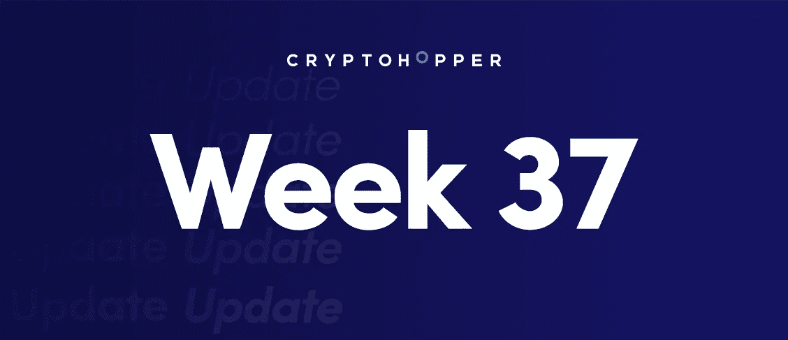
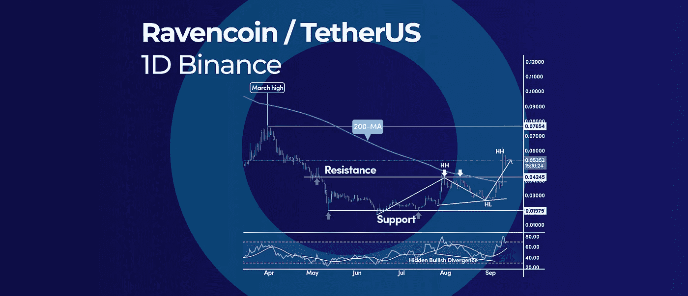
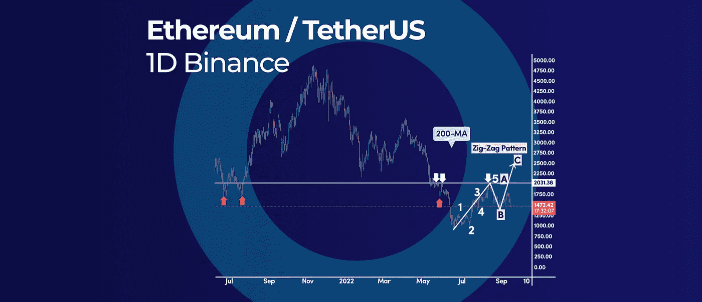
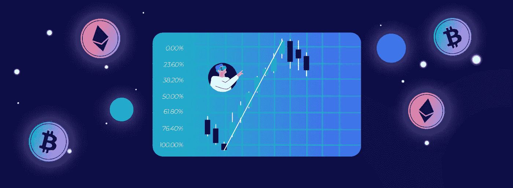
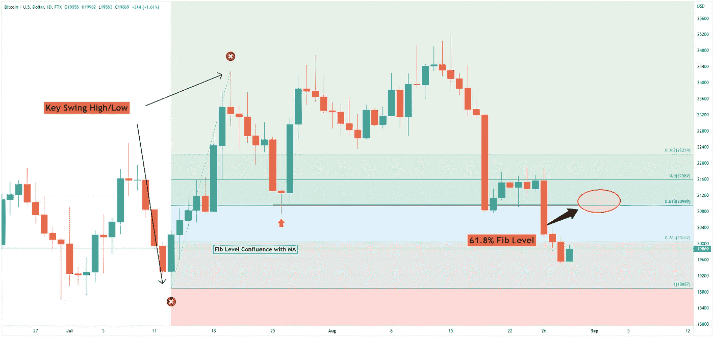

# 有效使用斐波纳契水平的 4 个交易技巧|以及本周更新的更多内容。

> 原文：<https://medium.com/coinmonks/4-trading-tips-to-efficiently-use-fibonacci-levels-and-more-in-this-weeks-crypto-update-8f6f876a8a50?source=collection_archive---------23----------------------->

4 Trading Tips to Efficiently Use Fibonacci Levels | And More in This Weeks Crypto Update.

*   瑞文币收盘在 200 毫安以上，RSI 在 50 以上
*   以太坊合并前模式和合并后模式
*   加密交易 101: 4 有效使用斐波那契水平的交易技巧

# 瑞文币收盘在 200 毫安以上，RSI 在 50 以上

Ravencoin (RVN)已经突破了 200 天简单移动平均线的关键阻力，这有可能标志着趋势方向的变化。此外，日线图显示价格和 RSI 振荡指标之间隐藏的看涨背离，增加了看涨情况的融合。

## 200 天简单移动平均线

自今年年初以来，这是 RVN 价格第二次试图突破其 200 天简单移动平均线。第一次尝试是在年初，但 RVN 的价格未能在 200 天的 SMA 上方获得更多的牵引力。

0.040 美元和 0.042 美元之间的区域是多头设法克服的强大阻力，现在有可能变成新的支撑位。我们也开始创造更高的高点，这正是上升趋势的定义。

## RSI 隐藏看涨背离

200 天简单均线上方延续的可能性也得到 RSI 隐藏看涨背离的支撑，这是一个反转信号。最近的价格走势显示，RVN 打印了更高的低点，同时，RSI 在 0.027 美元附近创下了更低的低点。

RVN 的价格需要保持在 200 天的 SMA 上方，看涨势头才能继续。在这方面，任何回调到 0.040 美元的水平都需要失败；否则，我们最终可能要么恢复下降趋势，要么充其量进入一个漫长的盘整阶段。

## 什么是 Ravencoin？

Ravencoin 是一个数字资产和区块链平台，旨在促进令牌、资产和智能合同等资产的转移。该平台建立在比特币代码的分叉上，并使用 UTXO 模型。Ravencoin 还有一个独特的功能，允许用户创建自己的令牌。Ravencoin 网络快速、安全且可扩展。

# 以太坊合并前模式和合并后模式

了解以太坊(ETH)在合并事件前的价格走势，可以让我们进一步洞察未来可能发生的事情。图表模式是真实的，历史价格行为告诉我们它们是重复的。基于价格行为结构，我们似乎正在开发一个之字形模式，这是一个价格序列，其中第一段和最后一段或多或少相似。

## 以太坊预合并模式

根据艾略特波浪分析，以太坊正在从 6 月中旬的低点形成一个之字形周期。在第一波上涨中(A 浪)，价格呈现五浪价格结构。那么价格已经在 B 浪中回撤，在 1424 美元的低点触底。

当前的价格走势结构表明，只要 1，424 美元的低点保持下行，ETH 的价格就会进一步走强。合并后，ETH 的价格可能会飙升，以完成之字形模式的 C 浪。

浪 C 应该有和浪 A 一样的内部 5 浪价格结构，如果它发生了，应该要求在 2000 美元心理水平以上有进一步的力量。

展望未来:一旦 2000 美元关口被清除，下一个大障碍是 200 天简单移动平均线，目前位于 2080 美元。如果 C 浪等于 A 浪，我们可能会看到 ETH 的价格在当前的牛市中触及 2500 美元。

## 以太坊合并是什么意思？

被推迟了几年的以太坊合并计划在几天后的 9 月 15 日至 16 日举行。这次合并，也被称为以太坊 2.0 或 ETH 2.0，最有可能发生在 9 月 15 日至 16 日。广受期待的合并是从当前的工作证明共识到更节能的利益证明共识系统的升级。

这意味着它将用验证器取代在验证事务时消耗分散计算能力的挖掘器。相反，验证者将把他们的数字资产锁在或押在网络上，以获得 ETH 奖励，从而减少 99%的能耗。预计 ETH 2.0 将提高安全性和可扩展性，并将以太坊网络的碳足迹降至最低。

你可以在我们的博客中阅读更多关于以太坊合并的内容。

# 加密交易 101: 4 有效使用斐波那契水平的交易技巧

**斐波纳契**回撤水平是最受支持的支撑位和阻力位之一，用于确定潜在的反转点。在这篇交易指南中，我们将分享一些使用斐波纳契回撤工具构建交易策略的最强大的技术。

## 什么是斐波那契水平？

**斐波那契水平**是交易者经常用来预测市场走势的数学计算。斐波纳契水平可以用在任何时间框架上，但它们最常用在日线图或周线图上。有几个不同的斐波纳契水平，但最重要的是 0.618，0.786 和 1.000 水平。这些水平可以帮助交易者预测市场下一步的走向，做出更好的交易决定。

## #1 选择正确的高/低挥杆

首先，绘制斐波纳契回撤线依赖于波动的高点和低点。在这方面，最重要的方面是选择正确的价格波动；否则，斐波纳契线不会对价格产生有意义的影响。

为了正确选择合适的波动水平，交易者应该关注价格趋势。一般来说，使用那些价格有强烈方向性波动的高/低点。

## #2 关注更高的时间框架

关注长期趋势可能更有意义，斐波纳契线会更有分量。相比之下，日内图表会给你提供多种价格波动，这些波动有很多噪音，也不是那么相关。

## #3 黄金比例 61.8%是最重要的纤维水平

预计大多数价格回撤将在 61.8%的斐波那契水平失败。61.8%的 fib 水平被称为黄金比例，因为斐波纳契数列中的每个数字都是前一个数字的 1.618 倍；所以这一关很有分量。

## #4 纤维汇合与简单移动平均

结合多种交易技术可以增加建立可靠交易的机会。例如，一个简单的移动平均线可以很好地配合使用，因为这两个指标在趋势市场中效果最好。

简单移动平均线是确定动态支撑位和阻力位的好工具，当它和 Fib 水平一致时，它可以提供有利可图的交易设置。

**底线:**虽然没有一个交易工具有 100%的准确率，但斐波纳契线在寻找其他人肉眼看不到的隐藏的动态支撑位和阻力位时很有用。

订阅我们的媒体每周博客和更新。
在推特[上关注我们](https://twitter.com/cryptohopper) | [脸书](https://www.facebook.com/cryptohopper)|[Reddit](https://www.reddit.com/r/CryptoHopper/)|[insta gram](https://www.instagram.com/cryptohopper/?hl=nl)

在 [Cryptohopper](https://www.cryptohopper.com/) 开始交易！

> 交易新手？尝试[加密交易机器人](/coinmonks/crypto-trading-bot-c2ffce8acb2a)或[复制交易](/coinmonks/top-10-crypto-copy-trading-platforms-for-beginners-d0c37c7d698c)