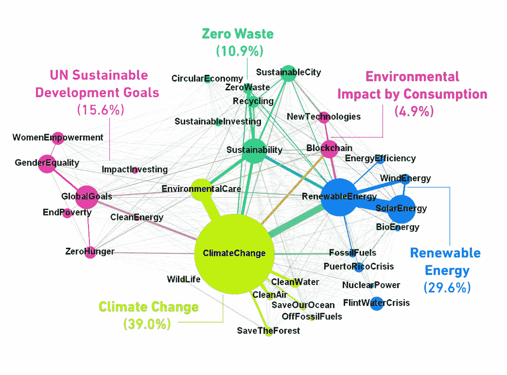
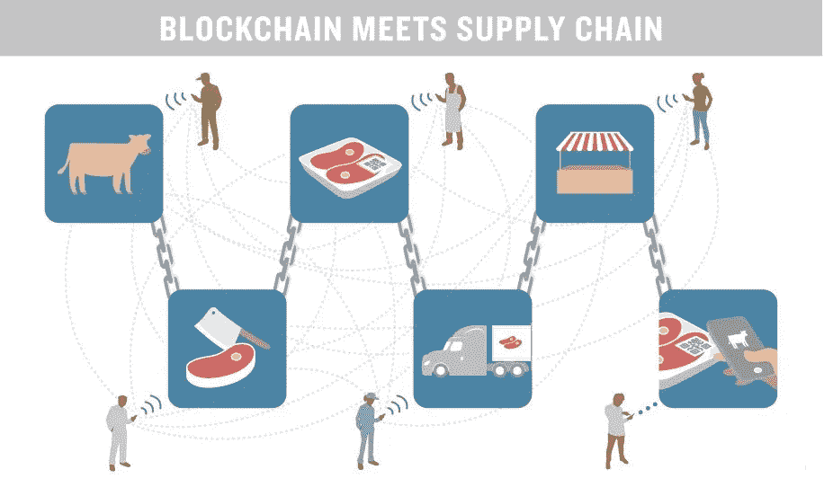

# 区块链支持可持续发展的 4 种方式——走向绿色

> 原文：<https://medium.com/coinmonks/4-ways-blockchain-supports-sustainability-go-green-670b69991116?source=collection_archive---------24----------------------->

世界各地的企业承诺采取可持续的做法或项目，这些做法或项目是长期的、适应性强的，对环境没有不利影响。区块链技术可以减少公司的整体计算，并改善其**能源足迹**。多亏了区块链，我们现在和未来的可持续发展努力因其独特的安全性、不变性和去中心化而有了保障..，请继续阅读了解详情！

加密货币有一个糟糕的环境声誉，需要太多的能源来运行它们的网络，这增加了它们的碳足迹。此外，这项技术还处于初期阶段，像 **Cardano** 、 **Chia** 和 **IOTA** 这样的可持续区块链替代品随着不断改进已经上市，并且**节能**。

让我先解释一下区块链；然后，我们将继续讨论**区块链如何支持可持续发展努力**。

# 什么是区块链？

区块链是**记录交易**、**建立信任**和**追踪资产**的共享但不可变的账本。信息一旦被记录在区块链，就不能被修改或编辑。每个块都与下一个块进行数字(密码)链接。一项资产，**有形的**和**数字的**但是有价值的，可以在区块链网络上被追踪和交易，去除中间人的成本，快速交易。

# 为什么区块链很重要？

业务依靠数据运行，敏感数据对企业来说是一种资产。将该资产存储在不可变的分类账中可以防止第三方访问。现在，用户可以控制对他们个人信息的访问。区块链提供了端到端交易所有细节的单一视图，并通过智能合同帮助完成交易。

**区块链技术的主要特点**

使用工具监测污染的区块链是一种有利于跟踪产品可持续性的绿色技术。这里列出了重要的特性。

*   **不变性**

不变性意味着不可编辑或改变的东西。区块链保证了存储在 ledger 上的数据是可信的和真实的。节点代表记录交易数据的分散式数字分类账。每个节点确认交易，并且一旦被大多数节点验证，交易就被添加到分类帐中。数据的有效性**鼓励透明**和**消除任何腐败的机会**。

***它与*** *有什么关系？*不变性可以对抗*网络安全风险、*和*腐败*和*提高慈善目的的透明度*。如果企业开始**整合区块链技术**来保护他们的内部网络系统，黑客就不可能入侵这个系统。

*   **分散式**

区块链没有治理权限；相反，遍布全球的节点组(矿工)负责其完整性和安全性，以支持协作 T21。存储的数据在验证后是持久的，有助于构建一个不可信的环境。

***有什么帮助？*** 数据永久存储后，任何人都无法编辑、删除或更新。这使得用户能够信任数据、共享、接收或发送，并吸引网络参与者加入协作。人们有一个平台，可以在不暴露身份的情况下发出声音，分享他们的担忧。

*   **安全可靠的数据**

区块链使用**加密**(密码术)来验证交易。存储在分散式账本上的数据为用户增加了另一层安全保障，以保护资产免受未经授权的访问。

它有助于开辟新的贸易渠道、供应链和 B2B 交易，实现快速、安全的支付转账。

*   **共识**

共识机制(也称为共识协议)允许分布式计算机网络保持安全并协同工作。该协议确保记录区块链上的合法交易，旨在保护系统免受**欺诈活动**(欺骗、重复消费)。

在秘密经济系统中，共识机制有助于防止某些经济攻击。例如，攻击者可以通过控制 51%的网络来破坏共识。共识机制旨在通过保护数据免受未经授权的访问来防止这种攻击。数据保持安全，用户无需支付**网络保险。**

**区块链如何支持可持续发展？**

区块链被称为加密货币背后的**先锋技术**，但它的功劳远不止于此。如果使用得当，它可以创造奇迹

*   **在全球范围内减少粮食浪费**

区块链可以降低**业务费用**，**提高准确性**，**带来问责**帮助管理**饥饿救济**。区块链可以重塑供应链，修复管道中的任何泄漏，以消除粮食浪费和资源分配不均。这一倡议可以管理**粮食价格上涨**和**消除饥饿**的危机，更好地引导资源。

第三世界国家正在努力应对供应链危机；绿色科技公司可以为渠道供应商建立可持续的解决方案，降低中介成本。这将增加大多数购买者的购买力，防止多余食物的浪费。

*   **促进健康和幸福**

医疗保健部门需要区块链的支持，以将**远程医疗保健服务**扩展到有需要的人，并对他们的信息保密。虽然，**物联网**和 **AI** 和区块链一起，可以在世卫组织的带领下，促成一个有效的协作平台。基于区块链的健康和福利使人们能够选择积极的生活方式并管理互动社区。

Clinicoin 是一个区块链平台，它向用户支付费用以保持健康，并将其与能够让用户保持健康的合适的人联系起来。注册了这款应用的健康从业者奖励用户为健康而努力，以促进自我保健。

*   **推进素质教育**

抄袭是教育界最大的担忧。区块链以安全性、匿名性和完整性著称，可以加密所有相关方的数据。不变性是区块链技术的最大特点，学习机构可以利用这一点进行学生验证，并将入学等待时间从几个月缩短到几分钟。总部位于区块链的教育基础设施将促进**透明度**和**可持续性**，**减少对抄袭的担忧**并为**远程/虚拟学习**铺平道路。

*   **负担得起的能源管理系统**

不断上涨的能源和天然气价格让各个层面的消费者都感到不安。区块链在可再生能源生产方面有着巨大的潜力**提高效率**和**降低成本**。 [NREL](https://www.nrel.gov/) 已经开发出一种软件——使用户能够控制他们的发电，并将其输送回电网。这种技术已被证明可以最大限度地降低能源成本，并且是可持续的，因为在这种类型的能源生产中不使用煤炭或天然气。

实施区块链可再生能源将减少对原油的依赖，以支持能源需求。这个部门有相当大的增长，以方便可持续项目的大规模采用。

**最后的想法！**

除了经济利益，**区块链通过使用更少的能源为网络供电来支持可持续发展；燃烧更少的化石燃料将减少碳排放，因此可以帮助所有企业在未来几年实现全球净零碳排放的愿景。绿色科技创业公司掌握着可持续发展的未来。要看到更美好的未来，就要靠政策制定者来推动这样的可持续项目。**

***订阅*获取技术人员笔记本，了解所有最新的技术见解！**

**# net zero emission****# sustainable****# green block chain****# block chain technology****# net zero 2030****# net zero future****# sustainable development****# sustainable business****#加密货币**

*原载于*[*https://www.linkedin.com*](https://www.linkedin.com/pulse/4-ways-blockchain-supports-sustainability-go-green-sana-ahmad/?published=t)*。*

> 交易新手？试试[加密交易机器人](/coinmonks/crypto-trading-bot-c2ffce8acb2a)或[复制交易](/coinmonks/top-10-crypto-copy-trading-platforms-for-beginners-d0c37c7d698c)