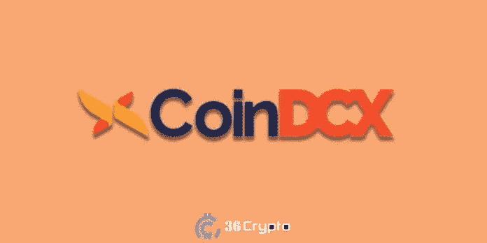

# 印度 5 大最佳加密交易所(2022 年 10 月)— 36Crypto

> 原文：<https://medium.com/coinmonks/5-best-crypto-exchanges-in-india-october-2022-36crypto-d058eac9fbd7?source=collection_archive---------14----------------------->

众所周知，印度是世界上加密货币领域的主要参与者之一。事实上，根据[欧洲新闻](https://www.euronews.com/next/2022/08/16/ukraine-now-ranks-second-in-the-world-for-crypto-use-which-other-countries-have-embraced-i#:~:text=Which%20countries%20are%20crypto%20hubs,amount%20of%20Bitcoin%20ATMs%20available.)上的一篇帖子，它在[拥有最多加密货币用户的国家名单](https://36crypto.com/top-7-countries-with-the-most-cryptocurrency-users-2022/)中排名第四，仅次于美国、乌克兰和英国。许多加密货币交易所已经进入印度市场，以利用越来越多的交易商和经济。

加密货币的日益普及和采用也带来了在印度运营的[加密货币交易所](https://36crypto.com/what-is-a-cryptocurrency-exchange/)数量的增加。一般来说，当你计划投资加密货币时，你选择的交易所很重要。

加密货币交易所的一般功能是在加密货币的买方和卖方之间充当中介或中间人。虽然它们可能都有类似的功能，但它们提供这些服务的方式却完全不同。

因此，重要的是要静下心来做你的研究，选择一个有利于你的需要。在选择一个之前，有几件事需要考虑，这些将在本文中讨论。

在印度，[加密货币](https://36crypto.com/what-is-cryptocurrency-the-beginners-map-to-understanding-how-cryptocurrency-works/)还没有得到法律上的完全认可，但由于政府没有对任何人提出指控，也没有对交易或赚取加密货币的人展开调查，可以有把握地认为印度政府正在逐渐接受这一现象。

印度市场是近期加密货币交易增长最快的经济体之一。请注意，虽然该国的发展和认知度很高，但并非所有加密货币交易所都在那里运作。在做出选择之前，有几个因素需要检查，见下文。

# 在印度选择加密货币交易所时需要检查的因素

作为一名新手，你应该了解一些针对初学者的[加密货币交易所](https://36crypto.com/the-best-cryptocurrency-exchanges-for-beginners/)，但在此之前，你可能需要寻找一些功能，以使你能够选择一个量身定制的平台来满足你的需求，并使你的加密之旅变得容易。

*   易接近
*   安全性
*   交易费用
*   支持的硬币
*   客户服务
*   用户界面和体验

# 1.易接近

这是需要注意的一件非常重要的事情。您需要确保您心目中的 exchange 平台在您的所在地可用。一些国家禁止你从事加密货币活动，所以你需要检查并确保你的位置不在上述列表中。其他一些地方有一些规定，指导使用加密交换，所以你必须非常确定哪一个适用于你，然后再作出选择。

# 2.安全性

您可能已经知道，加密货币是一种分散的资产，没有监管机构来监督和控制加密货币的交易，这就是为什么安全性在加密交易中如此重要。你最不希望的事情就是你的资产被盗，因为很少或者根本没有办法追回被盗的资金。

[加密诈骗](https://36crypto.com/bitcoin-scams-5-ways-to-avoid-them/)一直呈上升趋势，许多人因黑客而失去了毕生积蓄，因此在与他们合作之前，了解加密货币交易所的安全结构非常重要。此外，检查他们是否有适当的政策，以防黑客破坏平台。确保你密切关注这一点。阅读我们关于[如何避免加密货币诈骗](https://36crypto.com/common-cryptocurrency-scams-and-how-to-avoid-them/)的大量帖子。

# 3.交易费用

不同的加密货币交易所有不同的交易费用。当发起加密交易时，支付交易费用。一些交易所比其他交易所收取更高的费用。这是你应该考虑的事情，并且选择一个符合你预算的。了解平台的收费结构。

一些平台收取固定价格，其他的**收取交易的百分比**。根据您交易的[加密货币](https://36crypto.com/what-is-cryptocurrency-the-beginners-map-to-understanding-how-cryptocurrency-works/)，费用也会有所不同。一个加密交易所比另一个收取更低的费用并不能使它变得更好，收费更高的那个可能比另一个更安全。最好在继续之前确认这一点。

# 4.支持的硬币

加密市场上有数千种加密货币，但不幸的是，并非所有的加密货币交易所都支持它们。除了[比特币](https://36crypto.com/what-is-bitcoin-and-why-is-it-valuable/)和[以太坊](https://36crypto.com/what-is-ethereum-and-how-is-it-different-from-bitcoin/)之外，还有很多其他的替代币。如果你是初学者，建议你坚持使用流行的，直到你对加密市场有了更多的了解。

然而，在你的投资组合中拥有各种加密货币有助于分散你的资产，所以请确保在拥有各种加密货币以及你有兴趣投资的交易所注册。

# 5.客户服务

事实证明，并不是所有的交易所都以客户服务为优先。作为一个新手，你会希望与一个把你的兴趣放在心上的平台合作。可能会出现这样的情况，你需要联系一个代表来帮助你，如果你注册了一个客户服务很差的交易所，那么这可能是你的一个问题。

在交易加密货币时，时间是至关重要的，任何微小的延迟都可能给你带来很大的损失，所以你可能希望与一家在你需要时随时提供客户服务的交易所合作。

# 6.用户界面和体验

并非所有的加密货币交易所都有易于使用的界面。作为一个交易者，尤其是新手，最重要的是选择用户界面非常好的交易所。**注**:一个交易所可能对用户友好，但对初学者不友好，有些则两者兼而有之。

最好是两者兼而有之，因为一个优秀的用户界面可以帮助你轻松地浏览平台。

在你沉迷于某个交易所之前，确保你也在那里寻找评论。查看我们深入的[比特币基地评论](https://36crypto.com/coinbase-review-2022/)和[币安评论](https://36crypto.com/binance-review-for-2022/)。

# 那么对于印度的交易者来说，有哪些最好的加密货币交易所呢？

谈到加密货币和加密交易所，不同的国家有自己的法规。在印度，有很多加密交易所可供交易者使用，但我列出了前 5 名。排名不分先后:

# 1.瓦济克斯

WazirX 成立于 2017 年，由 Sameer Mhatre 和西达尔特·梅农于 2018 年推出。这是我们在印度顶级加密货币交易所的首选。它位于印度马哈拉施特拉邦的**瓦希。对于身为印度居民的商人来说，这也是一个非常好的选择。**

它自称是印度最好、最值得信赖的加密货币交易所之一。该平台支持超过 250 种加密货币，并且交易速度非常快。

WazirX 对其安全性非常挑剔，他们在注册时采用了 KYC(了解你的客户)程序。如果你决定跳过 KYC 进程，你将无法退出该平台。但是，完成 KYC 流程后，您就可以完全存取资金。

## 一些特征

*   支持超过 250 种加密货币，包括比特币和以太坊
*   它的交易费用是业内最低的。每笔交易的费用低至 0.10%
*   实时聊天支持全天候可用
*   它对用户和初学者都很友好
*   验证大约需要 2 个小时

# 2.CoinDCX

CoinDCX 成立于 2017 年，是一家区块链公司，**由 Sumit Gupta 和 Neeraj Khandelwal** 共同创立。它自诩为印度最大、最安全的加密货币交易所。

**CoinDCX 支持 300 多种加密货币**，最低投资额为 100 印度卢比。该公司目前的估值为 11 亿美元。CoinDCX 的用户可以享受良好的用户体验和界面。

**coin dcx 上的资金由 Bitgo 保险，**因此，如果出现任何安全漏洞，资金被盗，客户的损失将得到赔偿。在你开始投资之前，你必须先把钱存入印度卢比或[加密货币](https://36crypto.com/what-is-cryptocurrency-the-beginners-map-to-understanding-how-cryptocurrency-works/)。CoinDCX 支持的支付方式包括银行转账、网上银行、NEFT/RTGS、IMPS 和 UPI 支付。

CoinDCX 还支持将印度卢比直接存入您当地的银行账户。

## 一些特征

*   支持 300 多种加密货币
*   交易费用低至 0.10%。每个 BTC 有 0.001 BTC (~₹4,400)提款
*   CoinDCX 通过电子邮件和生活支持提供客户支持。
*   这是初学者友好的。
*   完成 KYC 流程大约需要 24-48 小时。

# [此处继续阅读](https://36crypto.com/top-5-cryptocurrency-exchanges-for-traders-in-india-october-2022/)

# 最后的想法

在印度选择一个加密交易所非常简单。有很多交易所，每一个都有不同的特点。我已经花了时间来浏览这些交流，并交付了前 5 名。

WazirX 是我对 2022 年 10 月印度顶级加密货币交易所的选择。如果你正在寻找一种简单而经济的方式在印度购买加密货币，我推荐你使用 WazirX。此外，[在平台上设置您的加密货币兑换账户](https://36crypto.com/set-up-your-cryptocurrency-exchange-account-in-just-few-steps-a-beginners-guide/)非常简单。

*免责声明:这不是财务建议。建议您在使用任何加密平台和投资任何加密资产之前进行尽职调查和研究。*

*原载于 2022 年 10 月 25 日 https://36crypto.com**[*。*](https://36crypto.com/top-5-cryptocurrency-exchanges-for-traders-in-india-october-2022/)*

> *交易新手？尝试[加密交易机器人](/coinmonks/crypto-trading-bot-c2ffce8acb2a)或[复制交易](/coinmonks/top-10-crypto-copy-trading-platforms-for-beginners-d0c37c7d698c)*