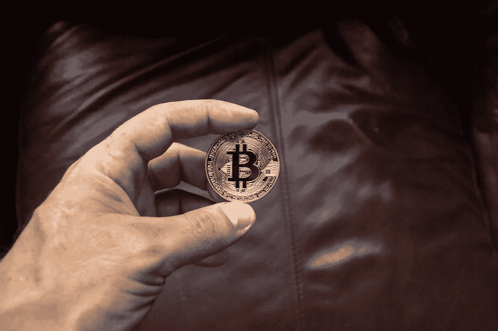

# 2022 年 10 月前购买的 5 种最佳加密货币。

> 原文：<https://medium.com/coinmonks/5-best-cryptocurrencies-to-buy-ahead-of-october-2022-5cfc758a1a5b?source=collection_archive---------7----------------------->

Photo by Worldspectrum: [https://www.pexels.com/photo/four-assorted-cryptocurrency-coins-843700/](https://www.pexels.com/photo/four-assorted-cryptocurrency-coins-843700/)

随着我们开始看到更广泛的加密市场的反弹，现在是开始关注那些你认为会在反弹过程中超越市场的项目的最佳时机之一。

这就给了你一个一路美元成本平均的机会。

即使比特币的价格已经跌破 2 万美元，数字货币仍然是一个讨论的话题。因此，我们选择了五个项目，我们预计它们将在未来几个月乃至 2023 年继续表现良好。

> 参见:[什么是以太坊合并？](/coinmonks/what-is-ethereum-the-merge-1b65f4d2c853)

# 1.以太坊

Photo by Worldspectrum: [https://www.pexels.com/photo/four-assorted-cryptocurrency-coins-843700/](https://www.pexels.com/photo/four-assorted-cryptocurrency-coins-843700/)

[**市场**上限:$ 164780783533](https://coinmarketcap.com/)

[**按市值持仓** : 2](https://coinmarketcap.com/currencies/ethereum/markets/)

[**当前**价格:1345.28 美元](https://coinmarketcap.com/currencies/ethereum/markets/)

[**市场**支配地位:19.66%](https://coinmarketcap.com/currencies/ethereum/markets/)

合并对区块链用户和加密投资者都有积极的影响。区块链将获得速度和可扩展性，而以太令牌的价格将飞涨。

到 2023 年，代币的价值可能会超过 2000 美元。

目前以太坊的价格在 1300 美元左右。以太坊允许任何人(dApps)创建和发布不可变的分散式应用程序。

以太坊推动了现在被称为分散金融(DeFi)的空间，并永远改变了密码世界。

当以太坊的共识机制从工作证明(PoW)过渡到股权证明(PoS)，俗称 ETH2，网络交易费用会降低，以太坊会变得更加环保。

# **2。比特币(BTC)**

Photo by Worldspectrum: [https://www.pexels.com/photo/round-gold-colored-and-black-coin-on-person-s-hand-844125/](https://www.pexels.com/photo/round-gold-colored-and-black-coin-on-person-s-hand-844125/)

[**市值:376，008，908，030 美元**](https://coinmarketcap.com/currencies/bitcoin/)

[**市值持仓** : 1](https://coinmarketcap.com/currencies/bitcoin/)

[**现价:$** 19，539.19 美元](https://coinmarketcap.com/currencies/bitcoin/)

[**市场支配地位:43%**](https://coinmarketcap.com/currencies/bitcoin/)

比特币在 18000 到 22000 之间依然坚挺。我们在这些层面得到了很多支持。然而，鲸鱼可能会很快回来，创造一个抛物线运动，将推动整个加密市场回升。因此，现在是一个安全的时间，以美元成本平均与 BTC。

9 月，比特币平均下跌了 5%左右。你必须回到 2016 年的价格图表，才能找到比特币上一次在 9 月为正的时间；比特币连续五年在 9 月减少。因此，可以理解为什么今年 9 月与往年没有什么不同。历史证据表明，比特币的价格失衡通常会在 10 月份恢复。

平均而言，10 月份的回报率约为 26%，是比特币历史上第四好的月份。更好的是，11 月是第二好的月份，比特币的价格平均上涨了 40%。

因此，如果你正在考虑积累一些比特币，现在是一个绝佳的时机。

> [**参见:加密期货交易讲解**](/coinmonks/crypto-futures-trading-explained-684598049ba8)

# **3。宇宙**

[https://themarketperiodical.com/wp-content/uploads/2021/06/s3.jpg](https://themarketperiodical.com/wp-content/uploads/2021/06/s3.jpg)

市值:3763705545 美元

[**市值持仓** :](https://coinmarketcap.com/currencies/bitcoin/) 23

[**现价**:](https://coinmarketcap.com/currencies/bitcoin/)[【13.12 美元](https://coinmarketcap.com/currencies/cosmos/markets/) [美元](https://coinmarketcap.com/currencies/bitcoin/)

[**市场支配地位:** 0.40%](https://coincodex.com/crypto/cosmos/)

Cosmos 自称为区块链互联网，因为他们是一个不断扩展的应用和服务生态系统，这些应用和服务相互连接，为去中心化的未来而构建。他们有

自 2021 年初以 6.49 美元的价格进行首次硬币兑换以来，ATOM(宇宙的原生资产)的价格大幅上涨。2021 年，ATOM 实现了 450%的回报。过去 12 个月中，数字资产的表现没有任何放缓的迹象。

由于这个主要原因，大多数专家认为原子硬币有很大的扩展空间。其他人认为，对 Cosmos' token 进行长期投资是他们能够采取的最佳举措之一。因此，现在可能是投资 Cosmos (ATOM)的理想时机，因为这枚硬币将继续为其持有者提供丰厚的回报。

向 Cosmos 引入分散融资(DeFi)是投资 ATOM 的最有说服力的理由之一。这将有助于 ATOM 获得新客户，因为分散式交易所能够实现加密货币的购买、销售和存储。

> **参见:**[**2022 年最佳 NFT 商场**](https://ilekeairende.com/the-best-nft-marketplaces-in-2022-bc94ae6270c)

# **4。索拉纳**

[https://bitcoin-trading.io/wp-content/uploads/2021/06/shutterstock_1984763987-scaled.jpg](https://bitcoin-trading.io/wp-content/uploads/2021/06/shutterstock_1984763987-scaled.jpg)

市值:11，815，983，486 美元

[**市值持仓** : 1](https://coinmarketcap.com/currencies/bitcoin/https://coinmarketcap.com/currencies/solana/)

[**现价:$** 33.28](https://coinmarketcap.com/currencies/solana/)

[**市场支配地位:20%**](https://coinmarketcap.com/currencies/bitcoin/https://coinmarketcap.com/currencies/solana/)

Solana 的表现优于比特币、以太坊和整个加密货币市场。索拉纳的市值排名第九，是世界上最快的区块链，拥有异常快速的生态系统。

Solana 的 SOL token 在过去的一个月里损失了 23%的价值，因为以太坊准备进行合并，这是其最重要的升级。

Solana 的主要销售特点是其快速区块链和低交易速度，这两个问题都是以太坊 9 月 15 日的合并分叉旨在解决的。Solana 还成功举办了一次黑客马拉松，为其生态系统开发了 750 个新项目。

Solana 的生态系统包括贷款协议、DeFi 计划、NFT 市场、Web3 应用程序和分散交易(DEX)项目。此外，还包括为 DeFi 和 NFTs 设计的 Solana 钱包 Phantom 和去中心化音乐共享网络 Audius。

专家预测，在不久的将来，代币的价格将从 53.50 美元反弹。此时不利用索拉纳加密货币的复苏将是一种耻辱。

> **另见:**[**Crypto 崩溃何时结束？**](/web3-surfers/when-is-the-crypto-crash-coming-to-an-end-3342f7d47cde)

# **5。柴犬**

[https://interesting-facts.com/wp-content/uploads/2021/06/Shiba-Coin--1536x864.jpg](https://interesting-facts.com/wp-content/uploads/2021/06/Shiba-Coin--1536x864.jpg)

市值:6139505765 美元

[**市值持仓** : 1](https://coinmarketcap.com/currencies/bitcoin/https:/coinmarketcap.com/currencies/solana/) 4

[**现价** :](https://coinmarketcap.com/currencies/solana/) [$0.00001118](https://coinmarketcap.com/currencies/shiba-inu/markets/)

[**市场支配地位**:小于 1](https://coinmarketcap.com/currencies/shiba-inu/)

对于柴犬来说，八月是相当忙碌的一个月，尤其是考虑到它的价格下跌。这只是一个暂时的阶段，因为代币的价格已经在小幅上涨。

毫无疑问，稳定币 SHI 稳定币的推出将有利于这种加密货币的价格。到 2023 年，可能达到 0.00000016 美元。

柴犬最近进入元宇宙是可能对其有利的变量之一。元宇宙被认为是密码技术的下一个重大发展。一些研究人员预测，到这个十年结束时，元宇宙的市场价值将达到 8 万亿美元。然而，元宇宙只是投资柴犬有利可图的原因之一。

Tokenomics 是现在购买柴犬的另一个原因。当柴犬最初进入市场时，有一千万亿枚代币在流通。到 2021 年年中，大约 50%的供应已经从市场上移除。

这是因为 Vitalik Buterin 选择烧掉柴犬团队在发布时分配给他的 50%的代币。柴犬从此继续烧代币。

2022 年 4 月，柴犬团队推出了 token burn 平台。这表明随着时间的推移，SHIB 代币将变得越来越罕见，基于供求经济学，柴犬有可能成为未来表现最好的迷因币之一。

> **另见:** [**煎饼互换，适合初学者。**](/coinmonks/pancake-swap-for-beginners-bb2896cdf56b)

# **总而言之**

以下是我们认为在接下来的几个月中表现良好的 5 个项目。比特币仍在 18，000 至 22，000 之间保持坚挺，因此现在是与 BTC 进行美元平均成本交易的安全时机。Cosmos 是一个不断扩展的应用和服务生态系统，专为去中心化的未来而构建。自 2021 年初以 6.49 美元的价格交易一枚硬币以来，他们的原生资产 ATOM 已经大幅增加。

现在可能是投资 ATOM 的最佳时机，因为这枚硬币将继续带来高收益。稳定硬币 SHI 稳定硬币的推出无疑将积极影响这种密码的价格。到 2023 年可能达到 0.00002016 美元。当柴犬第一次进入市场时，有一千万亿枚代币在流通。

然而，投资的首要规则是在投资任何资产之前进行充分的研究。

# 财务免责声明

本网站上的信息并非旨在提供也不代表任何交易、投资或金融建议。这只是为了教育、启发和娱乐的目的。

明智的做法是，在没有首先进行研究和咨询认证经纪人或财务顾问的情况下，避免根据本网站的内容做出任何财务、投资、交易或其他决定。

您承认您有责任评估本网站上或通过本网站提供的任何信息。

# 风险陈述

比特币和其他加密货币的交易既有优势也有劣势。交易并不适合所有人。任何对投资感兴趣的人都必须咨询专家。

> 交易新手？试试[加密交易机器人](/coinmonks/crypto-trading-bot-c2ffce8acb2a)或者[复制交易](/coinmonks/top-10-crypto-copy-trading-platforms-for-beginners-d0c37c7d698c)