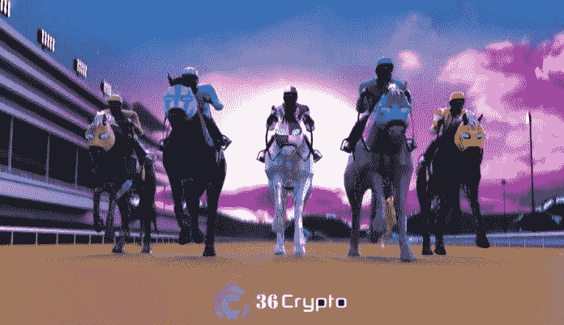

# 2022 年在 OpenSea 上为初学者购买的 5 个最佳 NFT 收藏

> 原文：<https://medium.com/coinmonks/5-best-nft-collections-to-buy-on-opensea-for-beginners-in-2022-36crypto-e4e71a1e2321?source=collection_archive---------12----------------------->

不可替代代币通常被称为 NFT 的代币将继续存在。尽管其背后的势头在 2022 年有所下降，但它仍然是新一代互联网的重要组成部分， [Web 3.0](https://36crypto.com/7-best-web-3-0-cryptocurrencies-to-invest-in-right-now/) ，像 Opensea 这样的平台仍然是购买它们的最佳市场之一。

2021 年，随着更多的投资者利用这一趋势，对拥有这些数字艺术越来越感兴趣，增长和关注度飙升。挑选最好的藏品进行投资可能会很困难，这就是为什么我策划了这篇文章，向你指出要购买的 [**最佳 NFT 藏品**](https://36crypto.com/6-cheapest-nft-projects-to-invest-in-october-2022/) 。

人们误以为 NFTs 仅仅是关于艺术的，但事实是 NFTs 的使用案例在过去几年里已经扩展到生活的不同领域。从艺术到房地产，到体育和娱乐，用例不断增长。

就像所有其他数字资产一样，非数字资产也伴随着风险。如果你想在投资上获得丰厚的利润，你需要做适当的研究，超越围绕它的炒作。你对不可替代代币的长期规划和愿景决定了它的基本价值。

作为初学者，Opensea 是开始 NFT 之旅的一个非常好的地方。这是第一个也是最大的 NFTs 市场。该平台成立于 2017 年，拥有超过 130 万用户，并列出超过 8000 万个非功能性桌面。

# 如何创建一个 Opensea 帐户

就像其他市场和加密货币交易所一样，你必须注册并创建一个账户，才能开始使用该平台。在 Opensea 上注册需要几个步骤，你可以在几分钟内完成。请参阅下面关于如何创建 Opensea 帐户的分步指南:

*   **购买一些 ETH:** ETH 是推动以太坊区块链的数字货币。你可以从热门的加密货币交易所购买以太坊，如[币安](https://36crypto.com/binance-review-for-2022/)、[比特币基地](https://36crypto.com/coinbase-review-2022/)和 [Bitfinex](https://36crypto.com/bitfinex-review-2022/) 。需要 ETH 从 Opensea、mint NFTs 购买 NFT，并支付交易费用。
*   **安装 Metamask 加密钱包**:从任何交易所购买 ETH 后，下一步需要做的就是安装加密钱包，在这种情况下，我们将使用 Metamask。 [Metamask](https://metamask.io/) 是一个软件加密钱包，用于存储 ETH 并处理以太坊区块链上的交易。
*   **连接你的钱包到 Opensea** :安装好 Metamask 钱包之后，接下来要做的就是连接到 Opensea，编辑你的个人资料。访问 [opensea.io](https://opensea.io/) ，点击个人资料图标连接钱包。

# 如何在 Opensea 上购买 NFTs

在 Opensea 上创建一个帐户并成功连接到 Metamask 后，您现在就可以购买 NFTs 了。遵循下面的简单步骤:

1.  打开浏览器，访问 [opensea.io](https://opensea.io/) 网站。
2.  浏览网站或搜索你想要的 NFT
3.  点击“立即购买”按钮。
4.  浏览市场的条款和条件，然后点击“结帐”
5.  审查并确认您的交易。

*重要提示:在继续购买之前，请务必仔细阅读交易细节并检查燃气费。*

要了解更多，请查看我们关于如何在 Opensea 上购买你的第一个 NFT[的详尽指南。](https://36crypto.com/how-to-buy-your-first-nft-on-opensea-a-beginners-guide/)

希望你已经看到了这篇文章的这一部分，现在让我们开始讨论一下**NFT 最值得投资的**项目。

# 2022 年在 Opensea 上购买的 5 种最佳 NFT(不可替代代币)

以下是我在 2023 年之前的剩余时间里投资的 NFT 收藏。

# 1.塔马多吉(TAMA)

Tamadoge 是一款 P2E(游戏赚钱)游戏，自 7 月份预售以来势头越来越猛。它被列为我们在 10 月份购买的首选加密货币。在 Tamadoge 中，玩家战斗并获得 Dogepoints，这有助于他们分阶段进行。

塔马多吉的本土标志是 TAMA。玩家参与“Tamaverse”游戏可以获得多重奖励。P2E 平台的特色是 Tamadoge 宠物，可以在 Tamaverse 购买和饲养。这些宠物也可以跨平台交易。

使用智能合约功能，这些宠物可以被铸造成不可替换的令牌，并且可以使用 Tamadoge 商店的 TAMA 令牌来购买这些 NFT。TAMA 代币也可以用来交易 Tamadoge 上的资产，也可以用来完成交易。

与 Dogecoin 不同， **TAMA 代币的最大供应量为 20 亿代币**。2022 年第三季度，TAMA 启动预售，两个月内筹集了 1900 万美元。TAMA 在 OKX、BitMart 和 Uniswap 上市后，价格飙升。

CoinMarketCap 的实时数据显示，Tamadoge 的价格为 0.031 美元，市值为 320 亿美元。

# 2.丝绸(STT)

2021 年 6 月在**推出，丝绸是一个元宇宙项目，用户可以拥有一匹赛马并因此获得奖励。使用区块链技术和 NFTs，幻想游戏将现实世界的赛马带到了元宇宙。这是一个真实世界的纯种马比赛的玩赚元宇宙游戏。**

**$STT 是丝绸生态系统的本土象征**。拥有该令牌的用户可以购买丝绸头像，丝绸纯种马，也可以购买土地和马厩。他们的目标是将真实世界的赛马刺激带入元宇宙。

Silks 生态系统上的治理令牌是$SLK 令牌。拥有此令牌的玩家可以执行某些功能，如投票平台决策，并使其成为 DAO 的一部分。也允许交换两个令牌。

丝绸 NFT 游戏中涉及的资产包括

丝绸化身:这些是丝绸生态系统中玩家的身份。它们做工精良，由颜色组合和图案组成。化身被铸造并与玩家的钱包相关联。

**丝绸纯种马**:当现实世界的马出生并注册后，丝绸生态系统将创建同一匹马的虚拟克隆。马匹是丝绸生态系统的主要组成部分。

丝绸之地:这是丝绸生态系统的另一项重要资产。丝绸生态系统中有大约 202，500 块一英亩的虚拟土地。赛马的主人可以购买这些土地，并在上面建造房屋和马厩。

**丝绸马厩**:玩家可以对他们的马厩的美学和属性进行处理，给它们一个独特的视角。马厩用来给 NFT 马下赌注，也可以获得奖励。

丝绸农场:丝绸农场可以有一个虚拟市场，在那里展示马匹。玩家可以直接从马的主人那里购买或竞拍马匹。

访问丝绸网站[https://www.silks.io/](https://www.silks.io/)了解更多信息。

# [此处继续阅读](https://36crypto.com/top-5-nfts-to-buy-on-opensea-for-beginners-in-2022/)

# 结论

投资 NFTs 是一笔好生意。它的用例非常广泛，真正的价值来自于它的独特性。在这篇文章中，你已经看到了 2022 年值得购买的不同 NFT 项目的列表。

所有这些项目都取得了进展，并成为 NFT 地区的顶级项目。像 Sorare 这样的项目已经非常成熟，拥有大量的追随者，然而，它们的高额价格可能并不适合所有人。

我最推荐在 Opensea 上购买的顶级 NFT 是丝绸。如果你打算低买高卖，投资丝绸是个不错的选择。该项目具有很好的增长潜力和较低的进入壁垒。

免责声明:这不是财务建议。本文所表达的观点和意见仅代表作者个人。

你喜欢阅读我们带给你的内容吗？如果是，请点击“**拍拍**按钮，增加其他人看到这个帖子并了解它的机会。

你最多可以鼓掌 50 次。你还在等什么？马上按下那个按钮。感谢您的阅读。

*原载于 2022 年 11 月 6 日***。**

> *交易新手？尝试[加密交易机器人](/coinmonks/crypto-trading-bot-c2ffce8acb2a)或[复制交易](/coinmonks/top-10-crypto-copy-trading-platforms-for-beginners-d0c37c7d698c)*