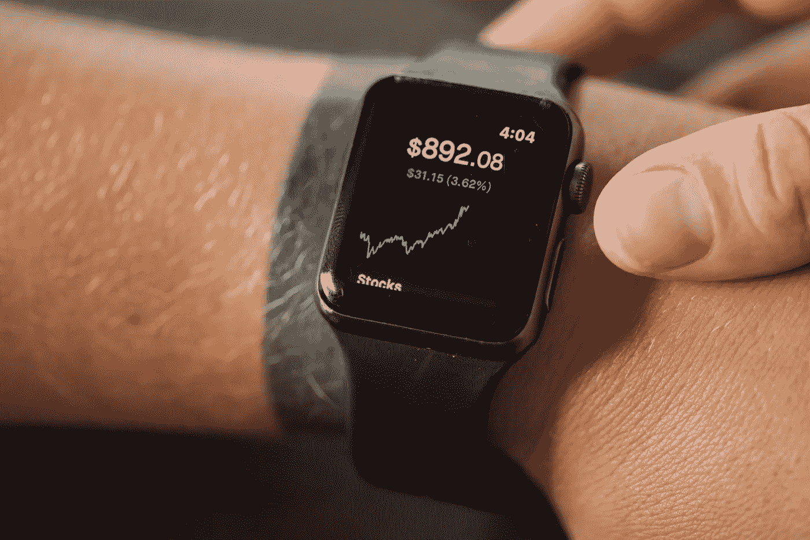

# 2022 年 11 月买入并保持到 2030 年的 5 只最佳股票

> 原文：<https://medium.com/coinmonks/5-best-stocks-to-buy-in-november-2022-and-keep-till-2030-fed21a2eb633?source=collection_archive---------11----------------------->

Source photo [Close-up of a Smartwatch with a Graph · Free Stock Photo (pexels.com)](https://www.pexels.com/photo/close-up-of-a-smartwatch-with-a-graph-7947969/)

# 字母表(谷歌，谷歌)

毫无疑问，Alphabet (NASDAQ:GOOG，NASDAQ:GOOGL)是退休后最值得购买的股票之一，因为没有它，互联网就不会一样了。我的许多同事之前提到过 Alphabet 拥有谷歌和 YouTube，这是互联网上访问量最大的两个网站。谷歌是一个低风险、高回报的…