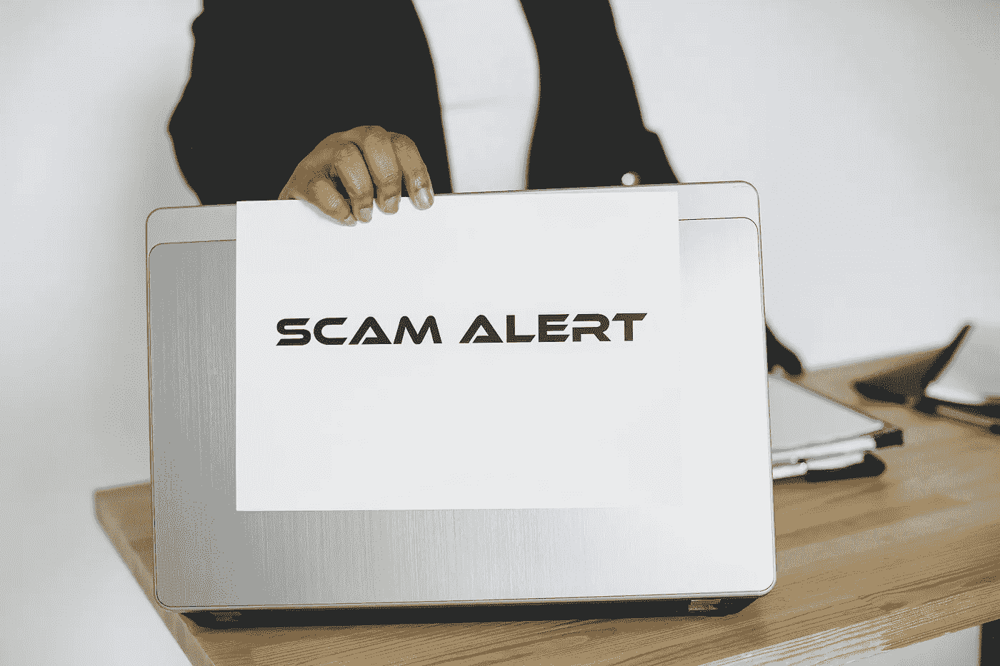

# 5 种常见的加密骗局以及如何避免它们

> 原文：<https://medium.com/coinmonks/5-common-crypto-scams-and-how-to-avoid-them-4dd49454ada3?source=collection_archive---------26----------------------->

Photo by Gustavo Fring: [https://www.pexels.com/photo/man-holding-a-sheet-of-paper-on-the-laptop-5934213/](https://www.pexels.com/photo/man-holding-a-sheet-of-paper-on-the-laptop-5934213/)

随着加密货币越来越受欢迎，骗子有更多的机会利用那些缺乏行业知识的人。

2020 年，欺诈者窃取了价值超过 78 亿美元的加密货币。2021 年，价值超过 140 亿美元的加密货币被盗。总是有新的加密货币骗局需要警惕，如果你不小心，你可能会赔钱。

# **投资/“快速致富”骗局**

承诺你将“快速致富”或你将能够轻松积聚大量金钱的缺点并不新鲜，而且它们肯定不是加密货币行业独有的。然而，骗子利用了数字钱包的保密性和加密货币交易的不可逆性。

这些不诚实的人能够利用各种伪装。当骗子通过社交媒体或即时消息接近加密货币社区成员，同时看起来与特定平台有联系时，他们犯下了最常见的在线欺诈形式之一。

许多不知情的网上欺诈受害者成为虚假但看似合法的网站的受害者。

骗子通常会说服潜在受害者支付一大笔钱，以获得不可能实现的“有保证的”利润。不想错过机会的人可能会决定投资(FOMO)。

行骗者可能会实施任何规模的这类计划，从许多天真的人那里拿走几美元，到从投资者那里窃取大量资金。

# 空投骗局

空投骗局的一种类型包括假赠品。项目发起人经常在空投中分发免费的代币或货币来传播信息(NFTs)。用户可能需要重新共享社交帖子或创建一个帐户才能获得资格。认领这些资产是在收到资产后出售它们的先决条件。

欺诈者可以使用空投将不知情的受害者引诱到恶意网站，在那里他们可以窃取他们的私钥或其他有价值的信息，如加密货币钱包中的资金。这与欺骗人们输入登录信息、希望退款或汇款给他们的网络钓鱼邮件非常相似。

# 浪漫骗局

浪漫欺诈是另一种经典的欺骗手段，已经进入了加密领域。在这个骗局中，罪犯认识了一个网络熟人，并假装喜欢他们。通常，欺诈者在开始联系后不久就声称爱受害者。骗子经常以网络连接问题为由来避免视频对话；如果他们拒绝这样做，你应该怀疑。

一旦他们抓住了受害者，骗子就会利用各种技术来榨取资金，例如假装有财务问题或需要照顾生病的亲戚。有时，他们希望见到受害者，但付不起机票钱。与以往类似性质的欺诈一样，该骗局的实施者声称急需现金，并承诺全额偿还贷款。

# 采矿/赌注池骗局

一些采矿和赌注池是加密领域的庞氏骗局。

随着加密货币越来越受欢迎，许多投资者希望参与区块链技术和分散经济。

比特币(BTC)、以太坊(ETH)、波尔卡多特(dot)和卡尔达诺(ADA)等硬币可以通过采矿池或赌注池进行开采或下注，后者是更常见的选择。

赌注是如何运作的？通过在预定的时间内提交或锁定他们的硬币，投资者为区块链的运行做出了贡献，该技术可以安全和永久地记录加密交易。作为交换，他们可能会获得加密货币奖励。

骗子试图说服个人加入假池。涉及采矿和股权池的骗局是传统庞氏骗局的变种。在某些欺诈中，目标是快速获得金钱。通常情况下，他们会主动要求加入一个资金池，并许诺丰厚的奖品。最初，当骗子试图建立您的信任时，您可能会收到退款。然而，与其他庞氏骗局一样，这些收益是用新参与者的资金支付的，而不是实际的投资回报。

欺诈者预计，如果您获得利润，您将向资金池贡献更多的加密货币。

如果你下了更大的赌注，你的加密货币可能会被转移到一个未知的地址，你可能再也见不到它了。

# 电子邮件诈骗

电子邮件可以伪装成来自合法公司或个人的样子来欺骗收件人。这些电子邮件中的大多数希望以加密货币进行“紧急”支付。这封邮件旨在让收件人产生一种紧迫感，这样他们就可以不假思索地回复邮件。

由于不可替代代币(NFT)和首次发行硬币(ico)等基于加密的投资的突然兴起。，诈骗者现在比以往有更多的选择来偷你的钱。

由于不可替代代币(NFT)和初始硬币发行等基于加密的投资的突然兴起，欺诈者现在比以往任何时候都有更多的选择来窃取您的资金。例如，骗子可能会伪装成信誉良好的加密货币企业，通过电子邮件向你发送限时优惠。

# 如何避免加密骗局

1.  **保护您的数字钱包:**

要交易或投资比特币和其他加密货币，你需要一个数字钱包和访问钱包的私钥。如果一个网站或企业曾经要求你的私钥，这很可能是一个骗局，你应该尽可能地避免它。你不应该把你的数字钱包的私人钥匙给任何人。

**2。千万不要将加密货币转移到不可信的地址:**
在将加密货币发送到那里之前，一定要验证接收钱包的所有者的身份。

骗子可能会给你提供一个钱包地址来实施买一送一的骗局。

不管这笔交易有多么吸引人，你都不应该向无法验证的钱包发送加密货币。

3.不要访问消息或电子邮件中的任何链接，除非您确定它们是安全的(例如，通过使用反网络钓鱼代码，联系平台的客户支持以确认他们确实发送了该链接，或将鼠标悬停在链接上而不点击以检查完整的 URL)

4.不要在任何非官方的网站或应用程序上输入您的凭据，并且始终使用您的浏览器而不是提供的链接来访问网站。

5.不要向通过即时消息、社交媒体或电话与您联系并表现得好像他们代表平台的任何人提供凭据或个人信息。

如果您有任何疑问或意见，我很乐意收到您的来信。如果您对#crypto、#web3、#nft、#defi、#元宇宙、#社区建设、#市场营销、#领导力、#职业生涯或自我提升有任何迫切的问题，请发送给我。

如有更多疑问，请发邮件至 abeabimbola40@gmail.com*联系我。*

*我可以被雇佣。*

*如果你想欣赏我的作品，你可以请我喝杯咖啡。*

*[https://www.buymeacoffee.com/abeabimbolo?new=1](https://www.buymeacoffee.com/abeabimbolo?new=1)*

*也可以关注我的*[*LinkedIn*](https://www.linkedin.com/in/abeabimbola/)*，或者*[*Twitter*](https://twitter.com/Bmarketer_)*。***

**如果您的网站、电子书或博客(媒体、Hashnode 或其他地方)需要任何加密和 NFT 相关的内容，请随时联系我！).**

**我已经当了两年多的受雇作家了。**

> **交易新手？尝试[加密交易机器人](/coinmonks/crypto-trading-bot-c2ffce8acb2a)或[复制交易](/coinmonks/top-10-crypto-copy-trading-platforms-for-beginners-d0c37c7d698c)**