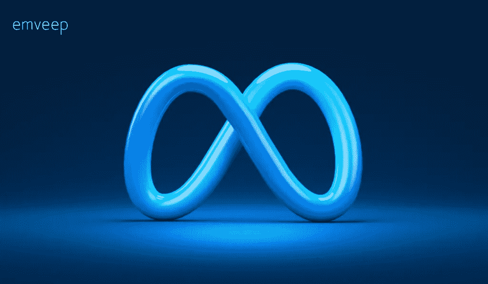
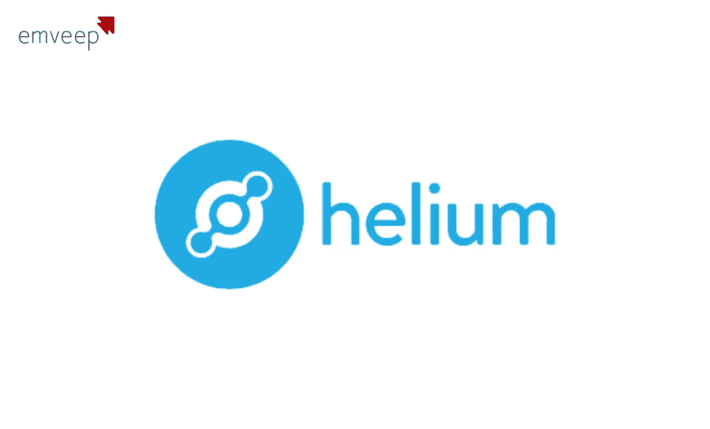
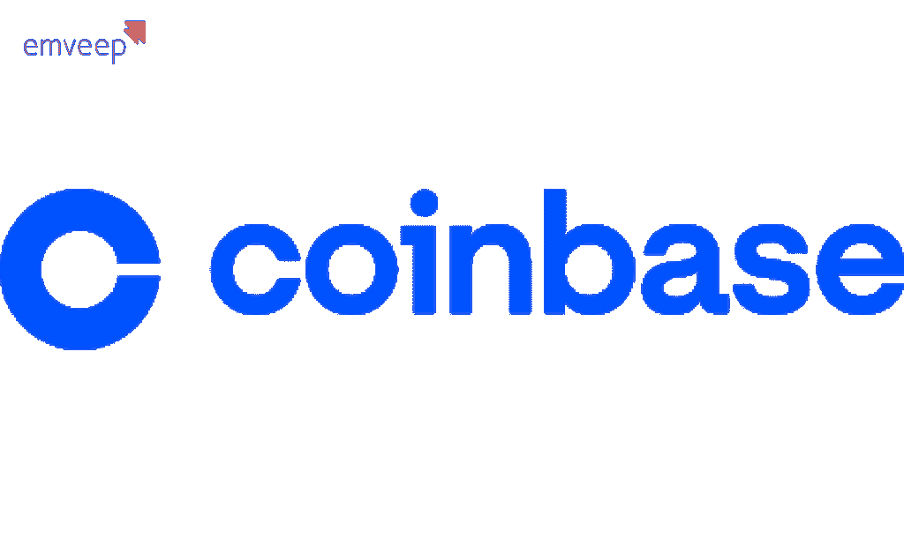
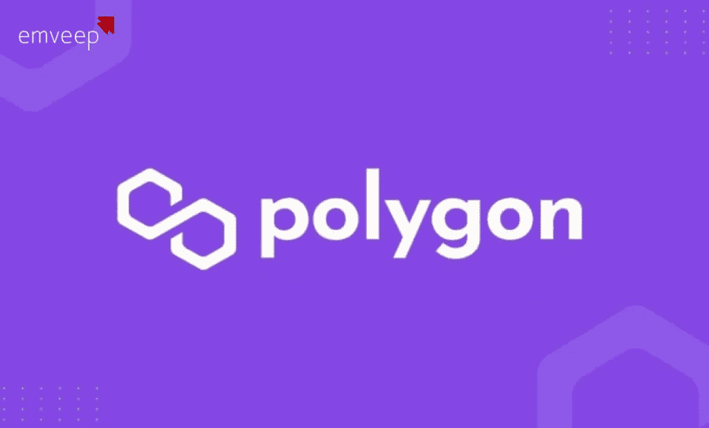
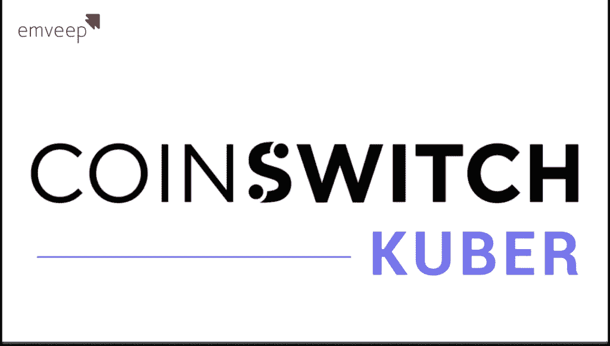

# 5 家公司通过 Web 3.0 盈利，达到 190 亿美元

> 原文：<https://medium.com/coinmonks/5-companies-make-profits-through-web-3-0-until-us-19-billion-58f705ea0e24?source=collection_archive---------4----------------------->

众所周知，在过去的三十年里，互联网经历了飞速的发展。当前，互联网文明已经进入 Web 3.0 阶段。Web 3.0 使设施能够在身临其境的 3D 环境中通过图像、视频和音频共享信息并相互交互，而不受距离的限制。

与此同时，谁不知道推动 Web 3.0 发展的加密货币和区块链系统呢？日益蓬勃发展的互联网一代吸引了技术领域或其他领域的公司参与其中，抓住机会，使他们成为 web 3.0 公司

如果您还不知道，由于 Web 3.0 服务的快速发展，预计 2030 年 Web 3.0 市场的总价值将达到近 815 亿美元。作为一个商人，这当然是很有诱惑力的。
那么，到底什么是 Web 3.0 公司？他们如何从 Web 3.0 中赚钱？

了解下面的方法，并确保您也可以了解通过 Web 3.0 成功增加收入的 5 家公司所采取的步骤。

# 什么是 Web 3.0 公司？

Web 3.0 公司是一种新型的创业公司，其工作方式已经颠覆了传统行业。他们的工作方式是依靠区块链技术。然而，他们不仅仅是新手，许多成熟的公司已经设法与区块链一起赚了数十亿美元。

在 Web 3.0 公司中，一切都是为了赚钱。他们不仅仅试图把传统世界变成一个超级现代的世界；当然，他们也试图致富。互联网改变了我们生活和做生意的方式。Web 3.0 公司是一种新趋势，它改变了我们很久以前就知道的世界。

> 交易新手？在[最佳加密交易](/coinmonks/crypto-exchange-dd2f9d6f3769)上尝试[加密交易机器人](/coinmonks/crypto-trading-bot-c2ffce8acb2a)或[复制交易](/coinmonks/top-10-crypto-copy-trading-platforms-for-beginners-d0c37c7d698c)

问题是，他们如何通过成为 Web 3.0 公司而致富？简而言之，他们通过创造产品并将其销售给客户来创造收入。让我们在下一次会议中更清楚地讨论。做好成为富人的准备！

# Web 3.0 公司如何赚钱？

# 1.创建您的令牌

Web 3.0 公司致富的方式是通过使用区块链技术来创建他们的代币，代币可以用于各种目的，例如在他们的平台上支付商品和服务。除此之外，他们还拥有代币，可以用作价值储存手段或在交易所交易。

# 2.创建分散应用程序(DApps)

除了创建令牌，Web 3.0 公司还使用区块链技术来创建分散式应用程序(DApps)。该应用没有中央控制点，并且不能被任何单个实体覆盖。DApps 允许世界上的任何人做出贡献，做出他们认为合适的改变。它也可以成为 Web 3.0 公司的财富来源。

# 3.区块链许可

区块链公司可以从两个主要来源赚钱，即通过向其他公司授权区块链和从虚拟货币矿工那里赚钱。许多公司授权他们的区块链生产产品，然后出售。他们可能出售数据、软件，并收取交易费用。

# 4.提供服务

Web 3.0 公司赚钱的另一种方式是通过提供咨询服务、商品或信息来换取加密货币。他们可以提供开发智能合约、区块链咨询以及 ICO(首次公开募股)营销等服务。对他们来说，灵活和精益对于保持竞争力是非常重要的。

# 5.收集用户数据

Web 3.0 公司也可以通过向用户免费提供服务来赚钱，而用户并不知道他们的数据就是 Web 3.0 公司的钱。像谷歌和脸书一样，他们在互联网上的传统方式是向用户收取服务费，然后从中赚钱。

你可以从 Web 3.0 公司复制的方法是精益创业方法，这是 Web 3.0 创业公司的工作方式，提供了一个很好的例子来确定向客户提供的产品，而无需在员工或不必要的办公设备上花钱。

在了解了 web 3.0 公司是如何运作的之后，这次我们将看看通过 Web 3.0 成功赚了很多钱的 3 家公司的真实例子

# 5 家利用 Web 3.0 赚钱的成功公司

# 1.元

首先，脸书和 Instagram 的控股公司 Meta 宣布，通过他们的元宇宙世界，他们将在那里销售数字产品并赚钱。

元宇宙世界是地平线世界，一个由 Meta 自己创造的虚拟世界。用户将使用全套虚拟现实设备进入元宇宙并与之互动。这个元宇宙平台是分散的，使用 Web 3.0。在那里，梅塔开始开采黄金。

Meta 的发言人向美国消费者新闻与商业频道表示，在该平台上发生的每笔交易都将享受 47.5%的折扣，其中这个数字是从 30%的硬件成本和 17.5%的平台折扣中获得的。

# 2.氦系统公司。

氦系统通过 Web 3.0 创造了约 190 亿美元的收入。Helium 是一家总部位于美国的物联网开发公司。氦专注于物联网设备的网络开发和数据转换。

更具体地说，氦提供工具和解决方案，通过利用区块链技术，以巨大的成本建设大型无线基础设施。

# 3.比特币基地全球公司

比特币基地全球公司，也称为比特币基地，是美国最大的加密货币交易平台。比特币基地提供一个安全的在线平台来购买、存储、转换和销售加密货币。

截至 2022 年 4 月，比特币基地已经推出了测试版的不可交换代币 Web 3.0 社交市场。这是为了让 beta 测试人员创建一个比特币基地 [NFT](https://www.emveep.com/blog/the-future-of-non-fungible-tokens/) 的个人资料来购买或出售 NFT。

2022 年 5 月晚些时候，比特币基地还通过比特币基地应用程序宣布推出 Web 3.0 移动 DApp(去中心化应用程序)和 DeFi 钱包，从而开始了新的冒险。众所周知，比特币基地获得的收入约为 78.4 亿美元。

# 4.多边形技术

这一次，Polygon Technology 是一家收入为 4.363 亿美元的印度公司，是一家分散以太坊扩展平台的开发商，他们专注于通过构建交易费用最低的易用 dApps 为组织提供区块链网络。

截至 2022 年 5 月，Polygon 已经推出了一个新的 web 3.0 开发网络，以实现大规模的 Web 3.0 采用。

# 5.俱吠罗硬币开关公司

第二家来自印度的公司是俱吠罗 CoinSwitch，这是印度最知名和最可靠的加密货币平台。他们为客户体验提供的一个突出优势是，从提供的数字资产中购买、交易和出售您最喜爱的加密货币没有时间限制。

CoinSwitch 俱吠罗公司致力于促进区块链开发商的发展，并与区块链在娱乐、工具、金融、物流、农业技术和医疗保健等领域合作提供解决方案。这也是 CoinSwitch 俱吠罗公司获得 5000 万美元收入的原因。

# 结论

Web 3.0 可以说是一次文化、经济和社会的突破，它将互联网生活从一个封闭的平台变成了一个去中心化的网络。Web 3.0 将让全世界学习如何建设和生活在一个可再生的世界。几个新的亿万富翁将通过 Web 3.0 公司被印刷出来，市场的高度热情和商业人士看到机会的聪明当然是 Web 3.0 公司变得富有的原因。

所以，正如你已经知道的，Web 3.0 公司通过很多方式赚钱。一些人试图创造他们的代币并让其他人申请，一些人还收取用户注册费作为赚钱的可靠途径，而其他人则忙于申请。只要不违法，什么都是合法的。

如果您有兴趣创建一个运行在 Web 3.0 上的应用程序，访问我们位于 Emveep.com[的网站是一个不错的主意，您可以在这里寻找机会、交流想法、讨论与业务相关的问题以及可以与我们合作的应用程序开发人员。](https://www.emveep.com/)

> 加入 Coinmonks [电报频道](https://t.me/coincodecap)和 [Youtube 频道](https://www.youtube.com/c/coinmonks/videos)了解加密交易和投资

# 另外，阅读

*   [Bitsgap 审核](/coinmonks/bitsgap-review-a-crypto-trading-bot-that-makes-easy-money-a5d88a336df2) | [Quadency 审核](/coinmonks/quadency-review-a-crypto-trading-automation-platform-3068eaa374e1) | [Bitbns 审核](/coinmonks/bitbns-review-38256a07e161)
*   [加密复制交易平台](/coinmonks/top-10-crypto-copy-trading-platforms-for-beginners-d0c37c7d698c) | [Coinmama 审核](/coinmonks/coinmama-review-ace5641bde6e)
*   [印度的加密交易所](/coinmonks/bitcoin-exchange-in-india-7f1fe79715c9) | [比特币储蓄账户](/coinmonks/bitcoin-savings-account-e65b13f92451)
*   [OKEx vs KuCoin](https://coincodecap.com/okex-kucoin) | [摄氏替代品](https://coincodecap.com/celsius-alternatives) | [如何购买 VeChain](https://coincodecap.com/buy-vechain)