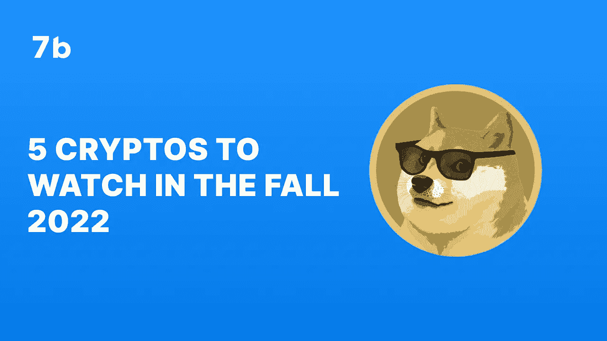
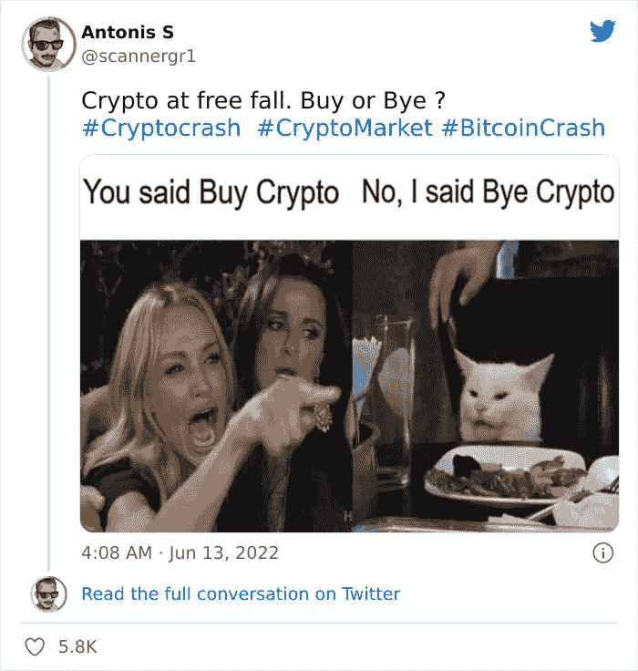
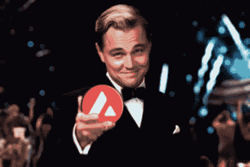

# 2022 年秋季值得关注的 5 种加密货币

> 原文：<https://medium.com/coinmonks/5-cryptocurrencies-to-watch-in-the-fall-of-2022-4ac86d4e3c9a?source=collection_archive---------42----------------------->

# 密码市场受趋势和季节的影响。之前的趋势和季节的市场动态和基本面为接下来的趋势和季节设定了节奏。

# 迄今为止的趋势…

到目前为止，2022 年是一个*隐秘的冬天*！密码市场一直在走下坡路。首先，当美联储[提高基准利率以对抗通货膨胀时，市场受到了打击。当算法稳定的货币](https://www.cnbc.com/2022/06/15/fed-hikes-its-benchmark-interest-rate-by-three-quarters-of-a-point-the-biggest-increase-since-1994.html)[失去与美元挂钩时，事情变得越来越糟。著名对冲基金 Three Arrows Capital 的暂停撤资和清算也导致熊市进一步肆虐。](https://www.cnbc.com/2022/05/12/cryptocurrency-luna-now-almost-worthless-after-ust-falls-below-peg.html)

但是，尽管市场前景黯淡，但某些加密货币在今年获得了增长并保持了势头。它们是值得关注的硬币，尤其是随着 2022 年秋季的临近。

# DogeCoin (DOGE)

许多人认为 DOGE 是一种没有实际用途的加密货币。然而，第一个迷因硬币 DOGE 在这个列表中是第一个。DOGE 在很大程度上遵循了 2022 年市场的看跌趋势。截至发稿时，DOGE 的交易价格为 0.07013 美元。这与它 2021 年的表现形成了鲜明对比，当时它在 5 个月内(1 月至 5 月)飙升了 9884%，峰值为 0.74 美元。

尽管 DOGE 今年表现平平，但它仍值得关注。这种旨在模仿比特币的加密货币已经学会了吸引和利用名人的兴趣。它在 2019 年引起了埃隆·马斯克的注意。现在，它引起了另一位商业巨头马克·库班的注意。

在最近的一次播客采访中，这位亿万富翁企业家兼达拉斯小牛队的所有者[表示](https://decrypt.co/107038/dogecoin-has-more-potential-applications-than-cardano-mark-cuban)doge coin 比 Cardano 更有潜力，尽管后者是智能合同的平台。去年三月，达拉斯小牛队宣布球迷可以使用 Dogecoin 购买门票和商品。

尽管据说 Dogecoin 没有任何用途，但它一直吸引着顶级投资者。这些投资者不仅热衷于购买和持有人民币，他们还在寻找扩大其效用的方法。

# 雪崩

[雪崩](http://sevenb.io/currencies/avalanche?utm_source=medium&utm_medium=article)是以太坊的对手。它果然名不虚传。Avalanche 的独特之处在于它的架构:它运行在三个区块链上。单独来说，这些区块链服务于不同的目的，但是它们共同为雪崩网络的速度和可扩展性提供了基础。

最近，艾娃实验室发布了 [AvalancheGo Verbier](https://github.com/ava-labs/avalanchego/releases/tag/v1.7.17) ，这是一个网络升级，让用户控制他们的跨链资产，并简化跨网络访问 dApps。这一发展将允许 Avalanche 扩展到一个更大的平台，并提高其效用。

AVAX，Avalanche 的原生令牌，对此次升级反应积极。它从 27.7 美元上涨到 30.0 美元，目前交易价为 29.13 美元。

# θ网络

[Theta Network](http://sevenb.io/currencies/theta?utm_source=medium&utm_medium=article) 通过具有坚实基础设施的分散式、经济实惠的视频流平台，正在革新视频流。这将最大化用户体验，并允许内容创作者为他们的作品赚取相应的溢价。Theta Network 一直在履行这一使命。

三星最近[宣布](https://news-samsung-com.translate.goog/kr/%EC%82%BC%EC%84%B1%EC%A0%84%EC%9E%90-%EB%89%B4-%EA%B0%A4%EB%9F%AD%EC%8B%9C-nft-%EC%83%9D%ED%83%9C%EA%B3%84-%EA%B5%AC%EC%B6%95-mou%EC%B2%B4%EA%B2%B0?_x_tr_sl=auto&_x_tr_tl=en&_x_tr_hl=en)与 Theta Labs 合作，为他们最新的 Galaxy 手机创建并管理一个 NFT 生态系统。三星旨在通过 NFTs 改善客户体验，他们希望 Theta Network 发挥作用。Theta 将向三星用户发放 Galaxy NFTs。根据 Theta 的说法，他们正在发起最大的离线 NFT 公用事业活动，将允许超过 10 万名 NFT 持有者通过 [ThetaPass 技术](https://twitter.com/Document_Theta/status/1483064389322354688?s=20&t=iOMM7-P9mraCtXh2i9vtiA)在线或离线使用 Theta NFT。这项技术是一个 NFT 票务系统，允许用户访问虚拟事件。

THETA 对这种合作关系反应积极。截至发稿时，代币价值 1.62 美元，比 7 天前的价格上涨了 18%。

# 猿

于 2022 年 3 月推出的 [ApeCoin](http://sevenb.io/currencies/ape?utm_source=medium&utm_medium=article) 是在加密/区块链领域大步前进的年轻人。这枚硬币不断扩大其在猿类生态系统之外的用途。

最近，比特币支付服务提供商 [Bitpay](https://bitpay.com/blog/bitpay-supports-apecoin/) 在其平台上增加了 ApeCoin。[古驰](https://cointelegraph.com/news/gucci-becomes-first-major-brand-to-accept-apecoin-payments)也成为第一个接受 ApeCoin 支付的主要品牌。事实上，古驰的客户可以通过 Bitpay 使用 ApeCoin 进行支付。

诸如此类的消息让 ApeCoin 在投资者眼中处于有利地位，从而使其成为未来几个月值得关注的加密货币。

# Ankr

Ankr 提供了一个基础设施，分散的应用程序和区块链可以在这里运行并相互通信。这是一个致力于 Web3 未来的平台。这就是为什么最近[将](https://cointelegraph.com/news/ankr-network-s-2-0-upgrade-aims-to-improve-web3-decentralization)的网络升级到 Ankr Network 2.0，并将其描述为“Web3 基础设施的去中心化市场”

令牌 ANKR 是一个用于交易和支付的跨功能实用令牌。它可以用作 ERC-20、BEP-2 和 BEP-20 令牌。为了扩大 Ankr 的效用，用户现在可以[下注](https://cryptobriefing.com/ankr-launches-ankr-token-staking-allowing-stakers-to-earn-rewards-across-all-rpc-requests-on-the-ankr-network/)他们的 ANKR 来获得 ANKR 网络的奖励。

随着世界逐渐拥抱 Web3，可以肯定的是，ANKR 网络将会有大规模的发展，这将导致 Ankr 的价值激增。

对这五种硬币的分析已经暗示了如何发现下一种大货币。继续保持价值和利润的加密货币都表现出类似的品质。

1.  **它们有可靠的使用案例:**比特币的诞生是为了颠覆传统金融。以太坊的创建是为了推进去中心化金融，并为智能合约提供平台。Theta Network 正在重塑视频流。这些公用事业确保世界将永远需要使用这些项目。随着这些工具的扩展，代币或加密货币的价值将会增加。
2.  它们建立在具体的技术之上:大型加密货币能够提供它们的效用，因为它们建立在坚实的技术之上。比特币建立在区块链的基础上，这催生了其他提供安全性和可扩展性的区块链。Avalanche 在三个独立的区块链上运行，提供快速和可扩展的服务。Ankr 的技术是专门为 Web3 基础设施开发的。

公用事业和技术使它们成为吸引投资者和机构的对象。

市场的现状并不能决定市场的未来。我们所做的是提供*建议*秋季可能要注意的硬币。作为一名投资者，这应该能引导你发现今年秋季可能表现良好的其他硬币。一旦你做到了这一点，并进行了其他必要的尽职调查，就要尽早投资。今天投资。使用 7b，安全和[匿名密码交换](http://sevenb.io/currencies/?utm_source=medium&utm_medium=article)，享受低廉的[密码交易费用](http://sevenb.io/about?utm_source=medium&utm_medium=article)。

*原载于 2022 年 8 月 18 日*[*https://seven b . io*](https://sevenb.io/blog/5-cryptocurrencies-to-watch-in-the-fall-of-2022/)*。*

> 交易新手？尝试[加密交易机器人](/coinmonks/crypto-trading-bot-c2ffce8acb2a)或[复制交易](/coinmonks/top-10-crypto-copy-trading-platforms-for-beginners-d0c37c7d698c)