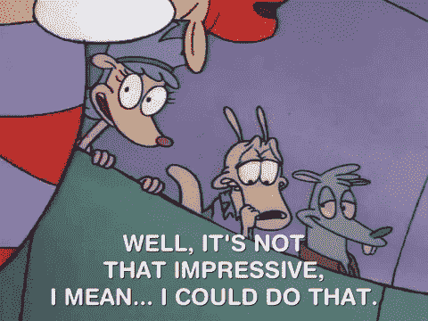
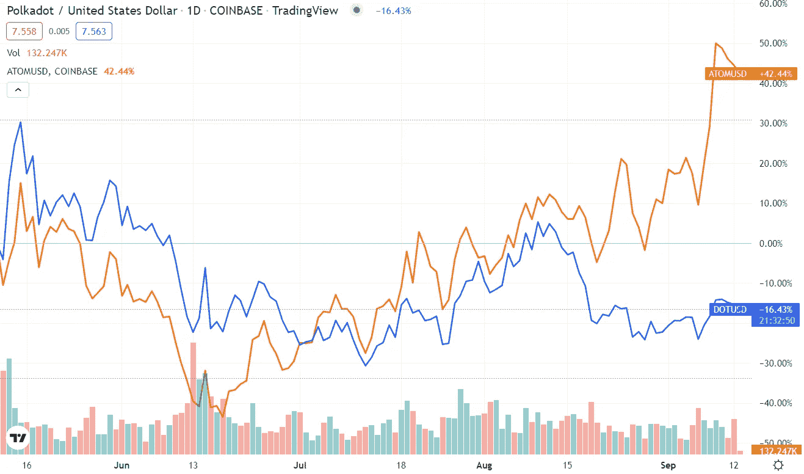
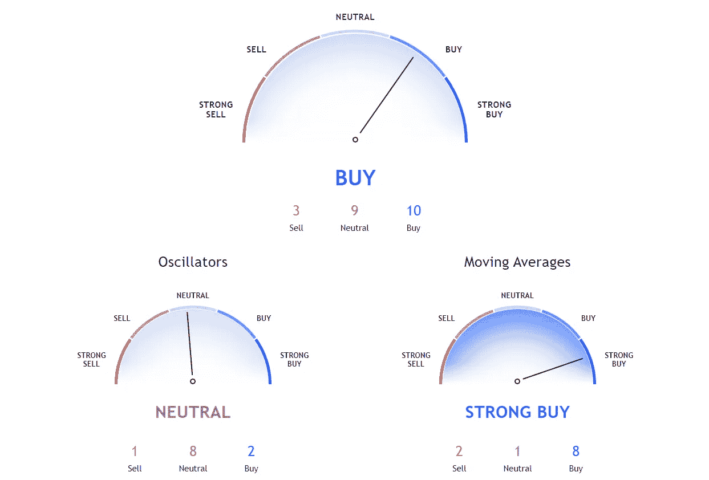

# 比特币基地有 5 种密码，绝对 100%保证在#ETHMerge 后上涨

> 原文：<https://medium.com/coinmonks/5-cryptos-available-on-coinbase-that-are-absolutely-100-guaranteed-to-go-up-after-the-ethmerge-eca1e9875d08?source=collection_archive---------2----------------------->

***这绝对不是 clickbait 头条***

说真的，你为什么点这个？[你认为我有答案吗？你认为有人知道吗？](/coinmonks/eth-urge-or-scourge-951d139e363a)

没有人知道在几个小时内会发生什么事情，因为这样的事情从来没有发生过。

以太坊从工作证明到利益证明的转换就好像一艘潜艇决定从柴油动力转换到核能动力。。。跑步的时候。。。地表下一千英尺。。。 ***被追的时候*** 。

Ethereum wants to do it with no downtime. Solana has downtime twice a month for no reason.

因此，当有人说合并可能会“[破坏互联网](https://www.fxstreet.com/cryptocurrencies/news/ethereum-merge-could-break-the-internet-according-to-preston-van-loon-202209111603)”时，你或许应该看看是哪种方式。因为也有聪明人认为扳动那个开关是个坏主意，要么是因为[复杂性](https://twitter.com/peter_szilagyi/status/1504887154761244673)要么是[集权](https://twitter.com/_Checkmatey_/status/1558215750422351875)。

Says someone who knows about losing proof of work.

以太坊的合并是一只翼龙大小的黑天鹅，所以任何说他们知道合并后的世界会发生什么的人都是在胡说八道。

当然，除了我。

pictured: me, watching my LUNA bags immolate in real time

我相信，无论联邦理工学院的合并如何，这些硬币在短期、中期和长期都会表现良好。一如既往:我不是理财顾问，不知道你具体的投资需求。我在某个时候拥有所有这些硬币，现在拥有一些，并且当你读这篇文章的时候可能会拥有一些。不足以说明问题。

不出所料，我认为第一枚硬币是。。。

# 比特币(BTC)

。。。没错。以太坊正在合并，买比特币吧。

我不想在 ETH 里有更多的重量。你也不应该，除非你认为在合并的瞬间它会呈指数抛物线增长。

尽管合并正在向前推进，以太坊背后的大脑似乎在努力工作，压制让亚瑟·海斯认为以太将达到五位数的疯狂猜测。更快的交易？降低汽油费？两倍甚至三倍的赌注收益率？Ethereum.org 在三个 T3 发出冰冷的噪音。

没有了所有失控的炒作，以太坊 2.0 开始有样子了。。。以太坊 1.0。只是少跑一会儿。当然，对于那些热衷于这类事情的人来说，它突然变得对 ESG 友好了。但是除非全世界都进入黑色星期五，否则没有实时压力——只有噪音。

每个想加入的人都已经加入了: *ETH 在过去的三个月里翻了一番*。当长期霍德勒在 alt 中获得利润时，他们会将其投入到国王加密中。

此外，比特币与以太坊的竞争是如此奇怪的派系斗争。就像苹果蜂和麦当劳之间存在巨大的竞争。他们提供了两种不同的东西，尤其是在以太坊进行股权证明之后。ETH 的收益不一定是 BTC 的损失。

也就是说，如果 PoS 确实是一个. .。好吧，顺便说一下，对于第二点来说，**实际上对比特币来说是个好消息。**

# 多边形(MATIC)

既然我们现在已经得到保证，合并不会加速交易或限制汽油费，这对第二层链来说是个好消息，它的功能就像以太坊的快速通道。其中，Polygon 不仅拥有最大的流量，还产生了各种与 ETH 无关的衍生价值，包括星巴克主题的元宇宙。

尽管你想嘲笑，但星巴克是应用忠诚度游戏的首批玩家之一。忠诚度积分是在 web2(或 web1)中长大的人理解加密货币的一种方式。赚取每日 metavers-ucino 是他们理解 NFTs 的方式。

这甚至还没有提到 [Polygon ID](https://twitter.com/0xPolygon/status/1508841855210852353) (它允许用户无需亲自验证凭证)和 [Avail](https://blog.polygon.technology/polygon-avail-launches-on-testnet-to-turn-monolithic-chains-modular/) (它允许**任何**区块链通过从自己的链外包交易数据来扩大自己的规模)。

不管合并如何进行，MATIC 都给自己定位得非常好。或者向上。

# 波尔卡多(点)

以太坊过渡到股权证明的唯一失败之处是合并速度不够快。这使得其他非 PoW 层区块链的行列在该领域获得了立足点，如由前以太坊大鱼 [Charles Hoskinson](https://en.wikipedia.org/wiki/Charles_Hoskinson) 创建的 Cardano (ADA)。但它们中的任何一个都不太可能像他们宣称的那样成为“以太坊杀手”，这意味着未来可能不是垄断，而是。。。不管垄断的对立面是什么？多倍体。

Wiktionary says it’s a word, so that means I’m right, but not original.

如果未来是多链的，就需要有互操作性，而 Polkadot 正处于这一领域。DOT 也有着超凡的血统，前联邦理工学院首席技术官[加文·伍德](https://en.wikipedia.org/wiki/Gavin_Wood)共同创建了这个项目并撰写了白皮书。

但是波尔卡多特也通过向高价竞标者提供定制的[仿链](https://parachains.info/)赚得盆满钵满，允许团队建立自己的网络。

宇宙是另一个区块链，它正在做很多同样的事情，但不同的是，原子已经引爆，使其近期低点翻倍。。。没有。

A giraffe vs. a pondskipper.

我喜欢 DOT 玩追赶游戏。

# 以太坊经典(等)

问题:当没有更多的乙醚可开采时，所有的乙醚矿工将去哪里？这是假设合并成功的话。如果它爆炸，用户可能会完全弃船前往不可伪造的原始以太坊区块链。

我也绝对不是第一个想出这个主意的人。ETC 在 6 月 18 日处于 12.50 美元的低点，到 8 月 13 日飙升至 45.75 美元，在撰写本文时回落到 40 美元以下。

但此举可能尚未完成:TradingView 的技术分析仍将 ETC 评级为 1 个月买入:

And here I will act like I know what that means.

最后:

# 莱特币

我们已经讨论了如果以太坊的过渡以任何方式失败，比特币等工作证明链将如何受益，这也将有利于 PoW 莱特币。但是如果合并成功，其他电力网的压力将继续增加，以使他们自己的开关变得不那么耗能。

比特币永远不会。媒介就是信息。工作证明和比特币永久融合。对比特币社区施加多大的社会压力，以及有多少爱管闲事的政客想要禁止它，都无关紧要。(我建议他们考察一下历史上对酒精、毒品、赌博和枪支等的禁令有多有效，但如果他们想到了这一点，他们就不会试图禁止工作证明加密货币。。。或者堕胎或者 32 盎司的软饮料。)

然而。。。莱特币很可能就是这么撬动的。他们的存在理由一直是比特币的一个不那么笨重、流通速度更快的版本——这就是他们的名字。如果不能全力以赴实现股权证明，其他将 ESG 纳入其未来的潜在投资者可能会简单地将 ETH 视为绿色能源，将 LTC 视为清洁燃烧的天然气，而比特币则是煤炭。

# 那么，下一步是什么？

我告诉过你，我不知道，其他人也不知道。

文暴涨？

🌻🌻🌻🌻🌻🌻🌻🌻

[在推特上关注我](https://twitter.com/HODL4GoodTWEETS)。进入游戏。

> 交易新手？试试[密码交易机器人](/coinmonks/crypto-trading-bot-c2ffce8acb2a)或[复制交易](/coinmonks/top-10-crypto-copy-trading-platforms-for-beginners-d0c37c7d698c)