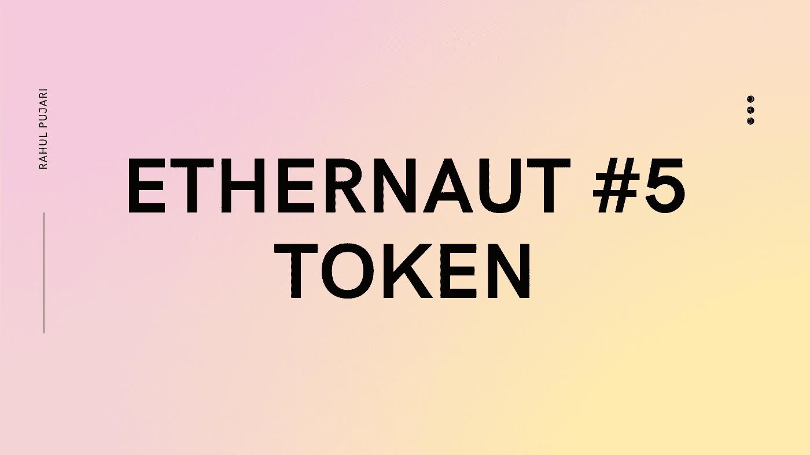
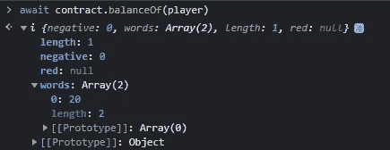
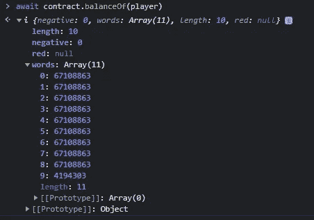

# #5-以太网挑战 5-令牌

> 原文：<https://medium.com/coinmonks/5-ethernaut-challenge-5-token-e4dfaf1f249c?source=collection_archive---------46----------------------->



# 理解代码:

```
// SPDX-License-Identifier: MIT
pragma solidity ^0.6.0;

contract Token {

  mapping(address => uint) balances;
  uint public totalSupply;

  constructor(uint _initialSupply) public {
    balances[msg.sender] = totalSupply = _initialSupply;
  }

  function transfer(address _to, uint _value) public returns (bool) {
    require(balances[msg.sender] - _value >= 0);
    balances[msg.sender] -= _value;
    balances[_to] += _value;
    return true;
  }

  function balanceOf(address _owner) public view returns (uint balance) {
    return balances[_owner];
  }
}
```

有一个 balances 的映射，它将用户的地址信息与他们的地址 uint 值存储在一起。totalSupply 变量跟踪所有创建的令牌供应。

一旦部署了契约，就执行构造函数，它在 balances 映射中将部署者地址下的总供应量和初始供应量设置为相等。

> 交易新手？在[最佳密码交易所](/coinmonks/crypto-exchange-dd2f9d6f3769)上尝试[密码交易机器人](/coinmonks/crypto-trading-bot-c2ffce8acb2a)或[复制交易](/coinmonks/top-10-crypto-copy-trading-platforms-for-beginners-d0c37c7d698c)

传递函数需要传递两个参数，目的地址和以太值。该函数检查发送方的余额(当扣除要转账的乙醚值时)是否大于 0，以确保金额可以转账。一旦支票兑现，从发送方地址的余额映射中减少金额，并增加接收方地址的余额。

在 balances[msg.sender] -= _value 行中，此函数看起来很弱。我们可以在这一行触发算术下溢。

balanceOf 函数只是返回所有者的余额。

现在，我们需要理解 solidity 中的下溢和上溢的概念。你可以在这里查看我简短的 2 分钟阅读博客。一旦你理解了下溢和上溢，我们就可以破解合同了。

# 怎么黑这个合同？

1.  去控制台输入**await contract . balance of(player)。这表明您的账户在地址映射上的余额为 20 英镑。**



2.在控制台上，使用参数(一个随机以太坊地址，值 20+1)触发函数 transfer，这样您的命令将类似于**contract . transfer(' 0x04b 24656 E4 b 114 E4 ef 83 f 40 a 1161d 1804 e 684d 89 '，20+1)。**

> 现在将会发生的是，当您转移代币时，首先，支票通过，因为它将是 **20 -20 +1 ≥ 0** 这是真的，我们转到下一行 balances[msg . sender]-= _ value；这里发生的情况是，你名下的余额**减去 20，再减去 21** ，得到 20–21**=-1。**因此，会出现算术下溢，合同被黑。



3.恭喜黑了合同！

# 预防措施:

1.  每当您部署协定时，请在代码中使用 SafeMath 库。

感谢您读到这里！

如果您觉得这很有帮助，请一定要鼓掌并关注更多内容:)

> 加入 Coinmonks [电报频道](https://t.me/coincodecap)和 [Youtube 频道](https://www.youtube.com/c/coinmonks/videos)了解加密交易和投资

# 另外，阅读

*   [用于 Huobi 的加密交易信号](https://coincodecap.com/huobi-crypto-trading-signals) | [HitBTC 审核](/coinmonks/hitbtc-review-c5143c5d53c2)
*   [TraderWagon 回顾](https://coincodecap.com/traderwagon-review) | [北海巨妖 vs 双子星 vs BitYard](https://coincodecap.com/kraken-vs-gemini-vs-bityard)
*   [如何在 FTX 交易所交易期货](https://coincodecap.com/ftx-futures-trading)
*   [OKEx vs KuCoin](https://coincodecap.com/okex-kucoin) | [摄氏替代品](https://coincodecap.com/celsius-alternatives) | [如何购买 VeChain](https://coincodecap.com/buy-vechain)
*   [ProfitFarmers 点评](https://coincodecap.com/profitfarmers-review) | [如何使用 Cornix 交易机器人](https://coincodecap.com/cornix-trading-bot)