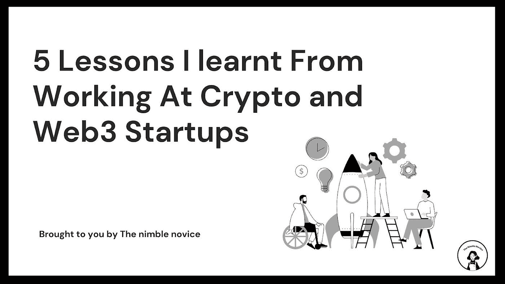

# 我从在 Crypto 和 Web3 初创公司工作中学到的 5 个教训

> 原文：<https://medium.com/coinmonks/5-lessons-i-learnt-from-working-at-crypto-and-web3-startups-179bc0a8bda5?source=collection_archive---------13----------------------->

在风投的资助下，远程工作和许许多多社交聚会的承诺听起来像是一个梦，对吗？算是吧。但也不尽然。

如今，Crypto/Web3 初创公司风靡一时，许多公司都试图打入这个“新生”领域。

不管那是什么意思。

在我们因为集体缺乏注意力广度而跳到这个列表之前，这里有一些关于我的事情让我变得有点可信。

我在内容、媒体和通信领域工作，自 2021 年 6 月以来一直是加密领域的一部分。

**我的经历:**

*   1 VC
*   3 家加密创业公司
*   1 个加密交换机
*   被另外三家创业公司雇佣为自由职业者。
*   我也不时为 web3 出版物撰稿。

好了，现在我们已经解决了这个问题，下面是我学到的 5 件事。

## 预计会有一大堆没有什么意义的流行语

这是个玩笑，但是相信我，这是真的。尤其是在 web3 中，许多项目甚至还没有概念的工作证明。

带着一个想法(有时可能不幸是一个抢钱的机会)和他们华丽的套牌，他们得到了那张甜蜜的风投支票。怎么会？在 web3 中获胜(或失败)的潜力是巨大的，许多人都来自相当成熟的 tradfi/web 2 背景。

投资者的名字，冒险是游戏。

你会听到诸如“监管”、“基础设施”、“机构”、“分析”和“协议”之类的东西。很有可能，你不知道所有这些在你工作的创业公司中意味着什么，因为产品和使命总是在发展。

会有很多术语被抛出，但几乎没有人能 100%清楚他们在构建什么。和每一个创业公司一样，不管是什么行业，公司都还在搞清楚他们的身份。

所以不要灰心丧气，要和团队一起努力。罗马不是一天建成的坚持到底，如果真的不行，你会带着一些经验离开。

## 准备好建立系统和领导(因为他们真的是无组织的 lol)

创业公司无法击败跨国公司的一件事是建立有效的系统。不要误解我的意思，我知道系统是必要的，但我也认为它们需要迭代和服从变化。如果遵循一个系统会导致更低的效率，那就糟透了，我讨厌它。

总之，回到创业。

创业公司发展迅速。Web3 初创公司发展更快。根据你的角色和职能，明智的做法是建立一个系统，与团队沟通事情进展如何，进度如何跟踪等。

你的老板会非常欣赏这一点，因为当他们出去与投资者交流和推销时，他们可以相信他们的团队能够管理端到端的功能。如果你能减轻他们的负担，他们会更加重视你。

> 💡小贴士:如果你觉得自己已经做了很多，一定要进行中期检查，并要求加薪。

哦！确保你展示了你的工作，这样你就能证明你所做的提高了效率。

## 你将身兼数职

创业公司创始人来自各行各业。有人以前是高管，而有人是连续创业者，他们会管理和期望不同的事情。无论如何，他们也在学习如何管理公司内部的所有职能，因此很自然，在开始时，角色不会那么专业化。

对于大多数初创公司来说都是如此，但对于加密初创公司来说尤其如此。特别是如果你的职能是营销，而你的上级是*fin bros*……他们会希望你处理从数字、内容、社交媒体营销、传播和公关到创建抵押品的一切，因为他们认为这些都属于“营销”。

你应该告诉他们，你需要一个更精简的工作流程，或者你需要一个更大的团队。他们中的一些人会试图削减成本，但是一个好的老板会倾听。(他们存在，我保证！)

## 正常人会评判你(但那是他们的事，我们正在建设未来的 XD)

如果当我提到我是 web3 革命的一部分时，我得到的那种居高临下的“ohhh”的次数是一美元，那么比特币被遗忘不会对我产生太大影响。

但是，我什么也不会改变。闯入 Web3 是我为自己做的最好的事情。网络、远程工作和改变传统世界运作方式的集体努力？有人看到风险，我看到机会。如果你感兴趣，我在这里写下了我的想法[。](/coinmonks/how-i-broke-into-crypto-and-web-3-0-7ac5d388cd3f)

## 永远要有一个后备计划，尤其是当你觉得因为它的发生而失去信心的时候

NGL，这次熊市已经对很多人造成了影响。虽然我很幸运拥有我所拥有的机会，但我的投资组合并不乐观，但这并不是我很难保持乐观的主要原因。抢现金的项目，有声望的人变成骗子，还有大量的人制造狗屎，却不能解决现有的问题，这让我既好笑又沮丧，所以重要的是不要把你的身份建立在“web 3 中的某个人”的基础上。

障碍的存在是有原因的，虽然这种可及性是前所未有的，但它揭示了人类有多么贪婪，我们需要被控制。我仍然看到自己在这个空间工作，但我不会把所有的希望都寄托在这里。*(多元化阿米利特？因此，我会不断地教自己新的东西，紧跟潮流，并尝试涉足其他行业。我建议你也这样做，但是我真的不能控制你做什么，所以我希望这至少能给你一些启示！下次见！*

# 关于

“敏捷新手”是一个充满激情的项目，在这里我记录我对任何事情的学习。我是一名内容战略家/设计师、作家和终身学习者。我有很多兴趣，但我主要写自由职业、生产力、数字营销、加密/区块链，偶尔也写流行文化。

[Linkedin](https://www.linkedin.com/in/natalie-khoo%E9%82%B1%E7%8F%BA%E5%AE%81/)|[Twitter](https://twitter.com/gr00vyfairy)|[跟我一起工作](https://nataliekhoocontent.super.site/) | [Lemon8](https://s.lemon8-app.com/s/hwYrvTSrYR)

> 交易新手？尝试[加密交易机器人](/coinmonks/crypto-trading-bot-c2ffce8acb2a)或[复制交易](/coinmonks/top-10-crypto-copy-trading-platforms-for-beginners-d0c37c7d698c)