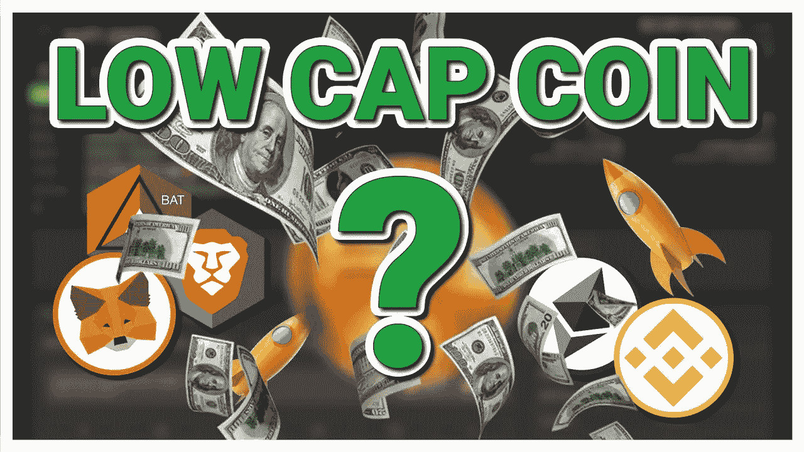
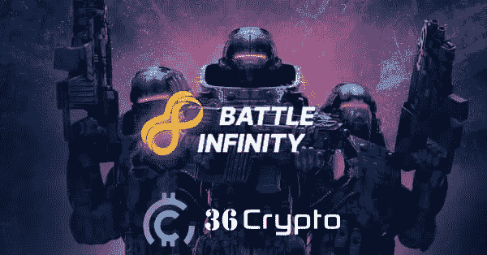
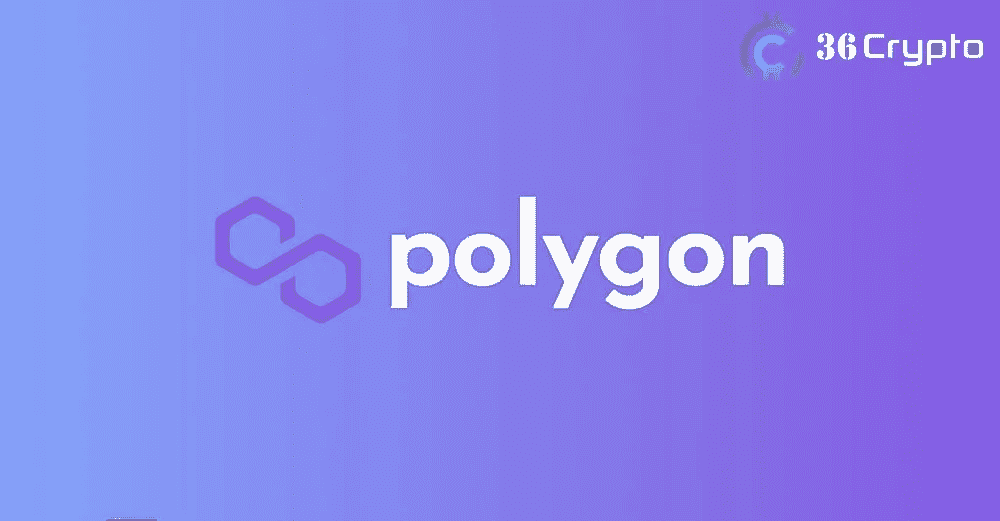
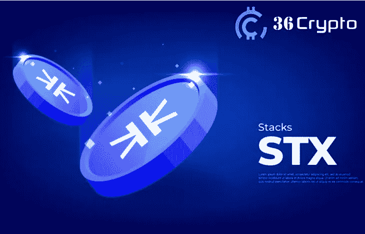
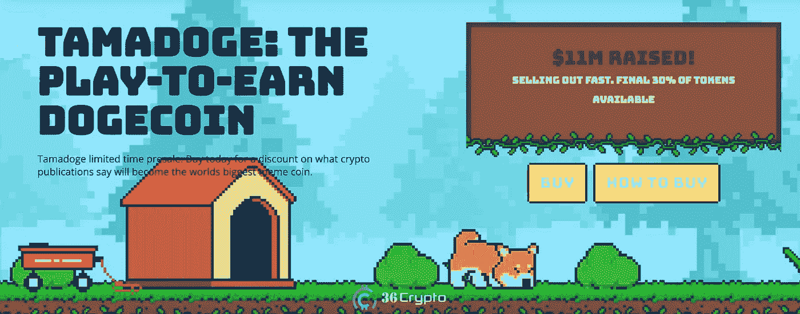
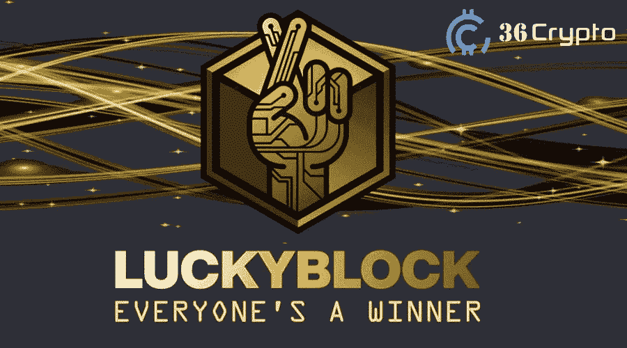

# 5 低市值加密货币将于 9 月投资

> 原文：<https://medium.com/coinmonks/5-low-market-cap-cryptocurrency-to-invest-in-september-c61b0abd981d?source=collection_archive---------20----------------------->

对一些投资者来说，投资供应量或市值较低的加密货币是一个不错的策略。他们倾向于关注新的加密项目，这些项目目前不是很受欢迎，而且价格非常低。

这些类型的加密货币最终会带来 10 到 100 倍的投资收益。很难找到这样具有良好增长潜力的硬币，这就是为什么我写了这篇文章给你指出一些低市值的最佳投资项目。

这些项目可能会导致未来价格大幅上涨。市场上大多数大型加密软件都是以低价起步的。例如，以太坊在 2014 年首次作为 ICO 发行时售价不到 1 美元，快进到 2022 年，我们可以看到该项目经历了显著增长。

继续阅读下面的内容，了解我们在 9 月份投资的 5 种有前途的加密货币。

# 2022 年最佳低市值加密货币投资

应该注意的是，虽然这些密码目前的市值较低，但它们在未来可能会带来非常好的增长机会。投资于长期盈利的项目总是最好的，因为考虑到加密市场的波动性，这被视为更有利可图。

排名不分先后:

*   战斗无限(IBAT)
*   多边形(MATIC)
*   堆栈(STX)
*   塔马多吉(TAMA)
*   幸运积木

让我们仔细看看上面列出的低上限和非常好的增长潜力的加密货币。

# 1.战斗无限(IBAT)

元宇宙一直是加密货币未来的主要主题之一。战斗无限是一个元宇宙的游戏项目，它的本土令牌 IBAT 已经获得了势头和关注有一段时间了。

由于该项目处于预售阶段，它的市值相对较低，当它完全投入使用时，它可以提供良好的利润。Battle Infinity 计划举办多种加密货币游戏 [play-to-earn 游戏](https://36crypto.com/top-5-nft-games-to-play-in-2022/),一旦用户参与，就可以获得加密货币奖励。

投资者还可以在元宇宙现场互动和观看比赛。战斗无限有几个其他产品，如战斗互换，IBAT 超级联赛，战斗竞技场，战斗赌注，战斗市场和战斗游戏。

使用[币安币(BNB)](https://36crypto.com/what-is-bnb-binance-coin-and-what-is-it-used-for/) 可以购买 IBAT 令牌。1 BNB 等于 166，666.666 IBAT 硬币。

[这里**买 IBAT**这里](https://battleinfinity.io/)

# 2.多边形(MATIC)

多边形背靠[币安](https://36crypto.com/binance-review-for-2022/)和[比特币基地](https://36crypto.com/coinbase-review-2022/)。它最初被称为 Matic 网络。根据比特币基地的[帖子，“Polygon 是一个侧链扩展解决方案，与](https://www.coinbase.com/learn/crypto-basics/what-is-polygon#:~:text=Definition,fees%2C%20staking%2C%20and%20more.)[以太坊区块链](https://36crypto.com/what-is-ethereum-and-how-is-it-different-from-bitcoin/)并行，允许快速交易和低费用。”

MATIC 是多边形网络的本地令牌。Polygon 每秒处理约 65，000 个事务，块确认速度为两秒。

它于 2019 年推出，售价为 0.004 美元。它在这个价格上交易了很长时间，直到 2021 年以太坊的伦敦 Hard Forkd 上线，并在同年年底看到价格飙升至 2.870 美元的历史高点。

截至撰写本文时，每 MATIC 的价格为 0.8859 美元。

[**在此购买 MATIC**](https://www.binance.com/tr/trade/MATIC_BUSD?_from=markets&theme=dark&type=spot)

# 3.堆栈(STX)

栈，原名 Blockstack。是一个开源的 DApps，是一个建立在比特币网络上的智能合约。它通过允许开发者在其他应用上构建来提供开源增长。

栈通过“转移证明”与比特币相连，这是一种跨越两个链的共识机制，允许矿工用比特币支付，以铸造新的 STX 令牌。STX 是该平台的本机令牌，用于处理智能合约。

2021 年 11 月，STX 达到了 3.61 美元的历史高点，而今天，每股 STX 的价格为 0.3676 美元。这是你应该购买的低市值加密货币之一。

[**在此购买 STX**](https://www.binance.com/tr/trade/STX_BUSD?_from=markets&theme=dark&type=spot)

# 4.塔马多吉(TAMA)

Tamadoge 是一种 meme 币，是 doge 生态系统中的最新产品，已被列为顶级低供应加密货币之一。它仍处于预售阶段，在预售的前两周内已经筹集了超过 100 万美元的资金。

这个生态系统允许用户铸造他们的 Doge，并通过繁殖、训练和与他们的 Tamadoge 战斗每月赚钱。换句话说，Tamadoge 是一个游戏赚钱平台，允许投资者拥有一只 doge 宠物并与之互动。

只有 20 亿 TAMA 硬币供应可用，这意味着它有一个有限的供应和价格可能会受到通货膨胀的影响时，他们的需求。Tamadoge 是最便宜的加密软件之一，供应量很低，但有很好的发展潜力。您可以从下面的预售网站购买 TAMA。

[这里买 TAMA**这里买**](https://buy.tamadoge.io/)

# 5.幸运积木

幸运街区是 NFT 的一个竞赛平台。这是一个“[基于区块链](https://36crypto.com/blockchain-definition-what-is-blockchain-technology-and-how-does-it-work/)”的在线彩票协议，它允许透明、公平和安全的游戏。您可以购买 NFT，赢得奖品，还可以因持有幸运块 NFT 而获得奖励。

价格包括国际足联世界杯门票、100 万美元的比特币以及汽车。Lucky Block 于 2022 年推出，在推出的第一个月内就已经取得了显著增长。这枚硬币在 2022 年 1 月从发行时的 0.002 美元升至 0.009 美元的历史新高。

LBLOCK 已经吸引了一些最佳投资者的注意，也有一些著名的品牌大使。今天，根据 [Mex](https://www.mexc.com/exchange/LBLOCK_USDT) 的信息，LBLOCK 的价格为 0.000839 美元。

[**在此购买 LBLOCK**](https://www.mexc.com/exchange/LBLOCK_USDT)

*免责声明:以上帖子中表达的观点仅代表发表该帖子的作者，绝不是建议。我们总是建议你在投资任何数字资产之前做好自己的研究，因为它们以高波动性而闻名。无论你对这个帖子上传递的信息做什么，都是你自己的决定。*

最初发布于 [36crypto](https://36crypto.com/5-low-market-cap-cryptocurrency-to-invest-in-september/)

> 交易新手？试试[加密交易机器人](/coinmonks/crypto-trading-bot-c2ffce8acb2a)或者[复制交易](/coinmonks/top-10-crypto-copy-trading-platforms-for-beginners-d0c37c7d698c)