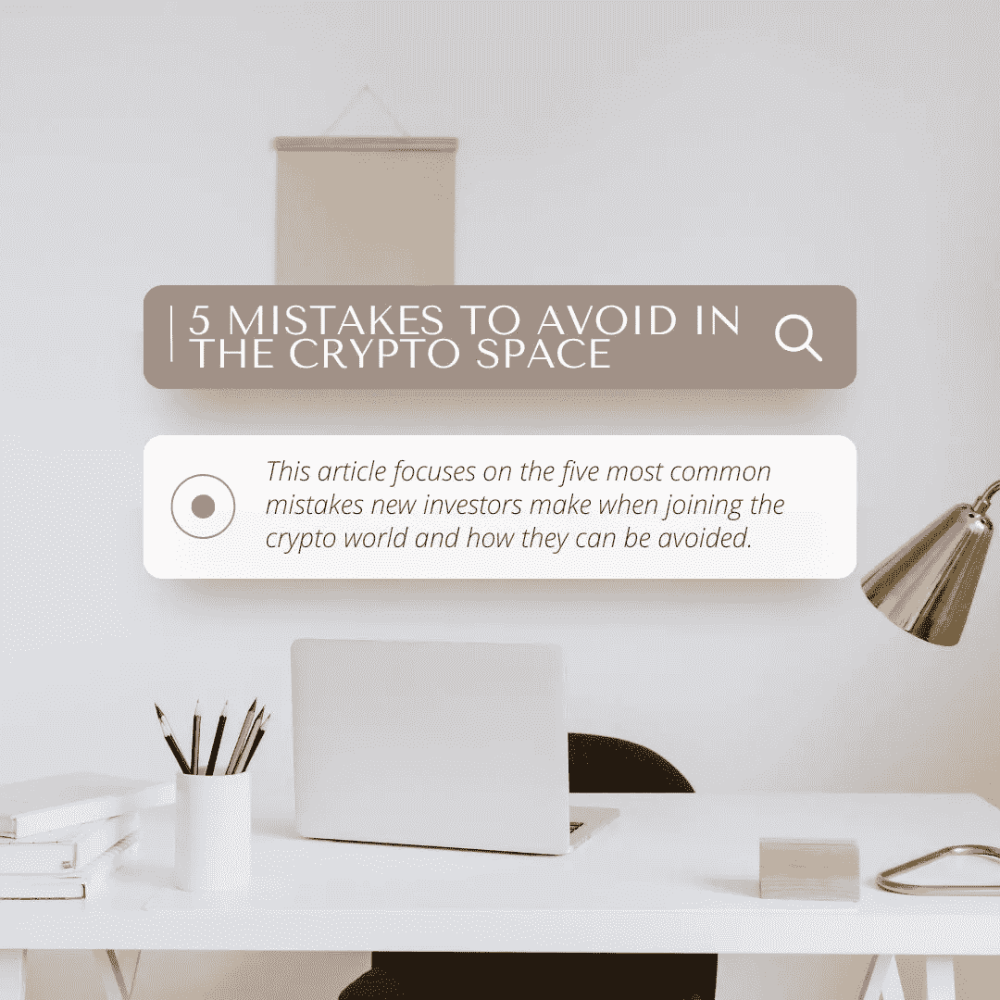

# 在加密领域要避免的 5 个错误

> 原文：<https://medium.com/coinmonks/5-mistakes-to-avoid-in-the-crypto-space-bbfb22f0a0e?source=collection_archive---------14----------------------->

***本文重点介绍新投资者在加入加密世界时最常犯的五个错误，以及如何避免它们。***

# 介绍

投资加密货币和其他数字资产从未如此简单。由于在线经纪人和受监管/分散的交易所，投资者可以在网上买卖代币，而无需使用传统的金融机构以及随之而来的高昂费用和罚款。加密货币旨在以分散的方式工作。这表明，尽管它们为全球点对点价值转移提供了一种新的途径，但没有可靠的权威机构来保证你的资产安全。一旦你拥有了你的数字资产，你的不幸就成了你的问题。在正确的时刻投资正确的加密货币需要运气，但知识和准确性更为关键。错误一个接一个，只有那些不断完善财务策略的人才能持续跑赢市场。

加密货币交易中的错误很容易发现，但对于新手投资者来说，避免这些错误可能很难，特别是考虑到其中涉及的重大风险。然而，由于涉及到巨大的风险，每个加密货币交易者都应该花一分钟来思考投资的逻辑和战术，对将发生的事情有一个现实的预期，并有一个合适的退出策略。

以下是一些新手可能会犯的错误，以及避免这些错误的潜在方法:

# 1.缺乏对加密货币及其市场的研究和了解

了解密码学的基础知识会让你的道路更加顺畅。有了独立评估计划的能力，你将利用重大的机会。许多其他加密货币与比特币协同工作。如果掌握了这些联系，就可能做出好的、代价高昂的投资决策。加密货币交易商意识到了这些动态，并利用它们来赚钱。此外，这个过程需要一段时间。然而，随着你学习的深入，你会进步的。您可以访问每种货币的网站和公告。调查硬币的经济性，考虑其市场资本总额、交易量、价格历史、总发行量，甚至考虑其他专家的意见。

# 2.非多样化投资组合和对廉价硬币的投资

无论投资看起来多么诱人，都要避免单调。每一个经验丰富的投资者都会分散他们的投资来对冲或保护他们的风险。建议拥有至少五枚硬币。同样，不要在幻想豪华轿车和昂贵喷气式飞机的时候追逐小硬币。许多新手加密货币购买者购买便宜的加密货币，认为他们成功的机会更高。这是一个标准错误。硬币的发行量和实际市场价值是影响硬币定价的两个重要因素。

# 3.超出要求的过度交易

一些投资者，主要是新手，设定了每天 15-20 笔交易的目标。这很危险。因为费用，或者因为他们做了糟糕的交易，然后进一步交易以弥补损失，他们中的一些人最终亏损了。事实上，并不是每天都有 20 个好的交易机会。糟糕的决策是过度交易的结果。交易过多会增加你的纳税义务。

# 4.要么过度投资，要么无力 HODL

由于加密货币市场通常非常不稳定，许多交易者出于情绪，表现出不耐烦的迹象。因此，保持耐心并经历整个市场周期——熊市和牛市——是至关重要的，同时要坚持你的投资。这需要耐心和对市场的了解。

# 5.不可逆转的灾难

所有上述错误普遍存在，尤其是。在新投资者中。然而，一些错误可能会让你损失整个钱包和收入！

## a.丢失区块链密钥

区块链的生态系统围绕着一个不那么集权的体系，让资产所有者成为他们唯一的保管人。因此，只要他们有密钥，只有他们才能完全控制他们的资产。私钥对于区块链上的交易是必不可少的，它们控制着谁可以访问你的账户。这也意味着，如果你把钥匙放错了地方，你将永远无法使用钱包里的资产。

## b.地址输入错误

投资者有时会不小心把资产送到钱包里，但却错误地弄乱了地址。这种错误经常发生，而且是不可逆的混乱。与其他交易不同，在这种情况下，没有监管或客户服务可以帮助你！这可能会影响一个人的整个投资组合，造成灾难。

# 结论

前面提到的错误只是新的加密投资者最常犯的一些错误。然而，总有学习和提高的空间。投资者必须始终研究和跟上加密生态系统，并做出他们认为最有利于他们的决策，同时将风险降至最低！

# 免责声明:

我是一名金融分析师，分享观点仅供学习和参考。我不是你的顾问，你也不应该根据我的工作进行交易。在进行任何金融交易之前，一定要咨询你的独立财务顾问。我假设市场参与者的任何交易都没有造成损失或损害。

# 最后:

如果你喜欢我的作品，请为我鼓掌！这将有助于我接触更多的人。也会提升我的士气，我会更多的分享我的作品！非常欢迎你的评论。也欢迎你不同意我的观点！

在推特上关注我:[www.twitter.com/bilalahsanelahi](http://www.twitter.com/bilalahsanelahi)

> 交易新手？试试[密码交易机器人](/coinmonks/crypto-trading-bot-c2ffce8acb2a)或者[复制交易](/coinmonks/top-10-crypto-copy-trading-platforms-for-beginners-d0c37c7d698c)