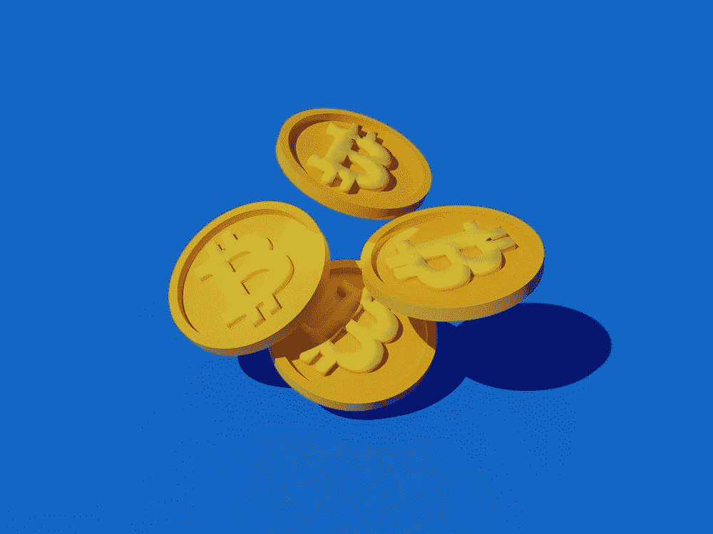

# 5 位最著名的比特币批评者

> 原文：<https://medium.com/coinmonks/5-most-prominent-bitcoin-critics-cabc9ce49943?source=collection_archive---------35----------------------->

自 2009 年首次推出以来，比特币已经走过了漫长的道路。在过去的十年里，加密货币已经从一种小众的利益发展成为一种拥有全球追随者的主流金融技术。然而，并不是所有人都是比特币的粉丝。有许多批评者表达了他们对加密货币的担忧——其中一些可能会让你感到惊讶。