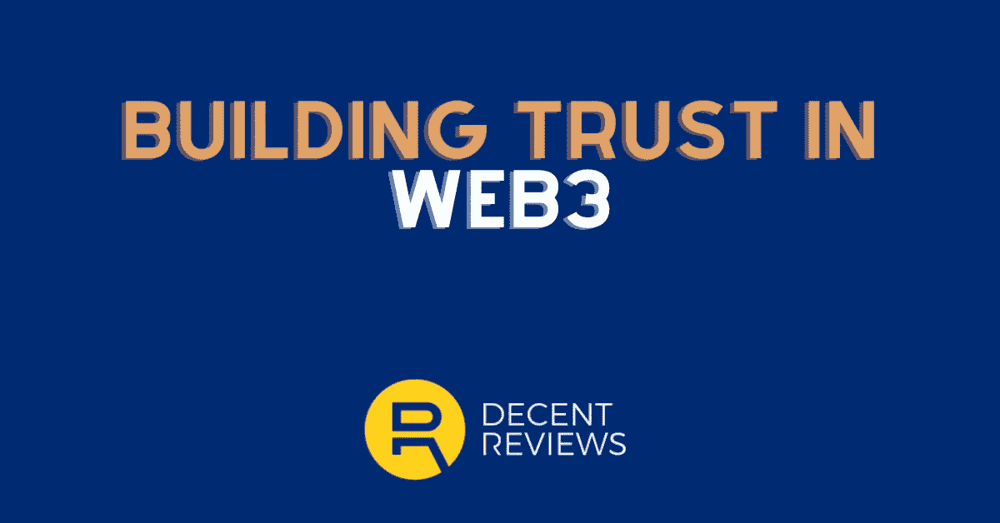

# 在网络中建立信任的 5 大支柱 3 — DecentReviews 博客

> 原文：<https://medium.com/coinmonks/5-pillars-of-trust-building-in-web3-decentreviews-blog-8ca521a631de?source=collection_archive---------51----------------------->

信任。

信任是获得新客户、销售更多产品和产生轰动的关键。

信任是任何企业发展的核心。

如果缺乏，新的潜在客户不会给你时间。玷污你的声誉，你现有的客户将会寻找竞争对手…