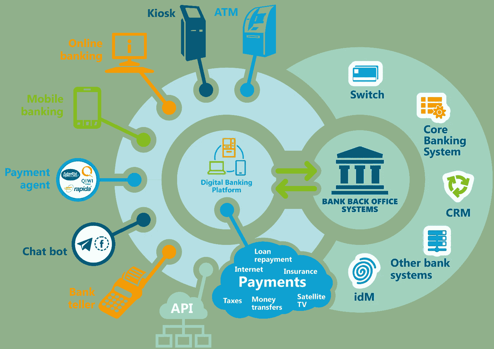
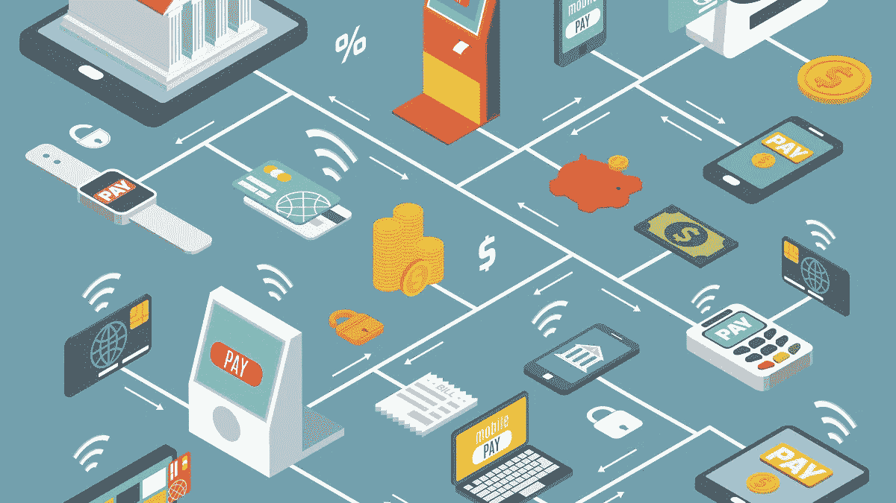

# 2023 年金融科技的 5 大流行趋势——新的开始！

> 原文：<https://medium.com/coinmonks/5-popular-fintech-trends-to-expect-in-2023-new-beginnings-354837eafb47?source=collection_archive---------36----------------------->

金融科技快速发展；数字解决方案正在取代传统的银行业务，以提高效率并支持中小企业和个人的跨境支付。举几个在通货膨胀期间满足客户期望的解决方案，如借贷应用、加密货币交易所、储蓄应用、投资平台和货币兑换工具。此类解决方案的发展引发了重塑现代金融世界的新趋势。

在下面的部分，我们将一起探讨 2023 年金融科技趋势对客户期望的影响。

> 从顶级交易者那里复制交易机器人。免费试用。

# 现在购买以后付款(BNPL)

增加税收、利率和动荡的市场是一场噩梦，对买家的购买力有负面影响。BNPL 可以帮助买家以具有竞争力的利率和付款条件轻松分期付款获得他们需要的任何东西。根据[商业内幕](https://www.businessinsider.com/buy-now-pay-later-bnpl-key-trends-impacting-fintechs-2022-7)的一份报告，BNPL 服务是金融科技领域发展最快的趋势之一。

列举一些好处，BNPL 为客户提供了一种方便的理财方式。第二，企业可以培养顾客的忠诚度，提高销售额。客户获得了便利和更快购物的能力。大多数 BNPL 应用程序不收利息。这意味着，如果你按时支付所有款项，你就可以免费使用这项服务。PayPal Pay and affirm 不收取任何滞纳金。

# 无接触技术

非接触式技术是疫情的礼物。如今，顾客要求快速付款，而不必排队等候。Apple Pay、Samsung Pay 和 Google Pay 等主要公司在非接触式支付领域处于领先地位，但 Visa PayWave、Square wallet 和 venom 等其他公司可以促进全球的大规模采用。

根据普华永道的一份报告，全球移动支付交易预计将从 2017 年的 3960 亿美元增长到 2022 年的 1.08 万亿美元。推动增长的因素是比传统磁条卡更安全的 EMV 芯片卡的使用。此外，支持 NFC 的移动设备作为一种支付形式，允许客户使用智能手机或智能手表进行非接触式支付。

# Fintech 超级 App

用户的首选是拥有一个提供一体化解决方案的应用程序！一款金融科技超级应用服务于这一目的。超级应用越来越受欢迎；许多崭露头角的金融科技初创公司正计划用一种可持续的金融产品来激励他们的客户，在需要的时候依靠这种产品。这些超级应用以移动优先的思维模式构建，帮助用户进行金融交易，而不必等待任何批准或延迟。这些金融科技应用的准入门槛低于传统金融科技公司。这是因为它们是建立在消息应用或社交网络上的。

# 纯数字银行或新银行

纯数字银行，也被称为**新银行**，提供与传统银行相同的服务，但没有实体足迹。Neobanks 比传统银行有优势，包括对客户的快速响应时间、低启动成本、高质量的用户体验、安全的交易和较低的交易费用。

*在接下来的几年里，当更多的人知道它们的好处时，它们在金融市场的渗透将会增加。*

# 区块链改变金融格局

区块链技术支持可信环境，支持验证、可追溯性、数据保护和合同执行等金融活动。据 [BankDirector](https://www.bankdirector.com/issues/technology/top-5-fintech-trends-now-and-in-the-future/) 称，在区块链金融科技的帮助下，用户可以*通过分散的应用程序直接相互交易、借贷和交换资产，而不是依赖于中介。*

权力下放的支持者坚持认为，这将降低大规模金融危机的风险，因为整个国家的财政将不再依赖于少数几家大银行。《福布斯》强调，国际转账缓慢且成本高昂，区块链可以以令人难以置信的速度和安全性以及较低的成本解决这些时间线。当科技公司不得不进行大规模裁员时，如果数据存储在区块链的人力资源应用程序中，可用的人才库可以远程聘用。

# **创新金融科技商业模式的新兴技术**

计划从金融科技创新趋势中受益的企业应关注下列技术:

**支持语音的交易。使用 Alexa 和 Siri 这样的平台，人们可以发出语音命令来执行金融交易，如支付。在不久的将来，语音识别也将成为一种安全方法。**

**物联网(IoT)。**当 Fintech 将物联网集成到其中时，金融机构和银行部门可以支持优质的客户服务和数据保护。用户可以使用某些可穿戴设备进行数字支付，如智能手机、智能手表，甚至 Apple Pay 等应用程序。

**大数据。**大数据使公司能够根据客户的财务状况更准确地细分和描述客户，从而提供最佳解决方案。虽然欺诈是数字银行领域的一个常见问题，但大数据可以通过早期识别任何可疑活动，帮助金融科技开发准确的欺诈检测系统。

# **金融科技趋势对你的企业意味着什么？**

那么，2023 年金融科技的这些新发展对你的企业意味着什么？答案和你的商业想法一样独特。为了找出这些技术对你的作用，问问你未来几年的目标是什么。你是一个寻求更高顾客忠诚度的零售商吗？也许一个 BNPL 选项可以让顾客回头客。您是想要削减成本的小企业吗？考虑使用 **neobank** 来利用低廉的银行费用。你想雇佣远程人才但跨境支付是阻碍吗？如果是中东业务，使用' **TAG** '、 **Easy Paisa** '(只收钱)或' **Naya Pay** '不要因为新技术是新的就使用它，使用它是因为它将帮助你的组织转变以符合你的愿景。

# **包装**

这些只是 2023 年你应该关注的几个重要趋势，因为它们预计将主导该行业。

**订阅*技术人员笔记本*了解所有最新的技术见解！**

*原载于*[*https://www.linkedin.com*](https://www.linkedin.com/pulse/5-popular-fintech-trends-expect-2023-new-beginnings-sana-ahmad/?trackingId=9GI40s5QT%2F6uCDaVDZbvsg%3D%3D)*。*

> 加入 Coinmonks [电报频道](https://t.me/coincodecap)和 [Youtube 频道](https://www.youtube.com/c/coinmonks/videos)了解加密交易和投资

# 另外，阅读

*   [AscendEx 保证金交易](https://coincodecap.com/ascendex-margin-trading) | [Bitfinex 赌注](https://coincodecap.com/bitfinex-staking) | [bitFlyer 点评](https://coincodecap.com/bitflyer-review)
*   [Bitget 回顾](https://coincodecap.com/bitget-review)|[Gemini vs block fi](https://coincodecap.com/gemini-vs-blockfi)cmd |[OKEx 期货交易](https://coincodecap.com/okex-futures-trading)
*   [AscendEx Staking](https://coincodecap.com/ascendex-staking)|[Bot Ocean Review](https://coincodecap.com/bot-ocean-review)|[最佳比特币钱包](https://coincodecap.com/bitcoin-wallets-india)
*   [霍比评论](https://coincodecap.com/huobi-review) | [OKEx 保证金交易](https://coincodecap.com/okex-margin-trading) | [期货交易](https://coincodecap.com/futures-trading)
*   [网格交易机器人](https://coincodecap.com/grid-trading) | [Cryptohopper 审查](/coinmonks/cryptohopper-review-a388ff5bae88) | [Bexplus 审查](https://coincodecap.com/bexplus-review)