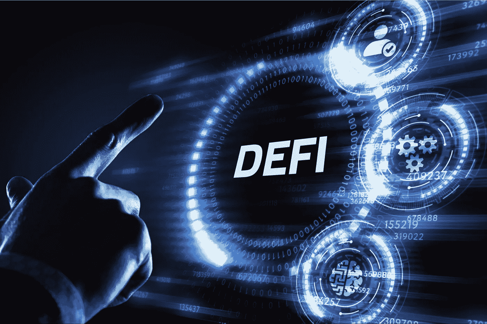

# 分散化金融(Defi)解决的 5 个问题

> 原文：<https://medium.com/coinmonks/5-problems-that-decentralised-finance-defi-solves-e7a386297632?source=collection_archive---------25----------------------->

[https://assets.entrepreneur.com/content/3x2/2000/1626792154-shutterstock-1880148124.jpg](https://assets.entrepreneur.com/content/3x2/2000/1626792154-shutterstock-1880148124.jpg)

当前的银行系统(中央集权金融)已经有将近 100 年的历史了，我们几乎没有增长。多个金融科技公司正努力提高银行系统的效率，但它们只是在给猪涂口红。增量变化已经完成，但核心问题仍然存在。

集中金融中仍然存在的五个基本问题是**集中控制、有限访问、低效、缺乏互操作性和不透明**。

分散金融，也称为 Defi，使用加密货币和区块链技术来管理金融交易。Defi 旨在通过用点对点关系取代传统的集中式机构来实现金融民主化，点对点关系可以提供全方位的金融服务，从日常银行业务、贷款和抵押贷款到复杂的合同关系和资产交易。

在本文中，我们将讨论中央银行系统的问题，旨在解决上述 5 个问题。

**集中控制**——我们的银行系统高度集中。大型银行有着举足轻重的影响力。中央国家银行，如美联储或印度储备银行，也控制着法定货币。中央集权的金融部门只像我们假装的那样稳定。实际上，集中式金融系统受到各种问题的影响，如欺诈、伪造、可疑的贷款流程等等。集中管理类似于一种独裁的领导形式，在这种形式下，员工只需要根据高层管理人员分配给他们的任务来交付成果。

Defi 建立在开源网络上，没有中央控制点和中介，不太可能受到操纵、欺诈或其他问题的影响。

**访问受限** —数据显示，全球有 17 亿人没有银行账户。可能有更多的银行不在。在我们的金融体系中，尽管它以目前的形式运行了 100 多年，但仍有许多人被排除在外。尽管集中化的金融机构非常普遍，但在可及性方面仍存在巨大差距。世界上大多数人都拥有智能手机并可以访问互联网，但许多国家仍在努力提供可靠的银行服务和金融稳定或问责制。

在 Defi 您只需要一个互联网连接和智能设备，就可以轻松进入全球金融交易市场，并管理您的交易。

缺乏互操作性——我们的机构高度孤立。在中央银行，交易可能需要很长时间，这取决于交易的类型。对于大额现金或国际支付，可能需要一周或更长时间。

> 交易新手？试试[加密交易机器人](/coinmonks/crypto-trading-bot-c2ffce8acb2a)或者[复制交易](/coinmonks/top-10-crypto-copy-trading-platforms-for-beginners-d0c37c7d698c)

做一些非常简单的事情，比如把一些钱从我的银行转到我的 xyzzy 账户，这需要两三天的时间。比方说，我想在 xyzzy 或其他经纪平台上购买股票之类的东西，并且想尽快完成。嗯，真的很难很快完成，因为我必须使用分散系统转账，这需要两三天的时间。同样，在互联网时代，花这么长时间去做这件事是令人沮丧的。

Defi(例如加密货币)没有营业时间，一周七天、一天 24 小时都可以使用。

**低效率**——我谈到了电汇或购买股票两天结算的低效率，这在互联网时代似乎是不可接受的。转账慢，是诈骗。信用卡公司收取 2-3%的费用，因为他们需要把钱花在安全上。他们保证，如果有人窃取了你的信用卡信息并使用它们，他们会偿还，你不会受到影响。本质上，你支付那 3%是因为他们有一个有缺陷的技术，你在补贴一个有缺陷的技术。

**不透明度** —最后一点就是不透明度。几乎没有透明度。由于银行交易和金融服务依赖于账号和个人信息，它们容易受到偏见的影响。你和你的同事有相同的银行账户，所以他/她得到的储蓄利率或定期存款利率比同一家银行提供给你的利率高得多也就不足为奇了。嗯，也许他们这么做是因为他接受了银行的其他服务，或者与银行有着良好的关系。大多数依赖中央银行的人无法控制他们的钱。事实上，银行以大多数人不理解的方式使用这些钱。在紧急情况下，银行挤兑会很快导致现金余额为零，就像在阿根廷或津巴布韦等地看到的那样。

Defi 是完全透明的。分类账得到维护，各方均可查看。这种去中心化的本质使偏见最小化。Defi 机构不会对你进行评判或侧写，中央银行会。

参考

1.https://www . Forbes . com/sites/derick David/2022/04/15/the-real-problem-with-centralized-banks-and-why-crypto-is-ability/？sh=62a94e852541

2.[https://www . fintechfutures . com/2020/02/分散与集中的金融影响全球市场/](https://www.fintechfutures.com/2020/02/decentralised-versus-centralised-finance-impacting-a-global-market/)

3.[https://www . coursera . org/learn/decentralized-finance-infra structure-duke/lecture/yplYD/brief-overview-of-cefi-problems](https://www.coursera.org/learn/decentralized-finance-infrastructure-duke/lecture/yplYD/brief-overview-of-cefi-problems)

4.[https://www . financialexpress . com/digital-currency/the-influence-of-defi-in-solution-the-flaws-of-traditional-finance/2542193/](https://www.financialexpress.com/digital-currency/the-influence-of-defi-in-solving-the-flaws-of-traditional-finance/2542193/)

> 加入 Coinmonks [电报频道](https://t.me/coincodecap)和 [Youtube 频道](https://www.youtube.com/c/coinmonks/videos)了解加密交易和投资

# 另外，阅读

*   [SmithBot 评论](https://coincodecap.com/smithbot-review) | [4 款最佳免费开源交易机器人](https://coincodecap.com/free-open-source-trading-bots)
*   [比特币基地僵尸工具](/coinmonks/coinbase-bots-ac6359e897f3) | [AscendEX 审查](/coinmonks/ascendex-review-53e829cf75fa) | [OKEx 交易僵尸工具](/coinmonks/okex-trading-bots-234920f61e60)
*   [如何在印度购买比特币？](/coinmonks/buy-bitcoin-in-india-feb50ddfef94) | [瓦济克斯评论](/coinmonks/wazirx-review-5c811b074f5b)
*   [加密交易机器人](/coinmonks/crypto-trading-bot-c2ffce8acb2a) | [Probit 审查](https://coincodecap.com/probit-review)
*   [隐翅虫替代品](/coinmonks/cryptohopper-alternatives-d67287b16d27) | [HitBTC 审查](/coinmonks/hitbtc-review-c5143c5d53c2)