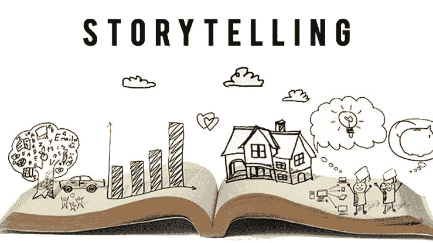

# 讲故事可以为 Web3 项目做的 5 件令人震惊的事情

> 原文：<https://medium.com/coinmonks/5-shocking-reasons-why-lore-can-build-or-break-a-web3-nfts-defi-project-654f9c521914?source=collection_archive---------10----------------------->

不不公用事业不是办法！

没有故事的 Web3 项目是死的。

你可能认为讲故事无关紧要

我要让你大吃一惊，转变思维

你确定你准备好了吗？

在整篇文章中，我将把“知识”和“故事”互换它们或多或少是一回事，唯一的区别是 web3。

澄清了这一点之后，我们能言归正传了吗？哦，我很高兴你准备好了，我也迫不及待地想挖掘一些关于知识的隐藏真相，以及利用这些真相将如何让你在你的证词中标记我，因为你的投资回报率是 3 到 6 倍。

Let’s get digging

# 故事建立了深厚的情感联系。

你可能很熟悉“人们基于情感购买，他们用逻辑证明”这句话，它在 web3 中仍然非常有效。

网络 3 中的人主要是为了获利，建立他们的袋子，在二手上购买，我们都知道这个清单还在继续，但在所有这些之前，他们首先想知道这个项目是否有利可图

即使在检查了不同的指标之后，不管他们是否知道，他们都会根据自己的情绪做出决定，并用他们检查的指标来证明这个决定。

那么，你如何激发他们的情感呢？

这就是讲故事发挥作用的地方。

一个简单的关于你为什么开始这个建设之旅的原因，你希望带来的效用，你花了多长时间，团队，你的 USP…如果告诉正确，人们会理解为什么它是特别的。

这可以是起源传说的形式，也可以是贴在你的页面/欢迎频道上的几行介绍，或者是一系列展示创作过程的精彩片段。

只要拿出一些有创意的东西，让他们产生情感上的联系，这将让他们保持忠诚，而这是数字、数据和演示幻灯片所不能做到的。

如果你坚持到底，你会在你的社区的心中铭刻你所建立的东西。虽然人们可以阅读事实、白皮书和路线图，并很容易忘记它们，但一个好的故事会打动人心。

# 好的知识能建立信任

目标受众会向三种人购买产品，他们是:

他们爱的人

他们尊敬的人

他们信任的人

虽然尊重需要时间来建立，但爱和信任是基于当你相信一个人对你透明时可以点燃的感情。

在这一点上，你很脆弱，你的牌翻了过来。

他们现在明白了，你不仅仅是想让他们赚钱，填满你的口袋，而是你在创造一些他们已经产生共鸣的东西。

怎么到这个地步？

我告诉你。跟我在一起，好吗？很好。

问问你自己:

我为什么要这么做？

他们为什么要铸造？

他们为什么要关注我？

为什么这个项目会繁荣？

为什么独一无二？

为什么？为什么？为什么？

找到答案了吗？太好了！然后你可以在你的故事里混合答案。

当你的知识显示出这种开放性，信任就来了

没有一个强有力的为什么人们不买。如果你不在你的故事中混淆一个引起共鸣的为什么，他们甚至不会采取你想要的行动。

简单来说(让我们一针见血)

故事是强有力的说服手段。

# 他们在营销活动中帮助建立认知

感知远比现实强大，你同意吗？

记住你要和我在一起，所以你应该同意…开个玩笑。

这是真的，因为感知是在人的头脑中进行的。比如说罗纳尔多签了一件球衣。

由于人们已经对罗纳尔多鼓舞人心的足球故事产生了共鸣，他们现在认为罗纳尔多签名的球衣比普通的 3 美元球衣价值数百万美元。

让我告诉你一个真实的故事

两名研究人员，沃克和格伦，通过拍卖易贝上与发自内心和有目的的短篇故事相关的无关物品，进行了讲故事的实验。

这些每件价值 1.25 美元的东西总共卖了将近 8000 美元。哇！你能想象吗？

这只是知识如何建立感知价值以提高投资回报率的一小部分。

**你认为这会对一个 web3 项目产生什么影响？**

因为它的效率，像可口可乐(快乐工厂)、巴塞罗那足球俱乐部和苹果这样的顶级公司在他们的营销活动中使用故事。

# 它帮助你回答“我为什么要关心？”问题

当你第一次向 Web3 社区展示你的项目时，人们的想法是‘哦，哇，又一个 NFT 项目，我为什么要关心？’或者“我为什么要关心他们的公用事业，他们和其他人的公用事业没什么不同”

嗯，像这样的想法只会因为没有好的(或任何)知识的糟糕演示而出现。

我肯定你不想那样，是吗？

曾经有一段时间，许多项目都将慈善捐赠作为其效用的一部分，但它达到了人们几乎不会产生共鸣的程度

当你说，“我的项目的部分效用是捐赠给慈善机构，”人们接下来会问“我为什么要关心？”

> 但是，如果你讲一个流浪街头的无家可归的男孩的故事，他被太阳烤焦，又被雨淋湿，会怎么样呢？他疲惫的鞋子和沙子的颜色一样，每吃一点食物碎屑，他的胃就觉得更空了。
> 
> 每一个面包屑在它们被消化之前就被大虫子吃掉了，他的胃就像一块亚麻布，显示出他肋骨的拱形形状

现在告诉我，用一个故事来更详细地讲述这个家伙和其他人的生活，难道不会让人看到这个品牌背后的灵感吗？他们不想造币吗？

**人们不买产品，他们买的是从中获得的感觉**

你不买奔驰…你买的是地位提升的感觉

你不买婚纱…你买的是说我愿意的感觉

你不会给你的妻子买辆车…你买的是做一个爱你的丈夫的感觉

你没有铸造 NFT…你铸造的是成为更大事物一部分的感觉。

# 知识建立大规模参与

你有没有问过自己，当人们加入我的服务器…

什么能让他们参与一般的聊天？

是什么强大到让他们天天光顾？

我的社区中最酷的部分是什么？

他们为什么要留下来？

如果你对这些问题的任何一个回答是“wl ”,那么你就做错了。

知识可以在这里发挥作用。

“我听到你在问怎么样，”。你真的想知道怎么做吗？

厉害！我们走吧

如果你把你的起源传说做成一个悬疑系列，每周播出一次或两次，会怎么样

你认为……

会让他们想留下来。

会让他们想就此展开对话。

会让他们想要造币。

会让他们不停地检查。

> 我想肯定会的，你觉得呢？

我希望我已经让你对讲故事在 web3 [NFTs，DeFi…]项目上的无限可能性以及它如何建立或破坏它们的思维转变感到震惊。

我很喜欢我们的小冒险，如果你想要更清楚或者你想我们讨论你的项目并为它设计一个迷人的故事情节，你可以很容易地在这里联系我

只需点击这里的，我们就可以开始通话了。

在我们结束之前，我想给你看一些读到这里的东西，你肯定和我在一起。

网络上的人们越来越意识到讲故事的重要性。

看看这些有影响力的人的推文

开采这种黑煤对你来说意味着什么？

打[这个](https://semi-lore.carrd.co/)然后我们再聊

哦，你看到拍手图标，是的，下面的那个，请点击它多次，并关注更多的 Web3 (NFTs，DeFi…)更新。

> 加入 Coinmonks [电报频道](https://t.me/coincodecap)和 [Youtube 频道](https://www.youtube.com/c/coinmonks/videos)获取每日[加密新闻](http://coincodecap.com/)

# 另外，阅读

*   [如何在 Uniswap 上交换加密？](https://coincodecap.com/swap-crypto-on-uniswap) | [A-Ads 审查](https://coincodecap.com/a-ads-review)
*   [加密货币储蓄账户](/coinmonks/cryptocurrency-savings-accounts-be3bc0feffbf) | [YoBit 审核](/coinmonks/yobit-review-175464162c62)
*   [肉毒杆菌对脊髓灰质炎(Napstoflio vs Muddrex)](/coinmonks/botsfolio-vs-napbots-vs-mudrex-c81344970c02)|[gate . io Exchange Review](/coinmonks/gate-io-exchange-review-61bf87b7078f)
*   [CoinFLEX 点评](https://coincodecap.com/coinflex-review) | [AEX 交易所点评](https://coincodecap.com/aex-exchange-review) | [UPbit 点评](https://coincodecap.com/upbit-review)
*   [上行保证金交易](https://coincodecap.com/ascendex-margin-trading)|[Bitfinex Staking](https://coincodecap.com/bitfinex-staking)|[bitFlyer Review](https://coincodecap.com/bitflyer-review)