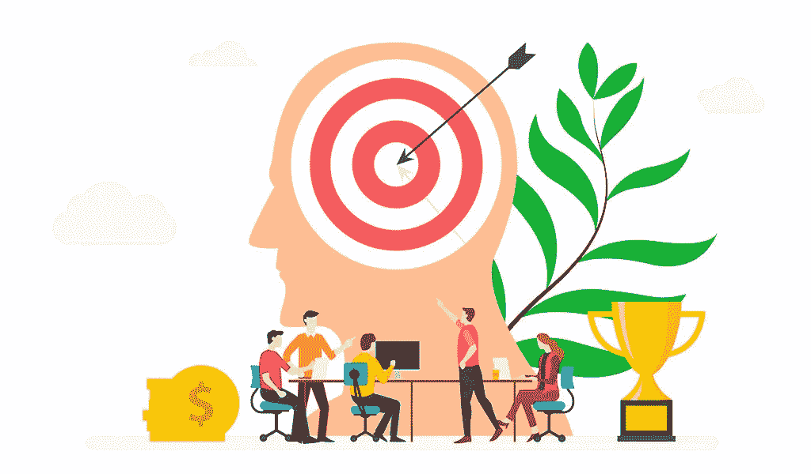

# 利用认知偏差进行强大的 Web3 营销的 5 个步骤

> 原文：<https://medium.com/coinmonks/5-steps-for-a-powerful-web3-marketing-using-cognitive-biases-6c3e38bf4b53?source=collection_archive---------14----------------------->

web3 中的营销都是基于一定的认知偏差，当你知道并应用它们时，你的转换率就会飙升。

在为超过 5 个 web3 品牌工作时，我发现这些认知偏差构成了协作、社区建设、社区之旅和 web3 营销的核心。

我们将关注网络 3 营销中的这些认知偏差。【稀缺】剥夺性超反应倾向
2。
互惠倾向(康德式的公平倾向)3。不一致回避倾向
4。Lollapalooza 倾向

不要介意这些有趣的词，我可以向你保证你会在不知不觉中使用其中的一个或多个

现在你将了解为什么它们在 web3 中如此重要，以及它们如何帮助最大化转化率

很神奇吧？

那么，让我们开始吧

## —剥夺性超反应倾向

也就是稀缺性简单地说

> 一个提议越有限，我们的心就越被它吸引，我们被迫采取行动，尤其是在一个时间框架内

这在 web2 中很常用，现在已经形成了 web3 的基础——稀缺性。

人们之所以花数百美元购买 jpeg 或任何其他形式的 NFT，不仅仅是因为它的实用性，还因为它的稀缺性

人们爱给**自己的**东西**独占**

我相信你已经听说过无数次稀缺性，所以让我们来谈谈更严重的问题。

为了更好地理解“更严重的问题”,让我们从头来看一下 web3 营销

# 网络 3 营销是如何真正运作的

就像任何一种营销一样，你第一

## **找到你的听众**

你通过寻找饥饿的人群而不是富人来找到你的观众

加里·赫伯特曾经说过，我转述一下

> 带着有钱支付的人群，带着最好的位置...抓住每一个营销优势，把我留给一群饥肠辘辘的人，但我仍会比你卖得多。”

他不只是说了这些话，他证明了这些话

这告诉我们，在你创造你的产品之前，你首先要寻找**人们渴望什么**(一个问题或需求)**、渴望它的人群**(你的观众)，然后你才能**创造一个解决方案**(你的产品)

完成后，我们可以进入下一步。

## **寻找他们聚集的地方**

不要一个接一个地去找他们

不，不，那就像在干草袋里找到一根针或者用渔网抓住一根针

人们聚集在一起，他们根据相似的兴趣组成团体，从音乐到足球俱乐部，不胜枚举

甚至经常可以看到某个名人的粉丝为自己创建了一个社区，并给自己取了个名字

把它带到 web3，每个项目和品牌都有它的价值观、氛围和兴趣。

我们看到，与项目氛围和兴趣产生共鸣的人聚集在一起，成为社区的一部分，这个社区可能在 discord 服务器、电报频道、电子邮件列表等等

让我们假设你有一个游戏项目，你正在寻找市场

你在目标受众可能聚集的地方寻找他们，比如游戏阿尔法小组、游戏 YouTube 频道、公会、游戏项目、游戏时事通讯和游戏播客。

在列出的子领域下创建一个社区电子表格

## **计划战略拓展**

你看，一个游戏公会会有一个社区经理。一个游戏播客会有一个播客…

在电子表格上的每个社区旁边，写下社区负责人的名字

然后，为每个社区量身打造一份不可抗拒的优惠，为团队提供令人瞠目结舌的价值

你进入这些社区的联系方式是社区负责人。

通常，合作与伙伴关系经理负责监督与营销相关的一切，是达成此类交易的最佳人选。

当合作达成一致并制定计划后，我们进入下一阶段

## **参与社区活动**

你和你合作的社区之间必须有一种沟通方式，毕竟，他们是你要找的人，而不是社区负责人

如果他们**对你的项目一无所知**，他们怎么能**信任**你，如果他们不信任你，他们怎么能**薄荷？**

你可以建立一个推特空间，AMA，采访...基本上任何能让你和他们联系的东西

我的导师说

> “参与是转化的关键因素”

*多真实*

虽然有些项目/社区可能对 AMA 不感兴趣，但您可以通过这种最少被提及的方式参与社区活动

这使得整个过程更加有趣

方法是让 WL 赠品，不是抽奖或 FCFS，而是一种注册形式，他们点击你的链接，并登记加入白名单

现在，我知道一些项目已经采用了这种策略，但是，没有一个项目充分发挥了潜力

你知道吗，作为一种与“即将成为”社区成员的人互动的方式，你可以在注册页面上传一个 5-15 分钟的视频，并为那些更倾向于文字的人附上文字记录。

多酷啊。

在视频中，你将吸引客户的情感和逻辑，谈论对他们有什么好处，销售你的产品，告诉他们他们将获得什么，以及这将如何提高他们的地位

如果你不是一个好的推销员，找一个流利的有说服力的来做视频

一旦他们进来，30%的工作就完成了

## **让他们踏上难忘的顾客之旅。**

实际上，带社区进行一次他们永远不会忘记的旅行，让他们成为构建路线图、提出建议、游戏和活动的一部分...正如我们在谈话中所说，人们喜欢成为社区的一部分，所以你有责任让他们有归属感。

> 给他们一个每天点击你的服务器的理由

您可以将特定事件分配给像跟随星期五、电影星期一和琐事星期二这样的日子...他们会产生共鸣，感觉自己是你社区的一部分

这就是互惠趋势发挥作用的地方

**往复趋势**指出

> 如果你没有为人们做任何事情，你就不能要求他们采取行动

It’s all about giving and receiving

所以至少给他们三样免费的东西...任何东西，当你提供的东西与你的产品联系在一起时，它就成了杀手。

如果你做了调查，了解他们的喜好，就不难找到一些你可以免费提供的价值

它可以是一个免费的视频，解释如何做一些真正困难的事情

只要确保你跟踪了有多少人对你的提议说是，或者我喜欢称之为“推销”

这里的交易是，当你免费给了你的社区 3 样有价值的东西，你向他们展示你的产品时，他们几乎会觉得必须购买，因为他们的头脑一直在寻找回报你的方法

他们自然想要回报。

我们都感受到了这种认知偏差，如果有人给你买了生日礼物，你会想要回礼

所有这些都是为了让他们产生另一种被称为**不一致回避倾向**的认知偏差

**不一致性避免趋势**指出

> 开始比结束容易抵抗
> ~伦纳德·达芬奇

其工作原理是，当你让社区成员踏上这个难忘的旅程时，从决策到推销，你让他们以一种承诺的形式参与进来

每走一步，他们都会更加投入，直到铸币日

因此，在铸币厂，他们已经在社区中做了令人惊讶的事情，对你所有的推销都说好，与其他成员一起玩游戏，投票赞成重大变革——他们已经太投入了，不能说不

他们现在认同社区，就是这样

让我们用 20 秒钟来谈论造币日

## 造币日会发生什么？

当他们点击按钮时，他们被转移到造币页面

让我们说，你已经做了一个很好的工作，我们讨论了所有，加上你保留了一个杀手副本，你的报价，保证，信誉和铸造的好处

发生的情况是，你使用的所有认知偏见——稀缺性、互惠倾向和不一致回避倾向——开始同时起作用

他们记得你带他们经历的令人惊叹的客户之旅，你免费提供的巨大价值，以及他们在构建社区方面取得的成就

所有这些认知偏差同时发生的那一点被称为“棒棒糖效应”

Phhew！那是一次漫长的旅程，我希望你享受其中的每一点，并且不是一次颠簸。如果你想我们多聊聊，请随时联系我们。

> 嘿，不要让我没有掌声和关注，这样你就不会错过像这篇文章这样更有价值的文章。

> 交易新手？试试[密码交易机器人](/coinmonks/crypto-trading-bot-c2ffce8acb2a)或者[复制交易](/coinmonks/top-10-crypto-copy-trading-platforms-for-beginners-d0c37c7d698c)