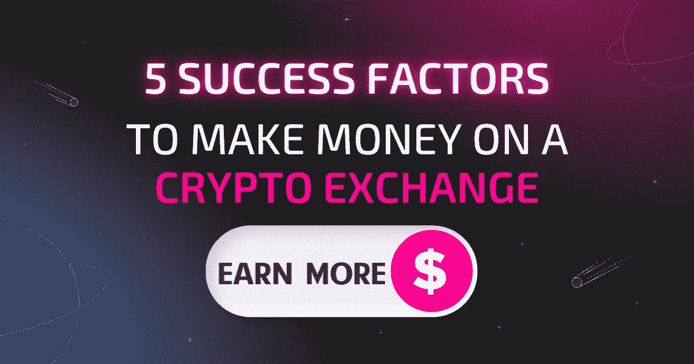

# 密码交易所赚钱的 5 个成功因素

> 原文：<https://medium.com/coinmonks/5-success-factors-for-a-crypto-exchange-to-make-money-8c6e49ca19a?source=collection_archive---------12----------------------->

加密货币市场正在快速发展，如果你想留在游戏中，你需要你的交换平台能够跟上变化。有许多加密货币交易所能够提供基本的交易服务，但并不是所有的交易所都提供相同水平的优质服务——一些交易所比其他交易所更灵活，一些交易所将安全性置于便利性之上，等等。在这篇文章中，我们将看看每一个好的交易所必须具备的五个基本特征，并展示如何详细阐述这些特征。

# 建立一个加密交换不是一件容易的事情

加密交易业务是一个竞争非常激烈的行业，在不稳定的加密领域会变得更加艰难。有许多挑战需要被克服，以使成功的加密交换产生利润。

除了一些明显的竞争优势，如低费用，还有一些因素需要密码交易所所有者考虑。我们整理了影响加密货币交易表现的五个最重要的因素。

# 1.安全性:核心加密价值

你的加密交换的安全性是它成功的最重要的因素，让我们不要掩饰，在任何加密项目的。缺乏安全感会导致资金损失，这将损害你的声誉和信誉。

加密交换必须是安全的，不受网络攻击，它们需要在隐私和安全方面有良好的声誉。在防止黑客攻击、保护客户信息安全以及如何保护用户资金的透明度方面，他们应该有出色的记录。

# 2.灵活性:资产越多越好

一个灵活的加密货币交易所将能够增加新的加密货币和交易对，以应对市场趋势和新的推出——换句话说，为客户提供更多的选择和机会，并加强平台。对于希望保持竞争力和盈利的加密货币交易所来说，市场的变化应该很容易。

作为一个加密交易所，你想分散你的交易资产。这不仅有助于降低风险(和减少损失)，还能让你的客户更有可能留下来。如果他们看到他们可以买卖多种不同的硬币，他们可能会在你这里开一个账户，并且比只有一两种选择的情况下开的时间更长。

多样化很重要，因为当一枚硬币有糟糕的一天时，另一枚可能有好的一天，这有助于平衡其对手的价值损失。这意味着，虽然一些人可能会因为最近关于比特币价格波动的新闻报道而对出售比特币感到紧张，但其他人可能会购买以太币或莱特币，因为这些货币目前正在升值而不是贬值。

对于交易者来说，不要把所有的鸡蛋放在一个篮子里也很重要——如果有人只交易以太坊经典(ETC ),那么如果 ETC 在任何给定的时间内(如 2019 年 1 月期间)大幅下跌，那么他们手头的所有现金也会下跌，因为除了 ETH 本身，在任何其他时间都没有其他东西在交易……这再次引导我们:不要把所有的鸡蛋放在一个篮子里。

# 3.易于使用:良好的 UX 和简单的注册

另一个重要因素是你的平台的用户界面和体验，这将决定你的客户是否喜欢使用它，以及在未来几个月你将吸引多少新用户！例如，如果有人试图使用北海巨妖的网站，但被某些事情(易用性问题)弄得沮丧，那么他们可能会转而使用另一个网站，在那里一切正常，没有任何问题。

创建注册流程时，您应该考虑以下事项:

*   用户应该能够注册只需一些个人资料。理想情况下，他们应该能够在不到 30 秒的时间内填写好表格。您在注册时要求的信息越多，用户完成注册和设置帐户所需的时间就越长。
*   注册过程应该快速简单，或者，如果可能的话，甚至不存在。用户在填写表单或提供特定信息(例如，他们的电子邮件地址)时应该不会有任何问题。事实上，这些元素应该感觉像是入职流程的一部分，而不是入职流程中的独立步骤，因为当 KYC 稍后进行检查时，它们与姓名和身份证号等其他数据一样重要。

# 4.可靠性:稳定快速的服务

为了从加密交换中获利，重要的是交换具有可靠且不间断的基础设施，这有助于提高客户满意度和信任度。

在选择加密货币交易所时，你必须考虑的第二件事是它的支持团队。如果您面临任何问题，或者您对您的帐户或交易方式有任何疑问，那么只有您会联系他们寻求帮助。

另一个需要考虑的因素是交易所的安全系统。安全性意味着它通过保护您的资金免受黑客和其他网络犯罪(如网络钓鱼等)的攻击来保护您的资金。

如果一个交易所具有可靠的法律地位，那么它肯定会有助于降低与欺诈或诈骗等相关的风险。

# 5.高级服务:质量支持团队

这个列表中的最后一项，但不是最重要的一项，是您要检查的交易所的客户支持。如果一个交易所没有一个好的客户服务团队，或者没有及时回复用户，他们就很难从用户身上赚钱。这就是为什么大多数人更喜欢使用全天候聊天或电子邮件支持的 exchanges，因为他们知道，如果他们的帐户出现问题，他们将能够在几分钟内找到可以帮助他们解决问题的人。

# 如何用一个解决方案增强这些因素？

从技术上来说，建立一个交易平台是很有挑战性的，但更具挑战性的是如何让它取得更大的成功。如果资源有限，但你仍然渴望锁定加密交易市场的顶端，找到一个有利可图的开发解决方案是很重要的。

Swapzone 通过我们的[**加密交换 API**](https://swapzone.io/partners/exchange-api) — **为加密货币交换提供全面支持，这是一个一体化解决方案，汇集了 20 多个可靠的提供商、1000 多个加密资产、99.9%的正常运行时间和高质量的客户支持。**这不仅是一个绝佳的备份机会，也是增加服务营业额和获得额外收入的一种方式。

> 交易新手？尝试[加密交易机器人](/coinmonks/crypto-trading-bot-c2ffce8acb2a)或[复制交易](/coinmonks/top-10-crypto-copy-trading-platforms-for-beginners-d0c37c7d698c)