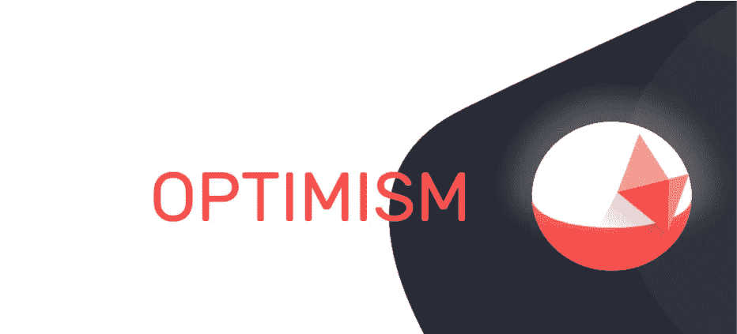

# 关于乐观的 5 件事，你会因为不知道而自责

> 原文：<https://medium.com/coinmonks/5-things-about-optimism-youll-kick-yourself-for-not-knowing-8edf9ae771f4?source=collection_archive---------18----------------------->

[Beautiful Free Images & Pictures | Unsplash](https://unsplash.com/)

随着加密货币在过去几年变得越来越受欢迎，一些区块链一直在努力跟上增加的负载。乐观是以太坊开发商建造的一个低成本、快如闪电的 L2 区块链以太坊。乐观主义把你热爱的以太坊的一切都拿来涡轮增压。乐观是一个非营利组织，致力于使以太坊生态系统上的交易更加快速、稳定、可扩展和便宜。

乐观主义是 35 个协议的家园，最大的是 [Synthetix (SNX)](https://coinmarketcap.com/currencies/synthetix-network-token/) ，一个衍生品交易所， [Uniswap (UNI)](https://coinmarketcap.com/currencies/uniswap/) ，一个 [DEX](https://coinmarketcap.com/alexandria/glossary/decentralized-exchange-dex) ，以及 [Velodrome (VELO)](https://coinmarketcap.com/currencies/velodrome-finance/) ，一个 [AMM](https://coinmarketcap.com/alexandria/glossary/automated-market-maker-amm) 。用户可以通过在他们的[元掩码](https://coinmarketcap.com/alexandria/glossary/metamask)和[桥接](https://coinmarketcap.com/alexandria/glossary/bridges)令牌(如 [ETH](https://coinmarketcap.com/currencies/ethereum/) 到 L2)上添加链来开始他们的乐观之旅。目前交易乐观股票的顶级加密货币交易所是[币安](https://coinmarketcap.com/exchanges/binance/)、 [BTCEX](https://coinmarketcap.com/exchanges/btcex-exchange/) 、 [BingX](https://coinmarketcap.com/exchanges/bingx/) 、 [MEXC](https://coinmarketcap.com/exchanges/mxc/) 和 [OKX](https://coinmarketcap.com/exchanges/okx/)

# 以太坊为什么需要乐观

乐观是以太坊最大的扩展解决方案之一，总价值超过 3 亿美元。据了解，以太坊是一个缓慢的网络，交易费用高，是最安全和分散的区块链之一。为了保持一切顺利运行，网络围绕三个属性构建:去中心化、安全性和可伸缩性。然而，由于区块链三难困境的限制，以太坊只能有效地部署这三个属性中的两个。这就是乐观发挥作用的地方。乐观主义为以太坊网络提供了一个可扩展的解决方案，有助于提高以太坊上的交易速度，而不会牺牲去中心化和安全性。

# 乐观主义的创始人是谁？

乐观主义由乐观主义基金会领导，这是一个致力于发展乐观主义生态系统的非营利组织，由[乐观主义](https://www.crunchbase.com/organization/optimism)的联合创始人&首席执行官[王京兰](https://www.crunchbase.com/person/jinglan-wang)领导。该公司有助于在互联网上加强和宣扬公平获取公共产品，类似于以太坊，乐观主义旨在成为一个完全分散的不以盈利为导向的公共产品。此外，乐观主义完全由世界各地的捐赠和资助。

# **乐观主义的独特之处在于什么？？**

乐观既省时又省钱，因为每笔交易都不必经常核对。如果验证者认为交易是欺诈性的，那么他们可以要求对其进行验证。如果是欺诈，则奖励验证者，并对完成欺诈交易的用户进行罚款。该系统减少了完成交易所需的能量，从而降低了交易成本并提高了速度。

另一个使乐观主义与众不同的特征是它对“公共产品”的关注，通过生态系统基金和追溯性公共产品资助计划来完成。代币供应总量的一部分被保留用于资助和奖励对整个社会有益的项目。乐观组织已经为此类项目捐赠了 100 多万美元。

同样，乐观链是部署 [(dApps)](https://www.benzinga.com/money/what-are-decentralized-applications/) 的方式。大多数[第二层](https://academy.binance.com/en/glossary/layer-2)解决方案使用[以太坊虚拟机(EVM)](https://help.coinbase.com/en/coinbase/getting-started/crypto-education/glossary/ethereum-virtual-machine) 兼容机制来部署 dApps。这种方法使得以太坊开发者很容易将他们的 dApps 移植到第二层和侧链。乐观使用乐观虚拟机[(OVM)](https://www.alchemy.com/overviews/optimistic-virtual-machine)，它是 EVM 的等价物。以太坊 dApps 可以加载到乐观上，不需要修改整个代码。

此外，乐观主义的建立过程是围绕着长期可持续发展的理念，而不是走捷径的可扩展性。这就是为什么它使用[乐观汇总](https://101blockchains.com/optimistic-rollups/#:~:text=An%20optimistic%20rollup%20is%20basically,on%20the%20main%20Ethereum%20blockchain.)并利用以太坊的[共识机制](https://ethereum.org/en/developers/docs/consensus-mechanisms/)来扩展网络。块在 L2(乐观)上创建和运行，而用户事务被批量处理并提交给 L1(以太坊)。L2 没有[内存池](https://coinmarketcap.com/alexandria/glossary)，交易被立即接受或拒绝。这保证了流畅的用户体验，同时通过以太坊共识机制确保了安全性。

最后，生态系统进一步强调实用主义[实用主义乐观主义是两个术语的结合:实用主义和乐观主义。放在一起；这意味着你对自己的未来持乐观态度，并且务实地看待你需要做些什么才能实现目标】。乐观是由团队和参与生态系统的用户的现实需求和约束推动的。因此，乐观主义的目标是迭代地构建并逐步实现像 EVM 等价这样的特性。

乐观的社交媒体渠道；[不和](https://discord-gateway.optimism.io/) [推特](https://twitter.com/optimismFND) [抽动](https://www.twitch.tv/optimismpbc) [博客](https://optimism.mirror.xyz/)

# 在你走之前…

*如果您觉得本文有帮助，请单击👏按钮，在脸书和 Linkedin 上评论或分享这篇文章，这样你的朋友就可以从中受益了……*

*你可以在*[*LinkedIn*](https://www.linkedin.com/in/frank-mawuli-akorlie-617b39153/)*和*[*Twitter*](https://twitter.com/jigarchills)*……..让我们连接！！！*

> 交易新手？尝试[加密交易机器人](/coinmonks/crypto-trading-bot-c2ffce8acb2a)或[复制交易](/coinmonks/top-10-crypto-copy-trading-platforms-for-beginners-d0c37c7d698c)