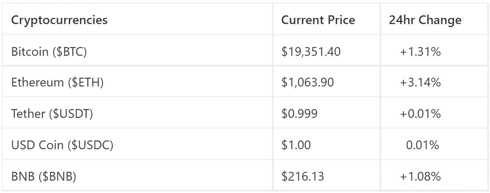
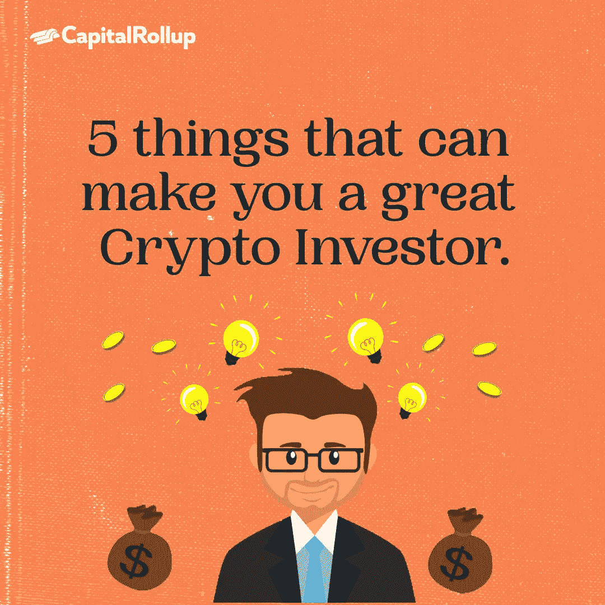

# 能让你成为伟大的加密投资者的 5 件事

> 原文：<https://medium.com/coinmonks/5-things-that-can-make-you-a-great-crypto-investor-7cd1d3e43e6a?source=collection_archive---------19----------------------->

欢迎来到最新一期的 CapitalRollup Digest！今天的文摘是 7 月 1 日的，大约需要 5 分钟。我们马上开始。

*   今天的市场看起来怎么样？(前 5/10 大流行加密货币)

Price Market Update

# 5 件事可以让你成为一个伟大的加密投资者。

谈到投资，只有几件事可以区分伟大的盈利投资者和糟糕的失败投资者。

在像 crypto 这样一个动荡的市场中，投资价值的下跌和上涨一样快，投资通常包括学习和培养习惯，帮助你始终做出正确的投资决策。这意味着即使是最好的和最赚钱的投资者有时也会失去他们的投资。

虽然你的投资不可能一直取得成功，但这些策略可以帮助你做出决定，为你带来长期的良好回报。

想成为一个伟大的加密投资者吗？这里有一些你可能想开始练习的提示。

## **1。永远要有计划**

许多秘密投资者犯的一个错误是，他们在开始投资之前没有具体的计划。

许多人进入 crypto 是为了赚钱，却没有制定如何赚钱的计划。结果，他们最终做出了影响他们和他们投资的错误决定。

每个伟大的投资者总是有一个计划，如果你想成为一个，你需要创建一个与你和你的投资一致的计划。一个理想的计划可以专注于你想投资什么类型的加密货币，你的投资有多大比例进入这些货币，以及你会在什么价位从你的投资中获利。

> 交易新手？试试[密码交易机器人](/coinmonks/crypto-trading-bot-c2ffce8acb2a)或[复制交易](/coinmonks/top-10-crypto-copy-trading-platforms-for-beginners-d0c37c7d698c)

## **2。做你的研究**

加密空间是一个相对较新但发展迅速的领域，因此在投资之前对硬币和代币进行深入研究是明智的。

做好加密研究是做出决定的必要条件，这些决定可能会对您的投资产生负面影响，也可能会积极改善您的投资。

伟大投资者的最好属性之一是他们不会做出粗心的投资选择。在采取行动之前，他们会研究任何投资的历史、模式和特征。

你如何能做你的研究？在投资前，听听播客，读读时事通讯和文章，加入社区以获取更多信息。

## **3。多样化你的投资组合**

正如多样化对于传统投资策略的重要性一样，对于加密投资也是如此。

一个可靠的加密投资组合应该是多样化的，包括各种硬币，你的兴趣是基于你的研究。多样化并不意味着你投资你看到或听到的每一枚硬币。

在你分散投资组合之前，你应该有一个策略来指导你想投资什么硬币，以及它将占你投资组合的百分比。

在不购买多枚硬币的情况下，分散您的加密投资组合的一个好方法是通过加密指数基金，您可以查看本文**了解它们是如何工作的，或者在这里 **购买您的第一只指数基金[。](http://capitalrollup.com)****

## ****4。投资您的安全****

**在加密领域，你的投资和安全一样重要。如果你不够小心，你可能会失去所有的投资，在加密空间猖獗的多个骗局。**

**根据 FTC [的一份报告](https://www.ftc.gov/business-guidance/blog/2022/06/reported-crypto-scam-losses-2021-top-1-billion-says-ftc-data-spotlight)，自 2021 年以来，已有超过 10 亿美元因不同的加密骗局而损失，这些骗局发生的频率是 2018 年的 6 倍。**

**因此，如果你打算建立一个长期盈利的加密组合，你必须做的一件事是认真对待你的安全。**

**实现这一点的一些方法包括:**

**投资一个冰冷的钱包。**

**避免点击可疑链接，**

**不要和任何人分享你的钱包密码，更重要的是，**

**避免做你不理解的事情。**

## **5.长期规划**

**长期投资听起来容易做起来难，很多秘密投资者很少这样做，主要是因为他们没有计划。**

**由于加密是一种不稳定的资产，当您投资它时，很难进行长期考虑，因为您的投资可能会随着时间的推移而大幅贬值。**

**尽管如此，如果你有一个长期投资计划，它有助于你做出将利润回报到投资组合中的决定。作为一名长期投资者，你能够避免许多短期投资者可能陷入的陷阱。**

**长期投资意味着交易时少带感情色彩，不管市场状况如何，只投资那些你确信长期会盈利的硬币。**

**而作为短期投资者，当市场不好时，你可能会恐慌，导致你做出可能会进一步降低你的加密投资价值的决定。**

**与其他资产类别相比，加密空间仍然是新的和不断增长的，因此需要大量的耐心、纪律、知识和策略，特别是因为它比股票市场、共同基金等传统资产类别更不稳定。**

**会有投资的机会，但是，你必须为这些时刻做好准备。它始于理解你需要什么才能成功，并发展你与坏投资者的区别。**

**就像密码里说的，“我们都会成功的！”**

# **琐事🤔**

****比特币是一种去中心化的数字货币。这是什么意思？****

**A.它不受政府或组织的控制**

**B.它是完全免费使用的**

**C.它平均分配给每个人**

**D.它是合并的**

**在下一期的 CapitalRollup Digest 中找到答案。😉**

****最后一个琐事的答案是 d .)没人知道****

# **每日一词！**

**💡 **SAFU** ( **S** 安全**A**sset**F**und for**U**SERS)**

**由币安交易所创建的货币基金，持有所有交易费用的 10%,以在交易所被黑客攻击的情况下补偿客户。术语“SAFU”也用来暗示安全。**

****用在句子中的术语:**
*—人们担心，问我的资金怎么样？CEO 会说“资金是****SAFU****”***

*   ****社区更新📢****

**我们将很快与 5 个行业领导者组织一个 Twitter 空间会议，在那里我们将讨论加密市场和 web3 上的一切。你可以期待它😎**

# **我们今天在读什么📰**

**成为成功的加密投资者的 4 种方法。 [***阅读更多***](https://www.fool.com/the-ascent/cryptocurrency/articles/4-ways-to-become-a-successful-crypto-investor/)**

****加密货币下跌期间保持和扩大财富的 5 种方法。** [***阅读更多***](https://www.entrepreneur.com/article/430481)**

****与朋友一起学习和投资加密💰****

**当您邀请您的朋友开始使用 CapitalRollup 进行有利可图的投资时，您将获得独特的奖励。**

**💬对 CapitalRollup Digest 有什么反馈吗？ [**告诉我们！**](mailto:hi@capitalrollup.com)**