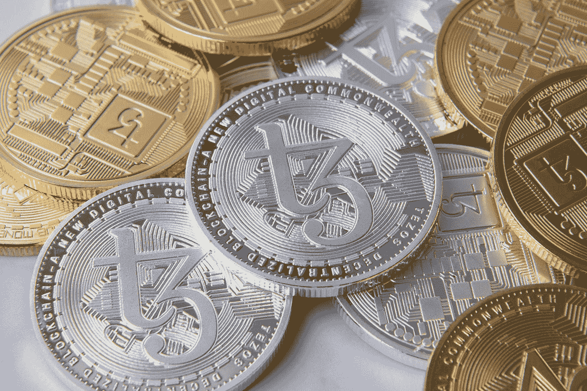

# 关于分散金融(DeFi)你必须知道的 5 件事

> 原文：<https://medium.com/coinmonks/5-things-you-must-know-about-decentralized-finance-defi-3988ebdafde3?source=collection_archive---------61----------------------->

Photo by [Tezos](https://unsplash.com/@tezos?utm_source=medium&utm_medium=referral) on [Unsplash](https://unsplash.com?utm_source=medium&utm_medium=referral)

让我们来讨论一下 DeFi 及其应用。

我们传统的金融体系存在许多瓶颈和局限性。中央集权的金融体系使得金融普惠仅限于特定人群。由于地理位置或收入水平的原因，一些人没有银行账户，无法获得基本的金融服务。

因为传统的金融系统是由赚取利润的中介机构维持的，它们的服务在低收入实体所在的地方通常是不存在的。然而，有了 DeFi，事情可能会有所改变。尽管并非没有限制，DeFi 已被证明是金融包容性的可变工具，消除了中央中介并降低了交易成本。

## **什么是分散金融(DeFi)**

大多数人，就像我一样，一定经历过一些传统金融系统的管理瓶颈。诸如资金管理不善、腐败、交易延迟、过高的服务费等挑战普遍存在。区块链技术的出现，使得去中心化的金融体系有可能解决我们传统金融体系中的这些金融漏洞。

去中心化金融(DeFi)是指建立在区块链网络上的金融应用系统。DeFi 的目标是建立一个透明和无许可的金融系统，这是提供给每个人，没有任何中央权力机构或中介机构的控制。在这里，用户可以完全控制他们的资产，并通过分散式应用程序(DApps)与系统进行交互

## **进入 DeFi 项目的要求**

要创建一个去中心化的金融系统，你需要一个平台或者一个基础设施来授权一个去中心化的系统。虽然以太坊很受欢迎，并且经常被视为 DeFi 的家园，但是您也可以在其他支持智能合约的区块链上进行构建，例如 BNB 智能链、Fantom、Polkadot、Solana 等。

但是，如果你想连接到一个已经存在的 DeFi DApp，你将需要一个兼容的钱包和一个加密资产。MetaMask 和 Trust wallet 之类的钱包对新手来说是不错的选择。您将需要的加密资产取决于您使用的智能链，例如，以太坊将需要以太(ETH)来支付其燃气费。

## **智能合约和 DeFi。**

智能合同是 DeFi 提供的服务的基础，包括投资、贷款、赌注等。DeFi 的独特性取决于创建和执行智能合同。智能合同是一种自动执行的计算机代码行，它指定了协议的条款。这意味着智能合同自动执行关系条款，包括没有任何第三方(如政府机构或银行)参与的财务关系。这一过程确保了许多目前由人工完成的业务流程的可靠和快速自动化。

传统金融依赖于银行等机构来促进金融服务，而 DeFi 应用程序不需要任何中介。守则规定了每一个可能的争议的结果，用户在任何时候都可以控制自己的资金。每一条信息都被记录在区块链上，并传播到数千个节点，使其可靠并对各方开放。

## **分散融资的用途**

迄今为止，DeFi 已经实现了以下目标:快速贷款服务、银行服务、抵押和保险服务等。

*   分散贷款比传统服务有很多优势。DeFi 通过智能合约实现即时交易结算，并消除所有中介，使每个人都能更快、更方便、更便宜地借款。
*   DeFi 使得发行不依赖于任何中央机构的稳定货币成为可能。
*   建立在智能合同基础上的保险和抵押贷款服务已经被证明是无缝的和更可靠的。
*   分散交易所(DEX)，如币安 DEX，允许用户交易数字资产，而不需要一个可信的中介来持有他们的资金。

## **DeFi 的挑战/风险。**

虽然 DeFi 世界可以提供惊人的机会，但也不是没有风险。下面介绍了您可能已经注意到或将会注意到的常见风险和挑战。

*   因为智能合同是计算机代码，它们容易受到风险和漏洞的影响。
*   由于混乱的生态系统，DeFi 仍然需要用户付出额外的努力。人们仍然发现很难找到最好的和最可靠的项目来工作。有时，很难找到用于特定用途的特定 DApp。
*   DeFi 还面临合法性风险。某些项目和服务的合法性仍有疑问，难以确定。
*   当您持有的加密资产受到影响时，您也可能会受到影响。加密货币是投机性的，其流动性会影响不同程度的风险。
*   如果你不小心，你可能会丢失你的私人钥匙。

## **结论**

分散融资及其应用相对较新。它旨在弥补传统金融体系的局限性。打造金融包容性社会。每个人都可以获得金融服务，不受监管机构的任何限制。DeFi 可能不打算从大型金融集权机构手中夺走权力，但如果它的采用成为主流，那么它意味着对数百万目前无法获得金融服务的人来说，经济和金融包容将成为可能。

根据经验，在投资任何 DeFi 项目之前，一定要做好研究。并且总是投资你可以放弃的钱。

(本文用于信息和教育目的，而非财务建议。)

> 交易新手？试试[加密交易机器人](/coinmonks/crypto-trading-bot-c2ffce8acb2a)或者[复制交易](/coinmonks/top-10-crypto-copy-trading-platforms-for-beginners-d0c37c7d698c)