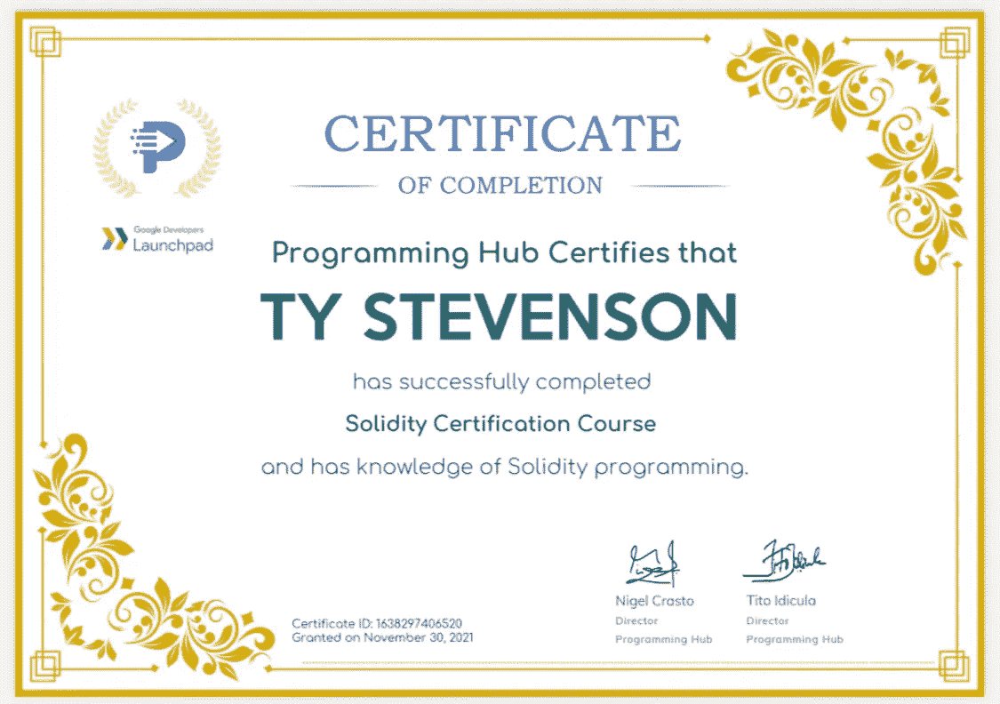

# 在网上找工作的 5 个技巧 3👨🏻‍💻

> 原文：<https://medium.com/coinmonks/5-tips-to-getting-a-job-in-web3-92d07b5b265?source=collection_archive---------0----------------------->

难怪许多 web2 专业人士、企业家、自由职业者和完全的新手正在进入 web3 领域，并转向完全远程工作…

大多数 web3 的工作都是完全远程的，通常有很高的工资，并且可能有很大的本地代币佣金的可能性……人们可能想在 web3 工作的原因有很多。

> 在这个简短的“如何做”指南中，我将带你经历获得高薪、完全远程的 web3 工作的步骤。
> _ _ _ _ _ _ _ _ _ _ _ _ _ _ _ _ _ _ _ _ _ _ _ _ _ _ _ _ _ _ _ _

# **提示 1:明确你的工作**

没有计划，你无法进入 web3(或任何领域)。

你想成为一名编码员/程序员/开发员吗，你想成为一名数字艺术家/平面设计师/动画师吗，或者也许你想成为一名营销人员、社区经理，甚至像一个迷因领主一样的特定工作…

无论你选择哪条路，要意识到掌握以最佳速度履行工作职责所需的技能是需要时间的，就像其他职业一样。

开发人员可能比社区经理有更高的学习曲线，但最终也会得到更高的报酬，通常会更受欢迎。

# 技巧 2:获得经验

> 在你选择的职业中变得更熟练的最好方法是实践！就像跑步一样，增加技能的最好方法就是跑步…

如果你想成为一名社区经理(像我一样)，并且你没有领导社区的经验，也许你可以志愿成为另一个 web3 项目的 CM，以获得一些经验/知识…如果你想成为一名开发人员，开始创建自己的应用程序/项目，参加黑客马拉松，建立关系网…

教育总是被重视的，但是经验总是更有价值。

阅读书籍，观看 YT 视频，参加在线课程/班，也是获得经验的好选择。

# **提示三:网络**

**这一点怎么强调都不为过！！**

> web3 的核心是去中心化、社交货币和关系。

你在 IRL 和/或网上交的“朋友”越多，当一个空缺职位出现时，你被记住的机会就越大。

就像任何其他领域一样，找到一份高薪、令人满意的工作并不是一件容易的事情，在低层有朋友总是有帮助的。

许多网络 3 公司会从内部招聘。这意味着他们将雇佣那些已经熟悉他们的生态系统并且已经参与了一段时间的人。所以，加入许多社区来拓展你的选择吧。

开始接触、参与和成为任何和所有网络 3“德根”的朋友。开始在社交媒体上建立你的个人品牌，投入时间和精力让自己在拥挤的市场中脱颖而出。

# 提示 4:有一份黑仔简历

当我为自己的项目寻找雇员时，我看了这么多简历，我有几个要点/技巧来帮助你的简历脱颖而出。

你希望你的简历简短、简洁、实用。

直奔主题。使用动词，如“委托”、“组织”、“创建”…

要点是好的，任何少于一句话的内容都应该被缩短。

> 雇主关注的是你做了什么，以及这些经验/技能如何能帮助推进他们的业务。

不要在你的简历中加入不相关的内容。如果你申请成为一名开发人员，只包括与开发/计算机等相关的任务/经历..不要写你曾做过一年酿酒师助理…

如果你愿意，也可以附上一张你自己的小照片。以及您的姓名、电话号码、电子邮件和所有社交信息。

包括至少一些“额外的”,如:每周读一本书，喜欢旅行，喜欢健身…让自己变得“人性化”

# **提示 5:应用，应用，应用**

一旦你知道了你想要的工作，你会不断地获得关于这个主题的经验/知识/实践，以及建立网络和建立你的“个人品牌”，你已经掌握了一页简历+电梯推销…这是你应该开始对申请工作感到舒服的时候。

> 【当我在求职时，我会每隔 2-3 天从以下网站申请 15-20 份工作:
> [【https://cryptocurrencyjobs.co/](https://cryptocurrencyjobs.co/)
> 
> [https://web3.career/](https://web3.career/)

找到你一直在寻找的工作可能需要 30 个月，在某些情况下甚至更长时间……所以要有耐心和毅力。

在你得到那份工作之前，你可能会接到几十个电话，得到 100 个拒绝，甚至更多的“没有回复”。

记住，是人在招聘(仍然……)，你所要做的就是让你与之交流的人相信你非常适合这家公司和这个职位。

# 额外提示/建议:

虽然大多数 web3 的工作确实报酬很高，但大多都很偏远，而且有很多额外津贴……有时工作可能只持续很短的一段时间(几周、几个月……)。

Web3 不是你典型的 IRL 工作，在那里你得到工作，向 HR 报告，注册 401k，以及所有那些公司世界的东西…

你可能会发现一些工作与你没有合同，可能只以加密方式支付(然而，许多工作确实以菲亚特方式支付，并要求你向他们发送付款发票)，并且可能在最初的招聘过程后很少与你交谈，让你完全靠自己…

你想花多少精力为别人工作真的取决于你，但总是，你投入的越多，得到的就越多。

> **最后提示…** 真正了解区块链技术、web3 迷因文化、德根人的行话，以及大家都去哪里玩。让自己沉浸在文化中。

## 祝你在 web3 找到梦想中的工作！！！

_ _ _ _ _ _ _ _ _ _ _ _ _ _ _ _ _ _ _ _ _ _ _ _ _ _ _ _ _ _
_ _ _ _ _ _ _ _ _ _ _ _ _ _ _ _ _ _ _ _ _ _ _ _ _ _ _ _ _ _ _

**时刻小心！！！⚠️**

*这一点我怎么强调都不为过！保持高度警惕，留意你点击的每一个链接、你做的每一笔交易和你接触的每一个人，因为这个领域骗子很多，即使是最好看的项目也会被撤下。*

*点击所有链接之前，仔细检查，确保它们是你要找的官方链接。此外，在给自己或他人发送任何有价值的东西之前，要再三检查所有的钱包地址。*

> [*推特*](https://www.twitter.com/metadadsxyz)[*不和*](https://discord.gg/Cv8v2Ert8m)[*YouTube*](https://www.youtube.com/channel/UC7pbtSBs9nRJHK6coMhCR8g)[*抖音*](https://www.tiktok.com/@thedudescrypto)[*insta gram*](https://www.instagram.com/metadadsxyz)[*Spotify 播客*](https://open.spotify.com/episode/5U8vXE9HDAsGbSbebw9p62?si=2rZIigw-Tw2pCxjxmkbYzQ)
> 
> 请将 Polygon Matic 发送到这个 Eth 地址，或 Eth Tokens，以支持我和我不断增长的家庭🙏🏼
> ***0xb 53b 3978333 e 11 c 382 ab 619 f 02 f 469 A8 c 70750 af***

_________________________________________________________________

感谢阅读:]

# 干杯，
泰，又名“纨绔子弟”

**我的其他一些博文:**
[5 个失败的网站 3](/coinmonks/5-downfalls-of-web3-cd5dc8ade4fd)
[5 + 5 个不和谐的战术](/coinmonks/5-tips-for-a-better-discord-nft-crypto-edition-ff9b039d0359)
[Crypto 101:一个初学者指南](/coinmonks/crypto-101-a-beginners-guide-345d440bd163)
[NFT 5 大最佳实践(营销&社区成长)](/coinmonks/top-5-nft-best-practices-marketing-and-community-growth-7025e26eb50c)
[网站 3 基础知识](/coinmonks/web3-basics-252121357f33)

> 交易新手？试试[加密交易机器人](/coinmonks/crypto-trading-bot-c2ffce8acb2a)或者[复制交易](/coinmonks/top-10-crypto-copy-trading-platforms-for-beginners-d0c37c7d698c)