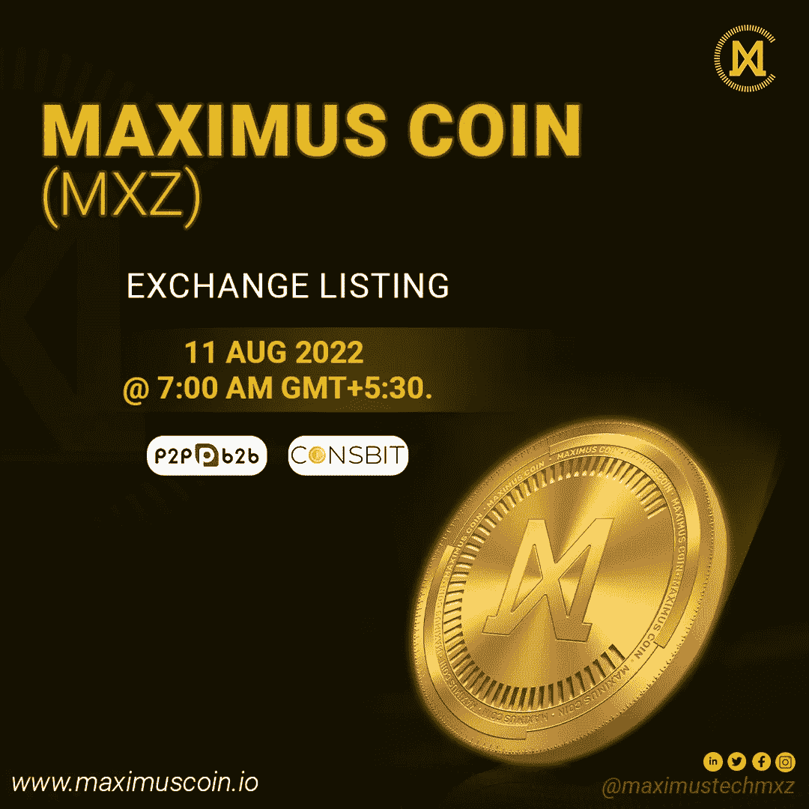

# 投资加密货币前要牢记的 5 条建议

> 原文：<https://medium.com/coinmonks/5-tips-to-keep-in-mind-before-investing-in-cryptocurrency-6c2f4b052059?source=collection_archive---------9----------------------->

**5 TIPS TO KEEP IN MIND BEFORE INVESTING IN CRYPTOCURRENCY**

鉴于最近所有的头条新闻，许多新手都想参与加密货币的热潮。尽管投资加密货币可能非常有利可图，但新手交易者在开始之前必须知道一些事情。

越来越多的人开始随意投资，认为在听说成功故事或目睹朋友或家人获得巨大收益后，或者在目睹自己的成功故事后，这很简单。如果加密货币投资真的这么简单，每个人都会变得富有。

毫无意识和准备地投入其中是你最不想做的事情。此外，你不应该相信你在社交网站上读到或看到的关于加密货币投资的一切；一点也不简单。

如果你正在考虑投资加密货币，以下是你应该记住的 5 条建议。

**1。** **开展自己的研究**

-在投资之前，始终进行自己的调查和彻底的研究，尤其是如果货币是新的。你应该看几个关于这个主题的 YouTube 课程视频。当你意识到这有多简单时，你会对可能的比特币投资进行更彻底的尽职调查。

-在用你的钱进行投资时，不要相信除了注册财务顾问以外的任何人。这些人靠卖信息为生，所以一旦拥有了你，他们其实并不在乎你是成功还是失败。

**2。** **价格波动频繁**

-价格波动主宰着加密货币行业。偶尔会有低谷和高潮。这是由于数字货币资产仍然大多不受控制。组织不设置价值或指定如何使用它。波动性是否会消失值得怀疑。但是，再一次，定义加密市场边缘的是不稳定性和缺乏中央控制。

**3。** **市场趋势的主要影响**

-加密资产的价值受到当前市场趋势的显著影响。他们深受经济表现和公众舆论的影响。如果你想明智和了解投资的最佳加密货币，请密切关注关于特定加密资产的谣言或预测。

**4。** **保护你的私钥**

-保护您的个人密钥极其重要。加密货币只能通过这种方式访问，如果你放错了钥匙，你将无法这样做。事实上，如果任何人知道你的关键短语，他们都可能访问并没收你的加密货币，这也是至关重要的。

-不要把它放在你的电脑上，也不要让它暴露在自然环境中。试着记住这句话，写下来，锁起来。

**5。** **关注资产安全**

-你可能已经知道，加密货币不受监管，也没有中央机构的支持。因此，你必须小心地持有你的资金，在投资时要非常小心。你可能会访问值得信赖的网站，这些网站让你交易和管理资产变得简单。此外，您必须不断采取预防措施来保护您的数据隐私。

**收尾**

加密货币已经惊人地扩展到进入主流金融对话。投资并获得你应得的预期回报的时机就是现在。然而，你应该意识到金融环境是复杂的。为了充分利用这一吸引人的资产，建议对资产进行全面分析，并通过全面策划的平台进行投资。

> Maximus Tech 准备在交易所重新上市其 Maximus Coin(MXZ)。我们很高兴地通知您，等待已经结束，在成功更名之后，我们的加密货币令牌$MXZ 将于 2022 年 8 月 11 日在 Coinsbit 和 P2PB2B 交易所重新上市。

Maximus Tech 正在寻找一个投资加密货币的机会。Maximus Tech 将于明天在交易所上市其加密令牌 Maximus Coin ($MXZ)，以前称为 M-coin。

任何希望参与并拥有 MXZ 的人都需要在 P2PB2B 或 Coinsbit 官方交易所注册。

交流官方链接:[www.p2pb2b.com](http://www.p2pb2b.com)&[www . coinsbit . io](http://www.coinsbit.io)

MXZ is listing on P2PB2B & Coinsbit exchanges on 11 August 2022

Maximus Coin (MXZ)得到了行业专家的支持，如[**Jason Daniel Paul Phillip**](https://www.linkedin.com/in/jason-daniel-paul-philip/)[ABBC Coin](https://abbccoin.com/)(ABBC 基金会)的首席执行官和创始人，该公司是 [coinmarketcap](https://coinmarketcap.com/) 排名的 400 强加密货币之一，已成功运营 ABBC 超过 5 年。

Maximus Coin 可以被视为像你一样的年轻加密投资者对分散式云存储概念背后的技术和市场的重大加密投资。

关注我们的[脸书](https://www.facebook.com/maximustechmxz/) & [推特](https://twitter.com/maximustechmxz)

加入我们在 t.me/maximustechmxz[的节目](http://t.me/maximustechmxz)

> 声明:*以上文章不提倡任何投资建议。这只是为了提供信息。*

> 交易新手？尝试[加密交易机器人](/coinmonks/crypto-trading-bot-c2ffce8acb2a)或[复制交易](/coinmonks/top-10-crypto-copy-trading-platforms-for-beginners-d0c37c7d698c)