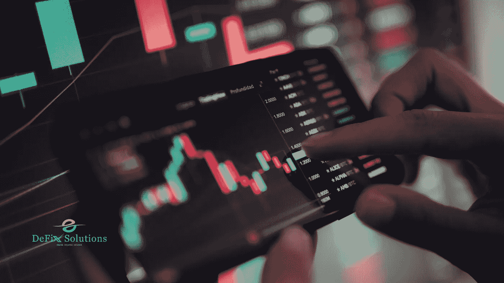

# 5 种类型的加密交换

> 原文：<https://medium.com/coinmonks/5-types-of-crypto-exchanges-a81b762a1cb9?source=collection_archive---------30----------------------->

## 了解不同类型的加密交换！

## **快速概述**

如果有人希望购买或出售加密货币，则需要加密货币交易所。这些在线服务类似于股票经纪人，它们允许你买卖数字货币，如比特币、以太币和 dogecoin。凭借最低的费用和强大的安全功能，顶级加密交易所可以轻松买卖您想要的货币。

在加密经济中，交换是最活跃和最重要的服务类别，占通过服务传输的所有价值的 90%。它们有几种形式和大小，以满足各种消费者的需求，无论他们是第一次购买密码的青少年还是长期交易者。

在为您的需求选择最佳加密交易所时，考虑支持的货币、价格、取款选择和安全性至关重要，这也是我们在编制最佳加密货币交易所列表时所做的。

有五大类你应该知道。每一种都有自己的优点和缺点，所以请仔细阅读以获得最有用的信息。

## **交易所类型:**

## **零售交易所(零售商):**

零售交易所是最常见的交易所形式，迎合了从经验丰富的交易者到首次购买比特币的所有人。这意味着可用性和速度是公司脱颖而出的两个最重要的方面。

为了使交易尽可能简单，零售交易所通常提供用户友好的界面。它们通常也是保管性的，这意味着它们为用户存储用户的私钥，这样他们就不必在每次交易时都把它们挖出来并输入。虽然这增加了便利性，但如果交易所被黑客攻击，尤其是如果交易所没有保险，这也增加了消费者损失资金的危险。

零售商的经营方式多种多样。一些专门做法定到加密的互换，而另一些只做加密到加密的交易。可能性实际上是无限的；这完全取决于供应商。比特币基地和北海巨妖是这类交易所中最著名的两个。

## **点对点(P2P):**

密码市场是用来描述这种可能性的术语。对等交换在两个不同的商家之间提供了一个链接。对于网站的服务，通常每笔交易都要支付一定比例或预定的费用。

P2P 交易只是连接买家和卖家，并不代表交易的另一方。本地比特币是最著名的例子，它将一个买家与许多供应商匹配，然后允许客户在选项中选择最佳价格。

这些交易所经常被用作中间人，以确保任何一方都不会受到欺诈。但是，因为您将与真实的人一起工作，所以接触到欺诈者是可以想象的。值得信赖的提供商，如 Paxful，通常会限制这些个人，并尽一切可能阻止他们在自己的网站上注册。

## **分散交换(DEX) :**

这种是最近才在网上发现的。这是一种非托管交易，不涉及你的任何资金。相反，为了提供钱包对钱包的交易，该公司采用特殊的网络和相关软件来自动转账。

由于交易所从未真正保留资产，这为用户提供了更多隐私，并消除了他们的资产在违规情况下被取走的可能性。

这些交易所是如此分散，以至于如果你犯了一个错误，比如把资金转移到错误的地址，交易所没有办法帮助你。

## **衍生品交易所:**

使用衍生品交易适合加密货币的专家用户，因为这需要更高水平的投资理解，比如做空硬币的能力。现货交易，只能赌价值上涨。

用户还可以在这些交易所进行高杠杆投资，从而获得更大的收益。另一方面，投资者面临更大的风险，因为他们可能失去的比他们投入的更多。由于高风险，这类交易所受到更多的监管。

## **即时兑换:**

这是另一种类型的非监禁交换，但它的工作方式有些不同。首先，这个版本是最容易使用的版本之一。它们还提供比商店更广泛的货币种类，交易可以即时完成。它们通常支持比零售交易所更广泛的货币种类，并能即时转换资金。用户只需输入他们希望进行的交易，订单将立即执行。

这些交易所从各种保管、零售交易所获得比特币，并在其基础上发挥分层服务的作用。即时交易所为客户提供了通过一个单一的中央设施访问众多不同交易所的交易对的机会。

## **结论:**

如果你想开始交易或投资加密货币，选择适合你需求的交易所至关重要。无论您想要最多的货币、最低的费用还是最简单的体验，都有一个体面的选择。在购买第一枚硬币之前，用户必须有一个资金帐户。

> 交易新手？尝试[加密交易机器人](/coinmonks/crypto-trading-bot-c2ffce8acb2a)或[复制交易](/coinmonks/top-10-crypto-copy-trading-platforms-for-beginners-d0c37c7d698c)