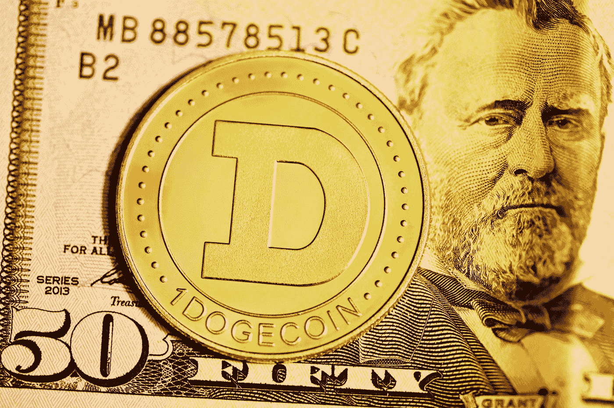
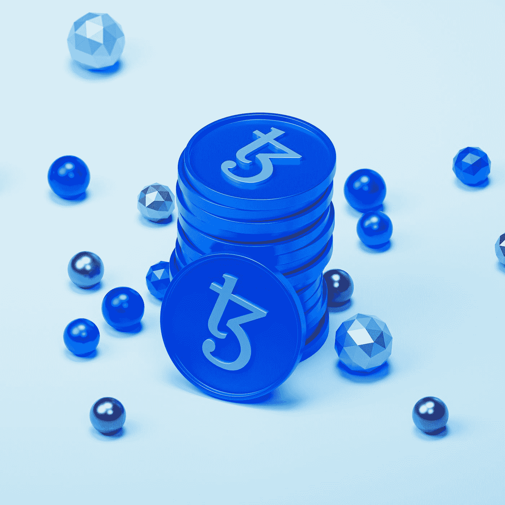
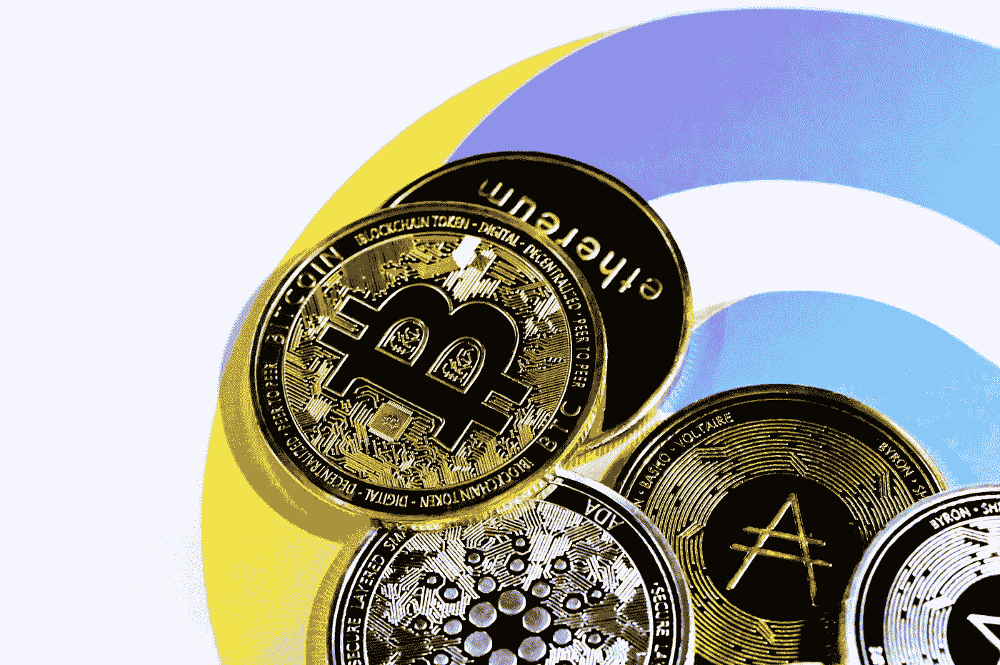
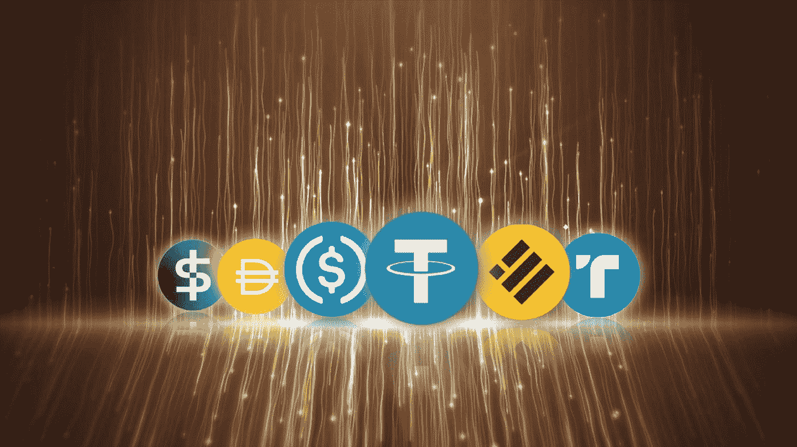
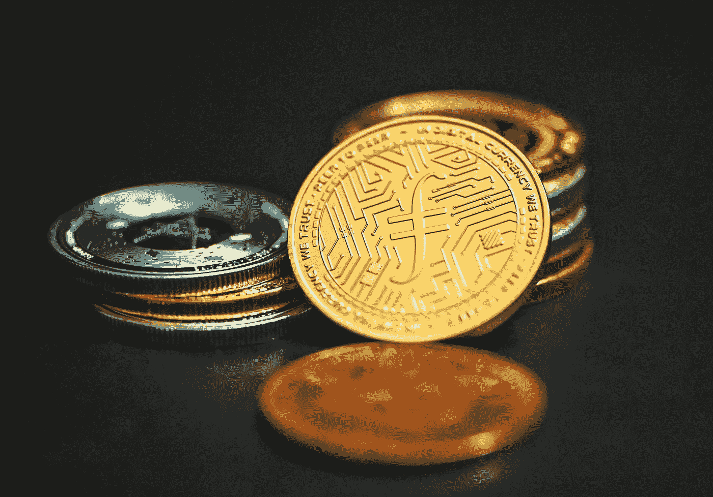

# 使用 Crypto 获得被动收入的 5 种方法——我这样做每月能赚 1000 多美元！

> 原文：<https://medium.com/coinmonks/5-ways-to-generate-passive-income-with-crypto-i-make-1000-month-doing-this-a7647b8c7ce3?source=collection_archive---------1----------------------->

近年来，加密货币因其潜在的高投资回报而广受欢迎。许多人都对用加密货币赚钱感兴趣，但他们可能没有时间或资源来积极交易它。在本文中，我们将探索五种利用加密货币获得被动收入的方法，每月最高可达 1000 美元。

Photo by [Kanchanara](https://unsplash.com/@kanchanara?utm_source=medium&utm_medium=referral) on [Unsplash](https://unsplash.com?utm_source=medium&utm_medium=referral)

1.  **打桩:**

Photo by [Rodion Kutsaiev](https://unsplash.com/es/@frostroomhead?utm_source=medium&utm_medium=referral) on [Unsplash](https://unsplash.com?utm_source=medium&utm_medium=referral)

利用加密货币赚取被动收入的一种方式是参与一个名为“赌注”的过程。赌注包括在数字钱包中持有一定数量的加密货币，并参与区块链上的交易验证过程。作为参与这一过程的回报，您可以获得一定比例的交易费以及帮助保护网络安全的奖励。一些流行的提供赌注的加密货币包括 Cardano、Cosmos 和 Tezos。

> 从顶级交易者那里复制交易机器人。免费试用。

**2。主节点:**

Photo by [Choong Deng Xiang](https://unsplash.com/@dengxiangs?utm_source=medium&utm_medium=referral) on [Unsplash](https://unsplash.com?utm_source=medium&utm_medium=referral)

另一种通过加密货币获得被动收入的方式是建立一个主节点。主节点是区块链网络上的特殊节点，执行各种功能，如处理事务和存储区块链的副本。作为运行 masternode 的回报，您可以获得交易费和区块奖励的一部分。一些提供 masternodes 的流行加密货币包括 Dash、PIVX 和 Zcoin。

**3。出借:**

Photo by [Traxer](https://unsplash.com/@traxer?utm_source=medium&utm_medium=referral) on [Unsplash](https://unsplash.com?utm_source=medium&utm_medium=referral)

你也可以通过 Nexo 或 BlockFi 等平台将加密货币借出，从而获得被动收入。这些平台允许你通过将持有的加密货币借给借款人来赚取利息。利率因平台和你借贷的加密货币类型而异，但你的投资有可能获得可观的回报。

**4。分红:**

Photo by [CoinWire Japan](https://unsplash.com/@coinwire?utm_source=medium&utm_medium=referral) on [Unsplash](https://unsplash.com?utm_source=medium&utm_medium=referral)

一些加密货币项目以分享利润或额外代币的形式向持有人提供红利。例如，一些 stablecoins 如 MakerDAO 和 Nexo 向其本地令牌的持有者提供红利。重要的是要做好你的研究，只投资那些有稳定回报记录的项目。

**5。云挖掘:**

Photo by [Shubham Dhage](https://unsplash.com/@theshubhamdhage?utm_source=medium&utm_medium=referral) on [Unsplash](https://unsplash.com?utm_source=medium&utm_medium=referral)

云挖掘涉及使用远程数据中心的处理能力来挖掘加密货币。你可以通过购买云采矿提供商的合同来获得加密货币的被动收入，这将允许你从采矿操作中获得一部分利润。选择云采矿提供商时要谨慎，这一点很重要，因为过去有许多骗局。

**结论:**

Photo by [Traxer](https://unsplash.com/@traxer?utm_source=medium&utm_medium=referral) on [Unsplash](https://unsplash.com?utm_source=medium&utm_medium=referral)

利用加密货币获得被动收入是可能的，但这确实需要一些研究和尽职调查。通过参与赌注，建立主节点，出借你的加密货币，投资提供股息的项目，或购买云采矿合同，你可以通过加密货币每月赚取高达 1000 美元。和任何投资一样，分散投资组合并意识到其中的风险是很重要的。

> 多样化的密码持有，了解[币安替代品](https://coincodecap.com/binance-alternatives)

*   [币安 vs FTX](https://coincodecap.com/binance-vs-ftx) | [最佳(SOL)索拉纳钱包](https://coincodecap.com/solana-wallets)
*   [比诺莫评论](https://coincodecap.com/binomo-review) | [斯多葛派 vs 3Commas vs TradeSanta](https://coincodecap.com/stoic-vs-3commas-vs-tradesanta)
*   [Capital.com 评论](https://coincodecap.com/capital-com-review) | [香港的加密借贷平台](https://coincodecap.com/crypto-lending-hong-kong)
*   [如何在 Uniswap 上交换加密？](https://coincodecap.com/swap-crypto-on-uniswap) | [A-Ads 审查](https://coincodecap.com/a-ads-review)
*   [WazirX vs coin dcx vs bit bns](/coinmonks/wazirx-vs-coindcx-vs-bitbns-149f4f19a2f1)|[block fi vs coin loan vs Nexo](/coinmonks/blockfi-vs-coinloan-vs-nexo-cb624635230d)