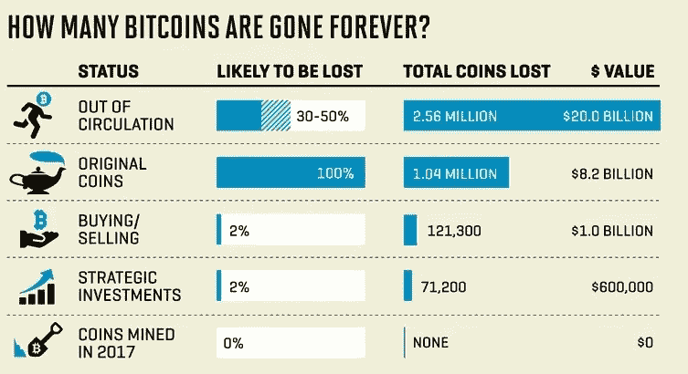
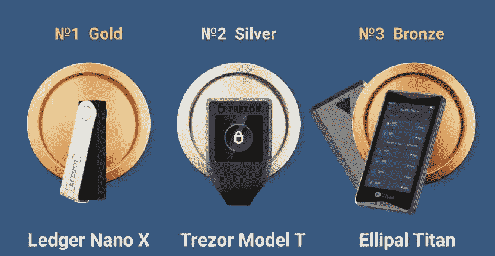
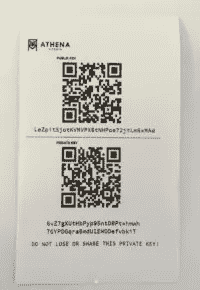

# 安全存储加密货币的 5 种方法

> 原文：<https://medium.com/coinmonks/5-ways-to-safely-store-your-cryptocurrency-12c05b286316?source=collection_archive---------57----------------------->

安全存储您的加密货币非常重要，因为它是一种很有价值的资产，容易被盗或丢失。如果您的加密货币存储不安全，它可能会被黑客窃取，或者在您无法访问钱包时丢失。

加密货币存储在数字钱包中，数字钱包本质上是保存你的公钥和私钥的软件程序。您的私钥是您访问加密货币的基础，因此确保它们的安全非常重要。

> 交易新手？在[最佳密码交易所](/coinmonks/crypto-exchange-dd2f9d6f3769)上尝试[密码交易机器人](/coinmonks/crypto-trading-bot-c2ffce8acb2a)或[复制交易](/coinmonks/top-10-crypto-copy-trading-platforms-for-beginners-d0c37c7d698c)

有几种方法可以安全地存储您的加密货币，包括使用硬件钱包、软件钱包、纸质钱包、冷藏或保管服务。这些选项各有利弊，因此根据您的需求选择合适的存储解决方案非常重要。

总的来说，安全地存储您的加密货币以保护您的资产并确保您可以访问它们是非常重要的。

以下是安全存储加密货币的五种方法:

1.  **使用硬件钱包:**

硬件钱包是一种离线存储加密货币的物理设备。这被认为是最安全的选择之一，因为它没有连接到互联网，因此不太容易受到黑客攻击。

硬件钱包通常会生成一个私钥，这是一个唯一的代码，允许您访问您的加密货币。私钥存储在硬件钱包上，不与任何在线服务器共享。这意味着，即使你的硬件钱包丢失或被盗，只要你保持你的私钥安全，你的加密货币将保持安全。

硬件钱包可以从不同的制造商那里买到，并且有不同的尺寸和价位。一些受欢迎的硬件钱包品牌包括 Ledger 和 Trezor。

要使用硬件钱包，您需要将其连接到您的电脑或移动设备，并输入 pin 码以访问您的加密货币。然后，您可以使用硬件钱包发送和接收加密货币，并查看您的余额。

总体而言，硬件钱包是存储加密货币的一种安全便捷的方式。然而，重要的是选择一个有信誉的制造商，并保持您的硬件钱包是最新的，以确保最高水平的安全性。

**2。使用软件钱包:**

软件钱包是一种可以安装在电脑或移动设备上的程序。它允许您存储、发送和接收加密货币。软件钱包通常被认为是安全的，但使用信誉良好的钱包提供商并保持您的设备和软件最新以降低黑客攻击的风险是很重要的。

软件钱包是可以安装在电脑或移动设备上的程序，允许您存储、发送和接收加密货币。它们通常被认为是安全的，但重要的是使用声誉良好的钱包提供商，并保持您的设备和软件最新，以降低黑客攻击的风险。

有不同类型的软件钱包，包括桌面钱包、移动钱包和网络钱包。桌面钱包安装在电脑上，允许您从该设备访问您的加密货币。移动钱包安装在智能手机上，允许你在旅途中访问你的加密货币。网络钱包通过网络浏览器访问，允许您从任何连接互联网的设备访问您的加密货币。

这里有几个软件钱包的例子:

1.  **MyEtherWallet:** 这是一个免费的开源软件钱包，支持以太坊和其他 ERC20 令牌。它可以在桌面上使用，也可以作为网络钱包使用，并提供多种安全功能，包括 2FA 和硬件钱包支持。
2.  **Electrum:** 这是一款免费的开源软件钱包，支持比特币和其他加密货币。它可以在桌面上使用，也可以作为移动钱包使用，并提供一系列安全功能，包括 2FA 和硬件钱包支持。
3.  **Coinomi:** 这是一款免费的开源软件钱包，支持多种加密货币。它可以用作移动钱包，并提供多种安全功能，包括 2FA 和硬件钱包支持。
4.  **Ledger Live:** 这是一款由制作硬件钱包的公司 Ledger 开发的软件钱包。它支持多种加密货币，可以在桌面上使用，也可以作为移动钱包使用。它提供了一系列安全功能，包括 2FA 和硬件钱包支持。
5.  **比特币基地钱包:**这是一款由比特币基地开发的软件钱包，这是一家流行的加密货币交易所。它支持多种加密货币，可以用作移动钱包。它提供了一系列安全功能，包括 2FA 和硬件钱包支持。

值得注意的是，这些只是软件钱包的几个例子，还有许多其他选项可用。做好自己的研究，选择一个符合自己需求、安全措施强的钱包是很重要的。

使用软件钱包时，务必使用最新的安全补丁和更新来更新您的设备和软件。您还应该启用双因素身份验证(2FA )(如果可用),因为这为您的帐户增加了一层额外的安全保护。为您的每个帐户使用强而唯一的密码，并避免与任何人共享您的私钥，这也是一个好主意。

总的来说，只要你采取必要的预防措施来保护你的资产，软件钱包可以是一种方便而安全的存储加密货币的方式。

**3。使用纸质钱包:**

纸质钱包是您的加密货币私钥的物理记录，通常打印在纸上。这是一个非常安全的选择，因为密钥不存储在连接到互联网的设备上。然而，把纸钱包放在一个安全的地方并确保它不会丢失或损坏是很重要的。

要使用纸质钱包，您需要生成一个新的地址和私人密钥。这可以通过加密货币钱包软件或在线服务来完成。一旦你有了私钥，你就可以把它和相应的地址一起打印在一张纸上。然后，您可以使用这个纸质钱包来存储您的加密货币，方法是将其发送到纸质钱包上列出的地址。

把纸钱包放在一个安全的地方并确保它不会丢失或损坏是很重要的。做一个纸质钱包的备份也是一个好主意，以防丢失或毁坏。

对于那些希望长期存储加密货币并且不打算频繁交易的人来说，使用纸质钱包是一个不错的选择。然而，对于日常使用来说，这不是最方便的选择，因为每次想要访问加密货币时，您都需要手动输入私钥。

**4。使用冷藏解决方案:**

冷存储是指离线存储加密货币的做法，可以在硬件钱包上，也可以在没有连接到互联网的设备上。这是一个安全的选择，因为它降低了您的加密货币被黑客攻击或窃取的风险。

实施冷藏有几种方法，包括:

*   使用硬件钱包:硬件钱包是一种离线存储加密货币的物理设备。这被认为是最安全的选择之一，因为它没有连接到互联网，因此不太容易受到黑客攻击。
*   将加密货币存储在未连接到互联网的设备上:这可以是一台仅用于存储加密货币的笔记本电脑或台式电脑，也可以是一个单独的存储设备，如 USB 驱动器。确保设备是安全的并且没有连接到互联网以降低黑客攻击的风险是很重要的。
*   打印出您的加密货币私钥:您可以打印出您的加密货币的私钥，并将其存储在安全的位置，如保险箱或银行存款箱。这是一个非常安全的选择，但是确保密钥不会丢失或损坏是很重要的。

总体而言，对于那些希望长期安全存储加密货币的人来说，冷藏是一个不错的选择。选择满足您的安全需求的冷存储解决方案并遵循最佳实践来保护您的加密货币是非常重要的。

**5。使用托管服务:**

保管服务是一家第三方公司，为你保管你的加密货币。这通常被认为是一个安全的选择，因为公司有强有力的安全措施来保护您的资产。然而，重要的是做你的研究，选择一个有信誉的保管服务。

使用托管服务来存储您的加密货币是一个安全的选择，因为该公司有强大的安全措施来保护您的资产。这些措施可能包括离线存储、多因素身份认证和保险。

使用保管服务的一个好处是，你不需要担心管理自己的私人钥匙或跟踪多个钱包地址。保管服务为你处理这一切。

然而，重要的是选择一个有信誉的保管服务。在将你的资产委托给他们之前，先研究一下这家公司的声誉、安全措施和跟踪记录。请务必阅读服务条款，并了解可能涉及的任何费用。

保管服务也可能提供额外的功能，如交易或交换您的加密货币的能力，或从您的资产中赚取利息。这些可能很方便，但了解与这些服务相关的风险和费用是很重要的。

一般来说，使用托管服务是存储加密货币的安全选择，但做好尽职调查并选择声誉良好的公司非常重要。

我希望这篇文章能帮助你理解安全存储你的数字资产的必要性。随着世界越来越接近数字账本，安全存储资产的需求将保护您免受血汗钱的损失。

如果你喜欢这个，请喜欢并关注我的博客。

[顶级密码](https://medium.com/u/608e0fc4efca?source=post_page-----12c05b286316--------------------------------)