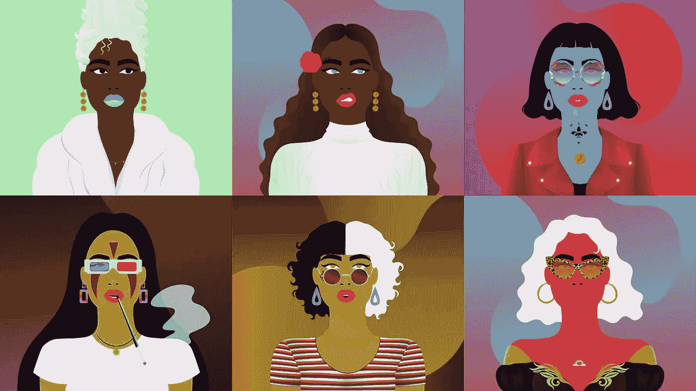
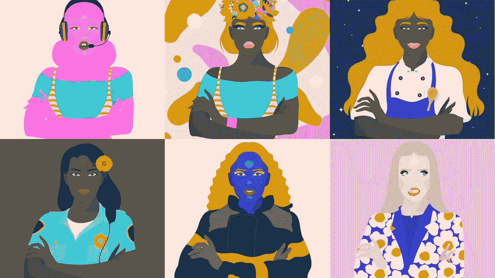
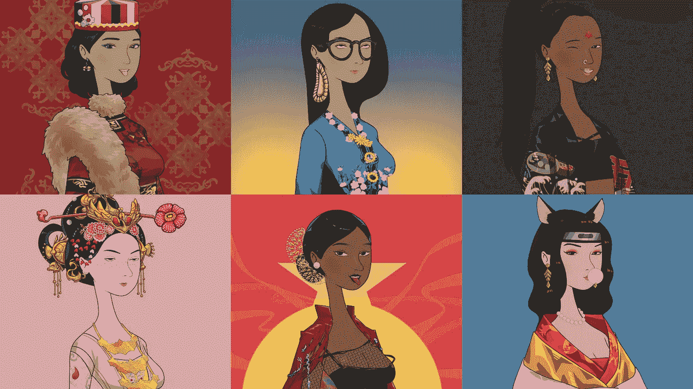
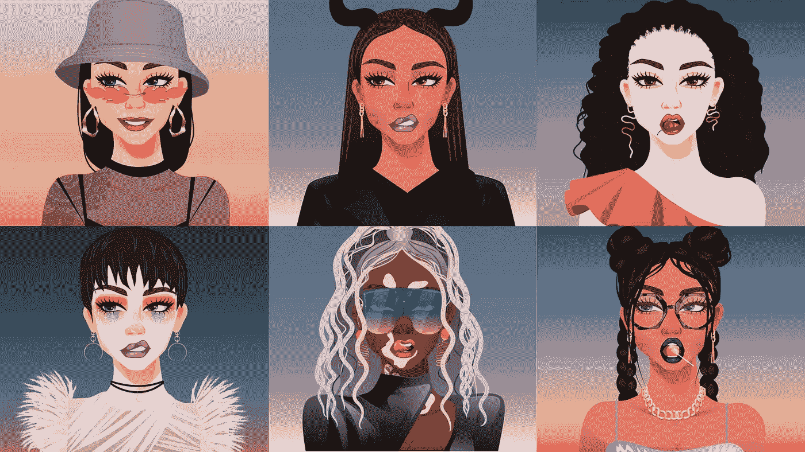
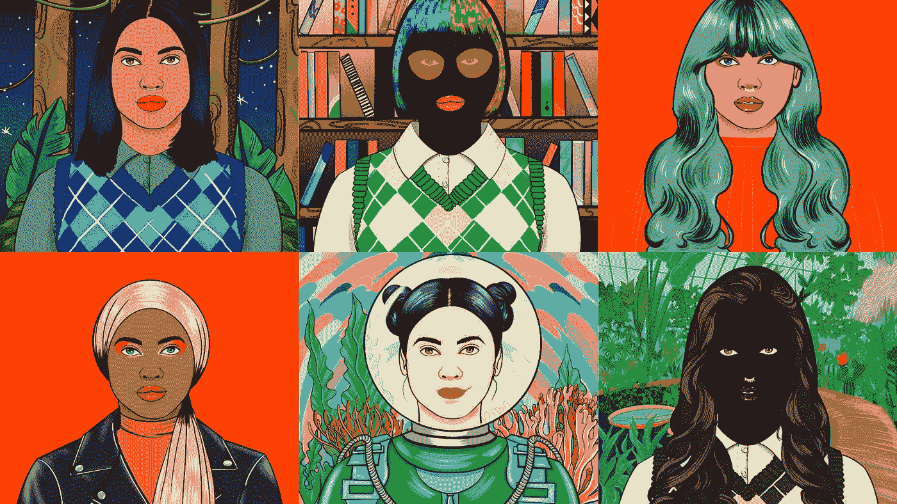

# 5 个妇女领导的国家森林论坛震撼了整个空间

> 原文：<https://medium.com/coinmonks/5-women-led-nfts-shaking-up-the-space-7b233d90ca11?source=collection_archive---------30----------------------->

你今天看到的大多数 NFT 项目都是由男人为其他男人创造的。但是在无聊的猿类游艇俱乐部、秘密朋克和隐形朋友的海洋中，来了几个意志坚强的女人，准备颠覆一切。

这些加密女王正在努力给女性艺术家和创作者一个声音，为社区中的女性发布他们的 NFT 系列。

以下是 5 个由女性领导的 NFT 项目，它们在过去两年中风靡了整个行业，致力于揭开女性秘密空间的神秘面纱:

## 1.女人的世界

[Clockwise from top left]: World of Women #9373, #3861, #1694, #3548, #4669, #4621\. Image courtesy of World of Women.

这是目前市场上最受欢迎的由妇女领导的 NFT 项目。由艺术家和联合创始人 Yam Karkai 于 2021 年 7 月创建的[女性世界](https://opensea.io/collection/world-of-women-nft)收集了 10，000 个不同且强大的女性化身。

该项目的愿景是:

*   构建一个包容性和多元化的网站 3
*   为任何人成为 NFT 项目的所有者、创造者和合作者创造新的平等机会
*   教育和登上不断增长的 NFT 艺术家，创作者和开发者的社区

它是如何变得如此流行的？

在许多女性对这个空间感到好奇的时候，成为首要的女性领导的 NFT 项目肯定有所帮助。该社区一直在等待一个项目，让女性在秘密空间中发表意见。

《妇女世界》这么快获得如此多关注的另一个原因是，她们的非功能性广告被一些知名人士购买，如瑞茜·威瑟斯彭、伊娃·朗格利亚和珊达·瑞姆斯。著名的营销天才和投资者 Gary Vee 也买了 15 本他自己的《own World of 》,使其在以 web2 投资者为主的受众中的知名度大增。

根据 OpenSea 的数据，World of Women 的底价为 3.3 ETH，在撰写本文时已完成 71，500 ETH 的交易量。

## 2.老板美人

[Clockwise from top left]: Boss Beauties #3029, #2706, #2983, #9804, #5690, #9705\. Image courtesy of Boss Beauties.

[Boss Beauties](https://opensea.io/collection/bossbeauties) 是 Lisa Mayer 的创意，她在过去的 10 年里一直通过她的慈善基金会 My Social Canvas 教育和赋权女性。

Boss Beauties 于 2021 年 9 月首次亮相，包括 10，000 张授权女性的数字画像，这些照片是由他们自己的 Z 世代变革者社区概念化的。这些妇女，正如她们的社区所想象的那样，代表了她们希望在这个世界上看到和成为的人。

> “一个女人可以成为她想要的一切”

忠实于 Boss Beauties 的座右铭，这些肖像展示了鼓舞人心的角色——从宇航员、母亲、士兵、飞行员等。

Boss Beauties 的使命是通过提供导师项目、实习和奖学金来教育和赋权下一代女性。

女演员伊娃·朗格利亚和企业家兰迪·扎克伯格等著名女性一直是 NFT 空间的有力倡导者，她们都购买了自己的老板美人，帮助使其成为主流。

根据 OpenSea 的数据，Boss Beauties 的底价为 0.39 ETH，在撰写本文时已完成 15,600 ETH 的交易量。

## 3.8 西安

[Clockwise from top left]: 8SIAN #666, #6990, #5972, #7573, #4152, #945\. Image courtesy of 8SIAN.

Nicole Yap 是 [8SIAN](https://opensea.io/collection/8sian-main-collection) 的联合创始人，在注意到亚洲人和女性在这个行业中严重缺乏代表性后，她于 2021 年 10 月发起了 NFT 项目。

8SIAN 收集了 8，888 位亚洲女性 NFT，她们每个人都有独特的文化背景和故事。

在汉语中，数字 8 是象征性的，代表财富、繁荣和成功。它也是平衡的象征，这就是为什么现存的 NFT 空间的不平衡是八仙 NFT 运动的核心。

成为一名 8SIAN 收藏家包括对举办竞赛和活动的社区主导基金的重大影响，以及获得区块链奖学金计划。但其路线图中最令人兴奋的是其将项目整合到元宇宙的计划，在那里 NFT 所有者可以使用他们的 8SIAN 虚拟角色进行互动。

根据 OpenSea 的数据，8SIAN 的底价为 0.06 ETH，在撰写本文时已完成 4，700 ETH 的交易量。

## 4.秘密小鸡

[Clockwise from top left]: Crypto Chicks #3, #9218, #9955, #9187, #8922, #9380\. Image courtesy of Crypto Chicks.

[Crypto Chicks](https://opensea.io/collection/the-crypto-chicks) 于 2021 年 9 月首次亮相，展示了 1 万幅不同背景的女性插图。Crypto Chicks NFTs 的丰富多彩、有趣和时尚的属性在第一天推出并销售一空时就引起了巨大的轰动。

Crypto Chicks 由 Elissa Maercklein 和 Madeline Lieber 创建，其愿景是建立一个社区，在整个 web3 旅程中赋予女性权力。这两位女士谈到了大多数新兴行业是如何严重地由男性主导的，但是 web3 为多样化提供了一个新的机会。

根据 OpenSea 的数据，Crypto Chicks 的底价为 0.18 ETH，在撰写本文时已完成 12，900 ETH 的交易量。

## 5.女性崛起

[Clockwise from top left]: Women Rise 9409, 9778, 8630, 4394, 2188, 3880\. Image courtesy of Women Rise.

[女性崛起](https://opensea.io/collection/womenrise)由 10，000 件独特的随机生成的 NFT 艺术作品组成，这些作品基于巴基斯坦艺术家 Maliha Abidi 绘制的 453 个女性手绘特征。

每件艺术品都代表了来自世界各地的女性，颂扬她们作为活动家、科学家、编码员、艺术家等角色，集体起来让世界变得更美好。

“女性崛起”寻求邀请更多女性加入社区，并为下一代网络 3 女孩在技术、区块链和 NFT 空间中的代表性做出贡献。

NFT 项目的路线图包括向慈善组织捐款，支持边缘化社会的性别平等、女童教育和心理健康。

“妇女崛起”也是首批致力于实现联合国可持续发展目标(SDG)的 NFT 项目之一，这是 web2 组织在过去几年中一直致力于采纳的目标。

根据 OpenSea 的数据，Women Rise 的底价为 0.07 ETH，在撰写本文时已完成 6，000 ETH 的交易量。

## 下一步是什么？

在过去的两年里，我们已经看到多个由女性主导的 NFT 系列出现在这个领域——但这仅仅是个开始。

我提到的这些项目中，有一些计划发布即将推出的系列，或者在路线图的下一阶段推进。

我的建议？注意这个空间。

*免责声明:任何意见表达(如有更改，恕不另行通知)都是我(作者)个人的意见，我(作者)不保证所提供的任何信息或分析的准确性或完整性。*

> 加入 Coinmonks [电报频道](https://t.me/coincodecap)和 [Youtube 频道](https://www.youtube.com/c/coinmonks/videos)了解加密交易和投资

# 另外，阅读

*   [印度最佳 P2P 加密交易所](https://coincodecap.com/p2p-crypto-exchanges-in-india) | [柴犬钱包](https://coincodecap.com/baby-shiba-inu-wallets)
*   [八大加密附属计划](https://coincodecap.com/crypto-affiliate-programs) | [eToro vs 比特币基地](https://coincodecap.com/etoro-vs-coinbase)
*   [最佳以太坊钱包](https://coincodecap.com/best-ethereum-wallets) | [电报上的加密货币机器人](https://coincodecap.com/telegram-crypto-bots)
*   [交易杠杆代币的最佳交易所](https://coincodecap.com/leveraged-token-exchanges) | [购买弗洛基](https://coincodecap.com/buy-floki-inu-token)
*   [3Commas 对 Pionex 对 Cryptohopper](https://coincodecap.com/3commas-vs-pionex-vs-cryptohopper) | [Bingbon 评论](https://coincodecap.com/bingbon-review)