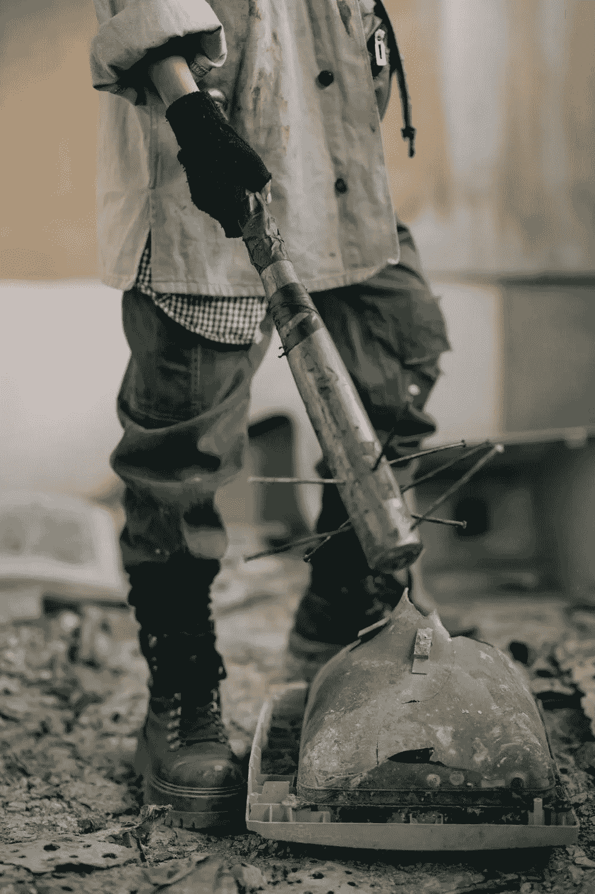
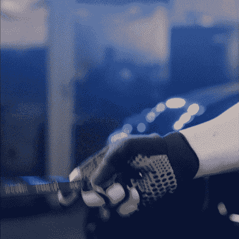
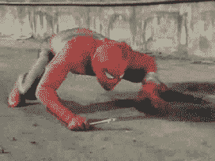
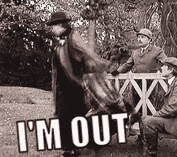

# 5 美元扳手攻击

> 原文：<https://medium.com/coinmonks/5-wrench-attack-d4aeef84a5a?source=collection_archive---------26----------------------->

Image by Cottonbro on [Pexels](http://pexels.com)

“如果安全得不到保证，去中心化就没有意义了。”

质疑权力下放是否是现有金融体系的可行替代方案的情况偶尔会发生。这份清单包括了从平台黑客到地毯式搜索到监管和可伸缩性的所有内容。

然而，加密货币是新技术的一部分，有更多的改进机会，这一事实确实需要引起高度重视。

本文不会支持或反对采用加密货币；相反，它将关注如何保护你的投资。

**听说过 5 美元扳手袭击吗？**

gif from [giphy](http://giphy.com)

尽管你可能会捐出 5 美元而不太在乎，但 5 美元的扳手攻击不是你不在乎的事情。虽然“5 美元扳手攻击”听起来很便宜，但它能够造成很大的损害。

**什么是 5 美元扳手攻击？**

一个 **$5 扳手攻击**是当某人决定对拥有加密货币的人进行物理攻击，以迫使他们在了解他们的持有情况后交出他们的资产或放弃他们的私钥。

受害者是其中有加密货币资产的钱包地址的所有者，这一事实对于攻击者来说一定是已知的，因为至少发生了 5 美元的扳手攻击。

也许你已经读到过，公开你的公钥只能让黑客有限地访问你的加密资产，他们最多能做的就是记录你的钱包交易。然而，时代已经变了，所以您可能要重新考虑盲目公开您的公钥。即使你的公钥不能让犯罪分子进入你的钱包，你的私钥也很有可能让他们亲自搜查你。

> 交易新手？尝试[加密交易机器人](/coinmonks/crypto-trading-bot-c2ffce8acb2a)或[复制交易](/coinmonks/top-10-crypto-copy-trading-platforms-for-beginners-d0c37c7d698c)

任何加密投资者最不希望经历的事情就是被不祥的、也许是武装的个人攻击和折磨，要求访问他们的私钥或加密钱包。在当前这个世纪，一些人已经变得完全分散，这意味着他们将很大一部分财富保留在加密货币中，如果他们的私钥被泄露，他们将遭受巨大损失。

当你选择使用分散系统而不是像银行那样的集中系统时，你同意承担保护你钱包的责任。很明显，你一直做得很好，但你可能需要更进一步。时代在变，外面变得异常狂野。

如果你被犯罪分子胁迫将钱从你的银行转移到其他银行账户，你可以提出投诉，并要求你的银行与其他打击犯罪的组织合作，协助追查你的钱最终到了哪里。这只有在传统的银行系统中才有可能。在处理加密货币时，情况远非如此；所有交易都是完全匿名的。在确定谁有权访问该帐户之前，您不能将一个钱包地址(尤其是如果它是非保管型钱包)与人脸进行比对。

那么接下来会是什么呢？您是否因为潜在的犯罪性人身攻击而失去了所有的加密资产？

没有答案，这篇文章将是不完整的！

然而，事实是，你仍然有一些控制权。你可以控制事情的发展。

你只要做对就行了。

**保护自己免受 5 美元扳手攻击**

到目前为止，您可能已经接受了适当的教育，黑客和攻击者可能会用您的私钥造成更大的破坏，并且几乎永远不会通过知道您的公钥来访问您的钱包。即使那仍然是非常正确的，你应该停止把你的公共密匙公开给每个人。眼下的战斗不是针对互联网攻击者的战斗；相反，您必须保护自己免受物理攻击者的攻击，他们可能会威胁您将您的加密资产交给他们。

如果你习惯这样做，你将不得不成为大人物，也许不会炫耀你的加密货币财富。成为 [SAFU](https://www.urbandictionary.com/define.php?term=Safu) 比感到抱歉更好。只有当你能够成长并保证你的钱的安全时，你才能变得有价值。继续避免在容易被识别的平台上披露您持有的加密货币。如果你必须公开你的加密资产，那么使用一个完全匿名的账户；不能跟你扯上关系的东西。当你的钱包地址的匿名性被适当地保持时，任何人将很难把那个钱包地址的所有权与你联系起来(即使在互联网上)。

如果你仍然执着于一个钱包，这可能不是你想听到的，但是是时候拥有一个以上的钱包了。拥有一个可以存放少量加密货币的诱饵钱包将有助于你保持安全。如果意外发生，你只会损失一小部分加密货币，而不是全部投资。攻击者的假设是，您只能访问假钱包，其他什么都没有。你可以有不止一个假钱包，以防攻击者认为你有额外的钱包。

住在一个安全的地方并保持高度的家庭安全是避免这种攻击的可靠方法。与处于易受攻击环境中的人相比，处于更安全的环境中意味着您被攻击和被迫交出您的加密资产的可能性更低。这意味着你应该对你决定出门的地方保持谨慎，你家的安全应该是严密的。

您可能也想在脱机状态下保持低调；你生活和工作的地方。考虑到有些人想接受你的秘密投资，如果他们不知道你是一个秘密投资者会更好。避免使用“加密投资者”这样的标签，这样至少不会有任何无意义的宣传围绕着你，你可能会阻止 5 美元扳手攻击的发生。

**结论**

无论是在线还是离线，都存在有人试图危及您的加密货币投资的情况，因此您必须意识到这些情况发生的可能性。

您应该优先考虑加密空间中剩余的 SAFU。

adiós