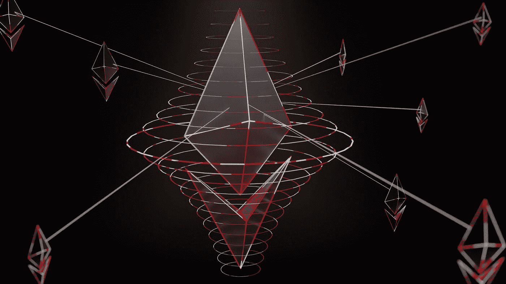

# 以太坊 2.0 完成 55%意味着是一个未完成的产品

> 原文：<https://medium.com/coinmonks/55-completion-of-ethereum-2-0-means-an-unfinished-product-23262c221a9e?source=collection_archive---------33----------------------->

Photo by [Shubham Dhage](https://unsplash.com/@theshubhamdhage?utm_source=medium&utm_medium=referral) on [Unsplash](https://unsplash.com?utm_source=medium&utm_medium=referral)

以太坊是一种流行的加密货币和数字令牌，可用于构建去中心化的应用。然而，最近它的主要用例是在以太坊平台本身。以太坊是一个基于区块链的公共平台，可用于构建去中心化的应用程序，如智能合约。智能合同是运行在虚拟机上的计算机程序，称为…