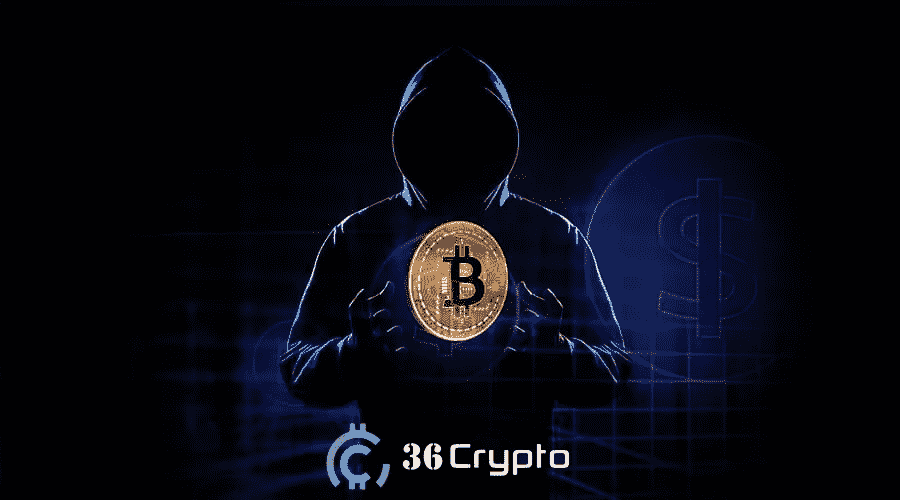

# 6 个比特币骗局和 5 种避免它们的方法——36 crypto

> 原文：<https://medium.com/coinmonks/6-bitcoin-scams-and-5-ways-to-avoid-them-36crypto-19edbae04b70?source=collection_archive---------21----------------------->

自从比特币和[加密货币](https://36crypto.com/some-truth-about-cryptocurrency-you-must-know/)普遍引入以来，已经有几起诈骗案的报道，涉及数百万美元。一些最常见的比特币诈骗包括虚假网站、勒索、虚假移动应用、电子邮件诈骗、赠品诈骗和社交媒体钓鱼。

2020 年[记录了超过 86 次攻击](https://www.comparitech.com/crypto/bitcoin-statistics-security/#:~:text=21.,and%20around%2016%20in%202018.)的大规模骗局，攻击者带走了价值超过 5 亿美元的加密货币。与 2018 年和 2019 年相比，2020 年记录的加密骗局要多得多。

2021 年，这一数字呈指数增长，价值超过 140 亿美元的加密货币被盗。随着人们越来越意识到，新的诈骗方式每天都在涌现，如果你不小心，你可能会失去所有的积蓄给这些家伙。

在本文中，我们将讨论一些常见的**比特币骗局和 5 种不同的避免方法**。如果这些骗子设法诱骗你在尝试比特币交易时出错，他们最终可能会窃取你的比特币，并且几乎不可能追回你被盗的资产或找到骗子。

可能重要的是要知道，这些骗局不仅仅是针对比特币的，还有一些针对其他加密资产的成功骗局和尝试。NFT 诈骗案也呈上升趋势。一般来说，在进行[加密交易](https://36crypto.com/5-steps-to-invest-in-cryptocurrency-a-beginners-guide/)时，你应该非常小心。让我们开门见山吧。

# 6 种常见的比特币骗局

比特币和[加密货币骗局](https://36crypto.com/some-truth-about-cryptocurrency-you-must-know/)的形式类似，首先，它们会通过获取安全代码或私钥等私人信息来欺骗你进入你的钱包。然后他们直接从你的钱包里转移或窃取加密货币。

一些常见的比特币骗局包括:

*   虚假网站
*   勒索
*   假冒手机应用
*   电子邮件诈骗
*   赠品骗局
*   社交媒体网络钓鱼

# 1.虚假网站

作为一个新的加密用户，你可能很难识别虚假网站，并将其与合法网站区分开来。许多这样的网站被设计成看起来非常真实的样子，有时他们甚至会克隆原始网站。

他们承诺给你巨大的利润和巨大的投资机会，在加密开采方面也是如此。投资的[步骤可能很容易，但几乎不可能提取你的收益，因为骗子会带着所有的钱逃跑，并进一步关闭网站。](https://36crypto.com/5-steps-to-invest-in-cryptocurrency-a-beginners-guide/)

这种类型的骗局的主要目的是从天真的人那里收集尽可能多的投资，然后关闭，清洗，并在一个新的域中重复这个过程。

# 2.勒索

加密货币勒索并不完全流行，但过去也有记录在案的案例。在这种类型的骗局中，犯罪者编造关于你的信息，并威胁如果你不遵守，就通过向他们发送[比特币付款](https://36crypto.com/5-things-you-can-buy-with-bitcoin-in-2022/)来释放他们。

他们选择加密支付，因为这有助于他们在交易中保持匿名。当你注册他们的网站或在不知情的情况下使用他们的假冒产品时，他们可以获得你的信息，比如你的电子邮件。

这种骗局的压力可能会让你向他们支付他们想要的任何金额的比特币。

# 3.假冒手机应用

这几乎类似于虚假网站骗局，只是在这一次，他们没有利用网络，而是引入了移动应用程序。这已经成为一种相当流行的方式来欺骗和骗取人们的[加密资产](https://36crypto.com/some-truth-about-cryptocurrency-you-must-know/)。

该应用程序的开发方式与原始应用程序相似，然后他们会欺骗你，让你相信你正在使用真正的移动应用程序。这个骗局的目的是欺骗你释放你的[密钥](https://36crypto.com/top-5-crypto-wallets/)来访问你的数字钱包。

当他们获得对你的[加密钱包](https://36crypto.com/top-5-crypto-wallets/)的访问和控制时，他们可以带走你存下的任何数量的比特币和其他加密货币。

一个流行的加密货币交易应用程序 Poloniex 成为了这种骗局的受害者。骗子开发了一个看起来像 Poloniex 的假应用程序，引诱超过 10，000 名用户下载它，并可能在他们注意到之前危及他们的储蓄。

# 4.电子邮件诈骗

今天，电子邮件是沟通和接触任何企业的潜在客户或顾客的最佳和最简单的方式之一。骗子向人们发送虚假的电子邮件，使其看起来像是来自一个有信誉的合法来源。

在这种类型的电子邮件中，目的是给人一种紧迫感，诱使你迅速做出决定，向他们发送加密支付。例如，他们可以发送一封关于产品或投资的有限优惠的电子邮件。

如果没有适当的研究和观察，你可能最终会向他们发送比特币或其他加密货币。随着 NFT(不可替代代币)和 ico(首次发行硬币)等基于加密的投资的引入和增长，骗子现在有更多的方法来获取你的加密。

# 5.赠品骗局

每个人都喜欢好的赠品。当你免费得到一件有价值的东西时，感觉总是很好。这些类型的骗局以广告的形式出现在社交媒体上，如 YouTube、Twitter、脸书、Instagram 和其他社交媒体平台。

他们再次用有限的报价时间戳描绘了一种紧迫感，并承诺增加或匹配发送给他们的加密货币的数量。他们给你的印象是千载难逢的机会。

可能很难辨别这个骗局，因为社交媒体上也有很多合法的赠品，这就是为什么我们总是建议你在参与之前做大量的研究。

# 6.社交媒体网络钓鱼

这是一种常见的比特币骗局，你很可能会在社交媒体上发现，就像赠品骗局一样。骗子创建社交媒体账户，冒充在[加密货币领域](https://36crypto.com/what-is-cryptocurrency-the-beginners-map-to-understanding-how-cryptocurrency-works/)受欢迎的人。

他们做的下一件事是创建假赠品，并通过推文或直接消息分享它们。如果你参与他们在这些平台上推广的任何东西，他们会向你提供一定数量的加密货币。

2021 年，埃隆·马斯克的模仿者从用户那里骗取了价值超过 200 万美元的[加密货币](https://36crypto.com/what-is-cryptocurrency-the-beginners-map-to-understanding-how-cryptocurrency-works/)。还有其他记录在案的案例，比如有人冒充**以太坊的联合创始人**Vitalik buter in，尤其是在[以太坊合并](https://36crypto.com/understanding-the-ethereum-merge-in-simple-term/)宣布并成功完成之后。

# 避免比特币骗局的 5 种方法

比特币骗局可能几乎每天都在增加，但你可以采取一些措施来警惕和避免它们。

以下是一些可以避免比特币骗局的方法:

# [在这里继续阅读](https://36crypto.com/bitcoin-scams-5-ways-to-avoid-them/)

*原载于 2022 年 9 月 26 日*[*【https://36crypto.com】*](https://36crypto.com/bitcoin-scams-5-ways-to-avoid-them/)*。*

> 交易新手？尝试[加密交易机器人](/coinmonks/crypto-trading-bot-c2ffce8acb2a)或[复制交易](/coinmonks/top-10-crypto-copy-trading-platforms-for-beginners-d0c37c7d698c)