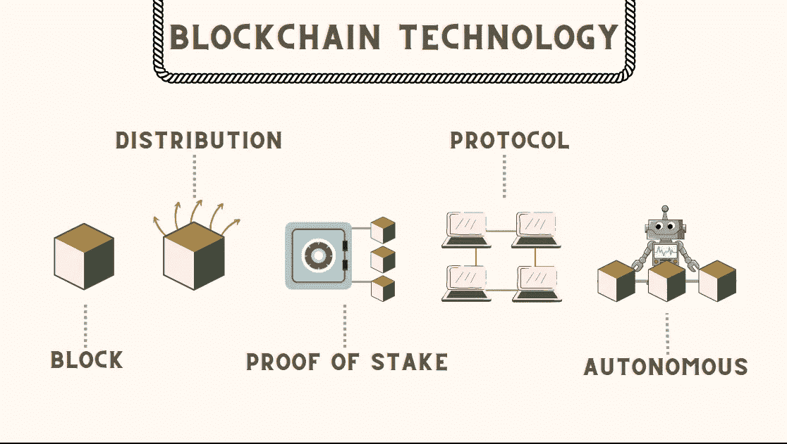

# 在寻求区块链咨询服务之前，需要了解 6 个区块链技术趋势

> 原文：<https://medium.com/coinmonks/6-blockchain-tech-trends-to-check-out-before-seeking-blockchain-consulting-2eccd6c0441e?source=collection_archive---------32----------------------->

加密货币和区块链技术的市场对我们所有人来说都是新的。传统机构之间在加密货币、区块链和去中心化方面存在激烈竞争。这将需要一些时间来传播这些技术的真正潜力。但是一旦你这样做了，没有人能阻止它——人们仍然想分一杯羹。区块链有广泛的用例；它是一种分布式加密数据库变体，可以解决在线安全和信任问题。你可以看看下面的信息图来了解区块链科技:

Blockchain Technology Trends

**在寻求区块链咨询服务之前，我们先来谈谈 6 大技术趋势:**

# **1。元宇宙的崛起:**

区块链技术将是虚拟世界增长的有效解决方案，因为去中心化的网络使其创造者能够控制各种因素。元宇宙的概念已经存在很多年了。然而，它在全球市场越来越重要。根据最新报告，基于虚拟现实的娱乐是最受期待的领域之一，预计未来几年的收入将增长超过 10 亿美元。此外，博彩业今年还讨论了区块链元宇宙的发展。所以，如果你为你即将到来的商业项目寻找[区块链咨询服务](https://bloxbytes.com/)，你应该知道像元宇宙这样的新兴技术趋势的事实。

# **2。NFT 是未来:**

不可替换的代币很久以前就被引入市场。它们最初是游戏玩家作为游戏代币使用的 ERC-721，但似乎去中心化的承诺和管理 NFT 使用的智能合同吸引了更多的玩家。它为这些代币带来了许多新的好处，人们开发了分散的应用程序来促进这些用途。然而，他们创造任何可以以某种方式交易的实物或虚拟资产的安全令牌化版本的能力，可能会扰乱电子商务世界。这是相反的虚拟物品像神奇宝贝卡，堡垒之夜网络武器等。今天被追踪。

# **3。区块链协议:**

按照当前的趋势，区块链协议是在工作一致性算法的基础上发起和发展的。权力有很多优势，比如分散化，没有中央权威，交易成本较低。

> 交易新手？尝试[加密交易机器人](/coinmonks/crypto-trading-bot-c2ffce8acb2a)或[复制交易](/coinmonks/top-10-crypto-copy-trading-platforms-for-beginners-d0c37c7d698c)

# **4。跨境支付:**

随着跨境交易的兴起，你就能理解跨境支付有多关键了。这就是为什么区块链技术成为过去十年中出现的最具颠覆性的技术之一，影响着全球不同的行业和企业。例如，日本和韩国的一些银行已经开始使用区块链技术进行支付交易。

**底层技术提供了显著的优势:**

*   立即执行
*   提高可追溯性
*   透明度
*   降低成本
*   速度加快
*   安全性

# **5。智能合约:**

[智能合同](https://bloxbytes.com/smart-contracts/)提供了一种新颖、高效的解决方案来实现商业交易的自动化，具有自我执行和自我实施的优势。它们还消除了中介的介入，为传统合同法提供了更快、更便宜的替代方案。再者，区块链的本质是透明的。因此，智能合约是透明的、安全的、不可信的，并且是 100%可验证的。

**智能合同用法的示例包括:**

*   供应链
*   国际贸易
*   保险支付
*   投票
*   众筹

# **6。加密货币:**

区块链技术是加密货币核心的数据库。这个数据库与数以千计的计算机相连，以达成交易的共识。然而，使用区块链有更多的优势，因为它是一种去中心化的方式来存储网络中的数据和信息。

**用不了多久，加密货币就会流行起来:**

*   支付
*   投资
*   挑战
*   更多的数字货币

# 结论:

在这篇博客中，我列出了一些你在寻找区块链咨询公司之前应该考虑的事实。这几点会让你意识到最近的技术趋势，包括元宇宙和 NFT。区块链无疑证明了它在改变我们所知的世界方面的勇气，这就是为什么所有行业都开始考虑区块链在日常运营中的巨大潜力。区块链被追踪到区块链初创公司、应用程序和交易平台的投资上升趋势所取代。此外，区块链的使用案例正在以指数速度增长。同时，很明显，区块链将在未来继续带来革命性的变化。2022 年区块链的趋势指出了这项技术将如何从一个发展中的概念转变为跨多个行业的名副其实的实体。

> *加入 Coinmonks* [*电报频道*](https://t.me/coincodecap) *和* [*Youtube 频道*](https://www.youtube.com/c/coinmonks/videos) *了解加密交易和投资*

# 另外，阅读

*   [3 商业评论](/coinmonks/3commas-review-an-excellent-crypto-trading-bot-2020-1313a58bec92) | [Pionex 评论](https://coincodecap.com/pionex-review-exchange-with-crypto-trading-bot) | [Coinrule 评论](/coinmonks/coinrule-review-2021-a-beginner-friendly-crypto-trading-bot-daf0504848ba)
*   [莱杰 vs n 格拉夫](/coinmonks/ledger-vs-ngrave-zero-7e40f0c1d694) | [莱杰纳诺 s vs x](/coinmonks/ledger-nano-s-vs-x-battery-hardware-price-storage-59a6663fe3b0) | [币安评论](/coinmonks/binance-review-ee10d3bf3b6e)
*   [加密交易机器人](/coinmonks/crypto-trading-bot-c2ffce8acb2a) | [Bingbon 评论](https://coincodecap.com/bingbon-review)
*   [Bybit Exchange 审查](/coinmonks/bybit-exchange-review-dbd570019b71) | [Bityard 审查](https://coincodecap.com/bityard-reivew) | [Jet-Bot 审查](https://coincodecap.com/jet-bot-review)
*   [3 commas vs crypto hopper](/coinmonks/3commas-vs-pionex-vs-cryptohopper-best-crypto-bot-6a98d2baa203)|[赚取加密利息](/coinmonks/earn-crypto-interest-b10b810fdda3)
*   最好的比特币[硬件钱包](/coinmonks/hardware-wallets-dfa1211730c6) | [BitBox02 回顾](/coinmonks/bitbox02-review-your-swiss-bitcoin-hardware-wallet-c36c88fff29)