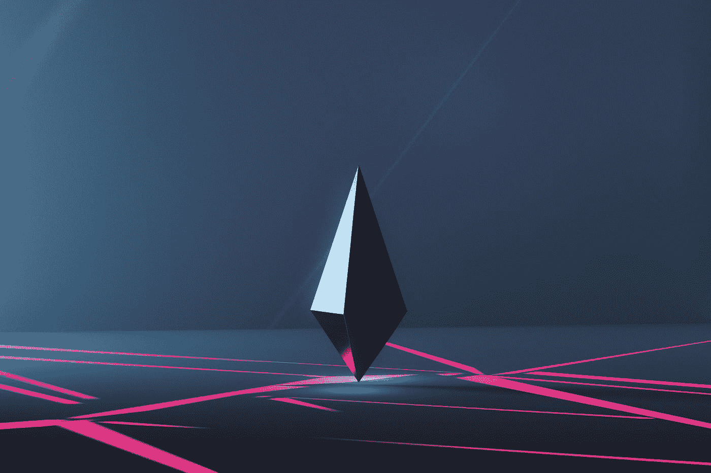

# 加密的 6 个真实使用案例

> 原文：<https://medium.com/coinmonks/6-real-world-use-cases-of-crypto-d3e3675a0849?source=collection_archive---------24----------------------->

## 以及为什么你应该探索 web3

在过去的两年里，我敢打赌至少有一个人告诉你应该进入 crypto。此外，我猜你也从来没有得到一个好的理由或解释。我们的生活中都有这样的人。我自己也做过那样的人，也对别人做过。

显而易见的问题是为什么？用一个数字钱包和一些以太网令牌你能做什么？进入 crypto 有什么意义，为什么要关注它？

Photo by [Milad Fakurian](https://unsplash.com/@fakurian?utm_source=medium&utm_medium=referral) on [Unsplash](https://unsplash.com?utm_source=medium&utm_medium=referral)

在本文中，您将通过探索 crypto 的 6 个真实世界用例以及如何开始来了解您可以在 web3 中做什么。

# **1。分钟付款**

加密货币最普遍和最相关的用例之一是区块链上即时的点对点(P2P)交易。假设你住在苏格兰的爱丁堡，你的女儿在加州圣地亚哥上大学。突然，你的女儿摔断了胳膊，被紧急送往医院。仅坐救护车一项就花了她 5000 美元，她刚刚花光了所有的钱去坎昆度假。在以太坊这样的区块链上使用加密货币，你可以在 5 分钟内将钱打入她的钱包，无论你在世界的哪个角落。不问任何问题。没有 3 天电汇窗口。没有银行挡路。快速、无摩擦、无权限。

Credit [Bitcoin News](https://news.bitcoin.com/private-bitcoin-p2p-exchanges-cash/)

当然还有成千上万的其他例子。这里的要点是即时 P2P 转换非常有价值。然而，在当今的加密市场中，这样做确实会带来一些波动风险。但是，如果您使用 ETH 或 BTC 等成熟的令牌，就可以大大降低这种风险。需要说明的是，菲亚特世界的波动风险也非常真实。今年 9 月，英镑兑美元汇率在几天内暴跌。所以从技术上讲，电汇会带来更大的风险，因为它需要更长的时间才能到达。你所需要的只是一个像 [MetaMask](https://metamask.io/) 这样的数字钱包。

有趣的事实，在 10 月 7 日的那一周，[比特币实际上比道琼斯指数波动性更小！](https://bitcoinist.com/bitcoins-is-not-volatile-the-dow-jones-is/)金融的未来可能比你想象的更近。

# **2。替代收入来源**

到目前为止，您可能听说过 NFTs？可悲的是，大多数主流媒体的注意力都集中在 NFT 的项目上，这些项目达到了天文数字的价格，但没有多少实际应用或用例。然而，如果你不去理会这些噪音，你会发现有一整个世界的非金融资产可以作为替代的现金流投资。如果你想分散你的投资组合，为什么不看看音乐 NFT 呢？他们提供歌曲或专辑的部分所有权，并向你支付持续的流媒体版税。此外，他们背后往往有强大的代币持有人群体，他们正努力提高您的投资价值。相当酷！

[AnotherBlock](https://anotherblock.io/)

我已经开始使用[瑞典 NFT 平台 AnotherBlock](https://anotherblock.io/) 构建我的另类现金流投资组合，但还有许多其他优秀的项目提供了强劲的投资机会。你也可以使用 [OpenSea](https://opensea.io/) 或 [NiftyGateway](https://www.niftygateway.com/) 在二级市场上购买音乐 NFT。

# **3。未经批准出借或贷款**

如果你以前贷款过，你会对它提供的糟糕的用户体验很熟悉。不管你的经济状况如何，当你去找银行要钱时，银行会让你觉得自己是一个值得珍惜的客户吗？大概不会。

在 web3 中，你不需要问任何人。把你的钱包和钱包或钱包连接起来，几分钟内就可以贷款，不问任何问题。

或者，如果你存了一些额外的钱，你想赚取一些收益。当你把钱存在银行的储蓄账户里时，你认为银行会和你分享回报吗？不太可能。现在你可以直接去 Aave，把你的钱存起来作为流动性(其他人可以借你的钱)，然后做市场利率。或者，把它押在你最喜欢的股权证明协议上，获得稳定的收益怎么样？这些都可以在 DeFi 中找到。

# **4。为你的企业或项目筹集资金**

曾经有过一个创意项目或业务的好主意，但却没有启动它的资本？像 Kickstarter 和 T2 这样的网站开创了众筹的时代。对于许多艺术家和企业家来说，这些改变了游戏规则。然而，它们受到你所在国家的严重限制(这限制了你潜在投资者的数量)，你必须遵守你所在国家的法律框架。这通常意味着大量的文书工作，并可能需要律师的帮助。

在以太坊这样的区块链上，你可以在几分钟内从世界各地的人那里为你的项目筹集资金！通过设计一份智能合同，规定如何使用资金的规则，投资者可以对资助你的项目充满信心，即使他们从未见过你。你只需要一个数字钱包。开始使用[分散资助的一个好地方是 Gitcoin Grants。](https://gitcoin.co/grants/)

[Gitcoin Grants](https://gitcoin.co/grants/)

# **5。建立你的声誉**

我们都有数字生活和角色，无论是你的社交媒体档案，你的 YouTube 频道还是你的元宇宙头像。然而，这些角色分布在多个平台上，我们的数据主要由少数公司所有。我们有数字生活，但我们没有数字身份。

通过用你的数字钱包完成区块链网络上的活动，你开始建立你的网络 3 声誉。您的钱包活动、交易、硬币、NFT 和数据都构成了您的数字身份。为什么这是一个有价值的用例？

正如我所说，我们并没有减缓数字技术的应用。最终，我们将被朋友、同事、雇主、贷款人和投资者根据我们的钱包活动进行评估，就像你根据一个人在脸书的个人资料来判断他或你的银行评估你的信用评分一样。今天就开始构建您的数字身份，让您的声誉走在时代前列。你会比你想象的更快从中受益。

如果你不确定如何开始，你可以跳进 [Galxe 并完成 web3 任务](https://galxe.com/)并获得证书和 NFT 奖励，展示你对 web3 的了解。另一个很好的起点是[乐观任务。](https://app.optimism.io/quests)

# **6。投资**

虽然这不是投资建议(像往常一样)，但 crypto 为我们提供了一个全新的投资视角。web3 宇宙中的每一项可投资资产都值得单独写一篇文章，然而，我在下面列出了一些令人难以置信的选项，让你开始。

*   购买并持有加密令牌。从[比特币基地](https://www.coinbase.com/)或[双子座](https://www.gemini.com/uk)开始。
*   购买产生收入的 NFT，如音乐所有权。你可以在 [OpenSea](https://opensea.io/category/music) 上找到很多这样的东西。或者，您可以查看 [Audius](https://audius.co/) 、 [Royal](https://royal.io/) 和 [AnotherBlock](https://anotherblock.io/) 以了解即将到来的音乐 NFT 滴或探索[rarable](https://rarible.com/)以了解酷 NFTs。
*   通过 [Synthetix](https://synthetix.io/) 使用您的密码获得真实世界的资产，这样您就永远不必离开 web3 生态系统。
*   赌注你最喜欢的加密令牌，如以太坊或索拉纳，以获得稳定的回报。你可以为此使用各种工具，包括 [Exodus](https://www.exodus.com/) 、[比特币基地](https://www.coinbase.com/)、[莱杰 Live](https://www.ledger.com/ledger-live) 、[利多](https://lido.fi/)和[火箭池](https://rocketpool.net/)。
*   在元宇宙购买土地，如分散土地或沙箱。

Credit [ChainDebrief](https://chaindebrief.com/metaverse-the-sandbox-project/)

选择是无穷无尽的，新的投资机会不断涌现。不要把农场押在这些工具上。从你投资组合的百分之几开始，享受用你的资本获得更广泛的投资。

# **6。建立一个可以移山的社区**

加入一个去中心化的自治组织(DAO)或者甚至创建你自己的组织，可能是你今天在 web3 中可以做的最有影响力和最有力量的事情之一。Dao 是强大的集体，他们团结在一个共同的目标下，通过代码自我管理。这是民主社区，这是他们的一贯作风。透明、无可辩驳、公平和包容。

想象一下，如果有一支来自世界各地、相信你的愿景的军队，你能建设出什么。你能建立一个独立的联合国吗？或者解决气候变化？也许你想通过整修城镇广场来提高当地社区的标准。Dao 让这比你想象的更容易实现。

如果你有兴趣开始自己的 DAO，但不知道如何开始，我推荐你去看看 Aragorn 网络。

你有它！我们只触及了 crypto 和 web3 的皮毛，但这应该会给你一个很好的开始和探索该技术真实使用案例的地方。

如果你能想到任何值得在这个名单上的其他人，我很乐意知道它(并修改文章)。

> 交易新手？试试[密码交易机器人](/coinmonks/crypto-trading-bot-c2ffce8acb2a)或者[复制交易](/coinmonks/top-10-crypto-copy-trading-platforms-for-beginners-d0c37c7d698c)