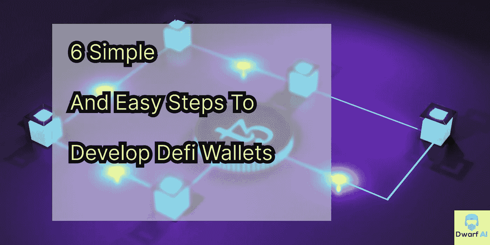

# 开发 Defi 钱包(DIY)的 6 个简单易行的步骤

> 原文：<https://medium.com/coinmonks/6-simple-easy-steps-to-develop-defi-wallets-diy-631ad425d0ef?source=collection_archive---------36----------------------->

6 Simple & Easy Steps To Develop Defi wallets

***分散财政钱包的必要性***

O 去中心化财务的好处之一是它允许用户控制他们的财务。这是通过使用分散的财务钱包来实现的。分散式金融钱包是一种允许用户存储、发送和接收数字资产的数字钱包。他们还可以查看自己的交易历史和余额。分散金融钱包不同于传统钱包，因为单个实体不会集中控制它们。

在 [Dwarf AI](https://www.dwarf-ai.com/blockchain) ，我们的开发人员确保在创建 defi wallet 时，它通过所有程序&构建客户端所需的功能，使 Defi wallet 与他们的业务相关且可靠。

有很多不同的钱包，但并不是所有的钱包都是平等的。如果你正在寻找一个支持分散金融(DeFi)应用的钱包，你需要确保你选择了正确的。DeFi 钱包需要能够连接到多个区块链网络，并支持各种不同的令牌。

***为什么选择 Defi 钱包？***

如果你在区块链做生意，那么你知道这个行业最重要的方面之一就是安全。有这么多的黑客和诈骗发生，确保你的资金安全是很重要的。这就是去中心化金融钱包的用武之地。这是一种存储加密货币的安全方式，不会像集中式交易所那样面临同样的风险。

***开发自己的钱包***

分散金融(DeFi)有很多不同的钱包，但并不是所有的钱包都是平等的。有些对于某些目的来说比其他的更好。在这篇文章中，我们将向您简要介绍开发 DeFi 钱包所需的六个简单步骤。

## **步骤 1 确立目的🤔**

为了确立目的，我们需要了解用户需求和他们喜欢的钱包类型，就像在 [Dwarf A](https://www.dwarf-ai.com/blockchain) I 中一样，我们向客户询问需求，然后进行一些研究、市场分析和目标受众，这给我们的开发人员一个清晰的概念，并帮助客户选择适合其业务的 defi 钱包。随着时间的推移，开发人员对是从头开始开发软件还是克隆流行的 defi 钱包有了相当深刻的认识，这进一步优化了钱包的开发。

## **第二步选择钱包类型👜**

1.  **手机钱包** —比特币基地、Trust Wallet 和 Argent。
2.  **桌面钱包-** Electrum 和 Bitgo
3.  **Web 界面-** MetaMask、Guarda 和 MyEtherWallet。
4.  **硬件支架-** 莱杰纳米，特雷佐。

## 步骤 3 定义架构📏

1.  识别 Defi 钱包服务器的位置

*   本地服务器
*   云服务器
*   任何混合动力版本

2.Defi 钱包将使用的区块链平台和令牌([矮人 AI](https://www.dwarf-ai.com/blockchain) 提供关于决定平台和令牌的免费咨询)

3.外部集成服务器

4.识别钱包是否将存储私钥或用户资金。

## 步骤 4 设计平台📲

设计合适类型的用户界面(UI ),让客户在与 defi wallet 交互时觉得简单易用并获得优质体验。这一步主要包括语调(TOV)，用户流量，配色方案和基本的初级概念。

## **第 5 步编码 defi 钱包💻**

在这一步，Defi 钱包已准备就绪。在 [Dwarf AI](https://www.dwarf-ai.com/blockchain) 上，我们通过让区块链、移动、前端和后端团队参与进来，归纳了 Defi 钱包的功能、架构和设计。这是我们的[矮人人工智能](https://www.dwarf-ai.com/blockchain)使用的典型科技堆栈

> 区块链:以太坊，币安智能链。
> 
> 智能合约:以太坊虚拟机，BSC 虚拟机。
> 
> 语言:PHP，JAVA，MEAN Stack，Laravel
> 
> 数据库:MySQL，MongoDB，Redis。
> 
> LAMP^ Linux 服务器，Apache，Mysql 数据库，Php
> 
> 网站开发:PHP — Laravel / Codeigniter
> 
> MEAN: MongoDB，Express JS，Angular js，Node js
> 
> 对于 Android: Java，Kotlin，Node JS，ROR，Laravel。
> 
> 对于 IOS: Swift，Node JS，ROR，Laravel，IOS fabric。
> 
> 云:AWS，谷歌云平台，MS Azure。
> 
> 推送通知:Twilio，亚马逊 SNS，地图。
> 
> 其他:RSpec，Phantom JS，PUMA server，PhoneGap，C ++，Xcode。

## **步骤 6:测试💡**

Defi 钱包在开发过程的最后一步需要通过可用性、操作性、可靠性和安全性等参数。Defi 钱包测试成功后，它已准备好部署在其他技术平台上，包括人工智能、物联网、大数据和第三方 Defi 协议。

Defi 钱包在不断发展，变得更加用户友好。它们用于以安全和分散的方式存储数字资产。构建 Defi 钱包的步骤包括:选择钱包的类型、定义架构、设计平台和对钱包进行编码。在 [Dwarf AI](https://www.dwarf-ai.com/blockchain) ，我们有一个专业团队可以帮助你建立一个安全和用户友好的 Defi 钱包。

总之，上面讨论的步骤是设计和开发 defi 钱夹的详细过程的总结。如果你有任何疑问或想开发一个 Defi 钱包，我们很乐意[听到来自你的](https://api.whatsapp.com/send?phone=+918587836880&text=Hi,%20Dwarf-AI,%20I%20am%20looking%20to%20make%20my%20business%20smarter.%20Can%20we%20discuss%20further?)。

作者- [克拉蒂凯什·米什拉](https://medium.com/u/22505c15ee08?source=post_page-----631ad425d0ef--------------------------------)

> 联系我们:
> 
> [**网站**](https://www.dwarf-ai.com/blockchain)**|**[**推特**](https://twitter.com/dwarf_ai)**|**|[**领英**](https://www.linkedin.com/company/dwarfai/)||[GITHUB](https://github.com/Dwarf-AI)

> 交易新手？尝试[加密交易机器人](/coinmonks/crypto-trading-bot-c2ffce8acb2a)或[复制交易](/coinmonks/top-10-crypto-copy-trading-platforms-for-beginners-d0c37c7d698c)