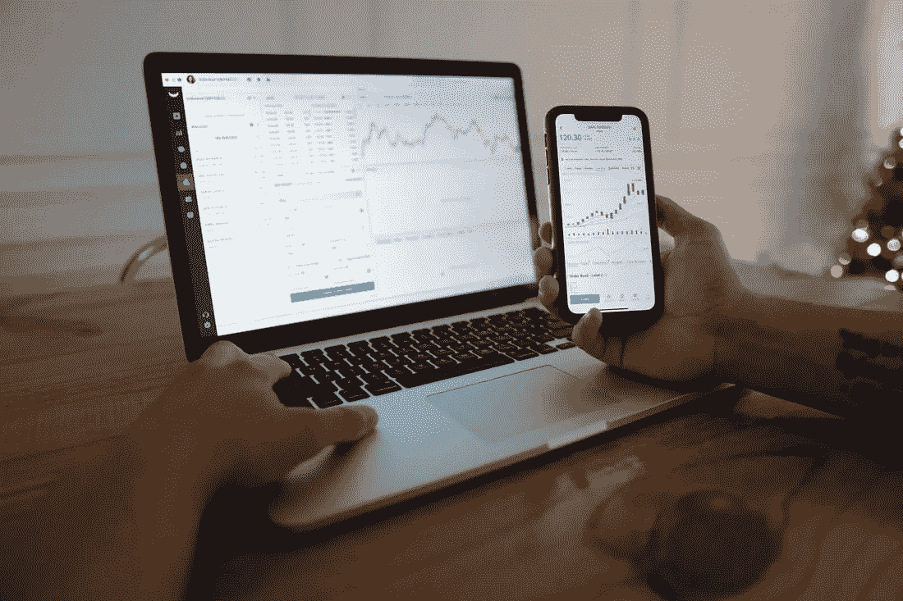
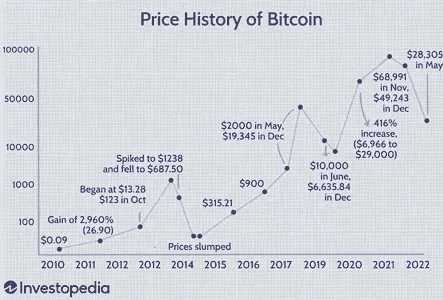
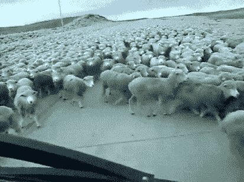

# 作为加密投资者，你应该知道的 6 件事

> 原文：<https://medium.com/coinmonks/6-things-you-should-know-as-a-crypto-investor-9d531d4016c4?source=collection_archive---------20----------------------->

Image by Joshua Mayo on [Unsplash](http://unsplash.com)

无论你是加密货币市场的常客，还是像这个领域的大多数人一样的新手，在投资加密市场这样一个波动性很大的市场时，你都必须注意某些事情，这些事情会让你保持克制。

考虑到有多少人已经从母体加密技术[比特币中受益，成为加密投资者似乎是一个不错的投资回报，在撰写本文时，比特币已经在历史高点](https://markets.businessinsider.com/currencies/btc-usd)上涨了 60，000%以上，目前交易价格低于 21，000 美元。一些人喜欢把加密作为一种投资，而另一些人认为这仅仅是一种运气，也许是赌博。不管是什么，如果你正在考虑投资加密货币，我会告诉你一些你应该知道的事情。

我不知道是否还会有高达 60，000%的增长；之前记录的比特币或其他加密货币。然而，重要的是要走在事件的前面，并知道如何根据情况的需要在这个新的市场中周旋。

Image by [Investopedia](https://www.investopedia.com/articles/forex/121815/bitcoins-price-history.asp)

*准备冲击同志们！*

1.  **加密货币不是一个快速致富的方案**

抱着一夜暴富的心态进入加密货币市场是不可取的。它不是，也永远不会是。

一些加密货币项目( [meme coins](https://crypto.com/university/what-are-meme-coins) )可能让 crypto 看起来像一个容易进入，容易离开的项目，但它不仅仅如此。虽然很少有加密项目是有实际用例的项目，但大多数快节奏、有回报的加密项目都是由骗子拥有的，他们最终会对他们的投资者进行诈骗。小心那些积极承诺在加密上快速投资回报的人——这些类型的项目通常运行一个庞氏骗局结构，他们不得不拆东墙补西墙。他们试图奖励第一批“受害者”，用新参与者的投资来支付他们之前的参与者，新参与者陷入了循环，他们失去了所有投资。

事实是，crypto 出现的时间并不长，任何人都不会对正在发生的事件太有信心。然而，有一点可以帮助你脱颖而出，那就是带着稳定的投资者心态进来，而不是投资一夜暴富。试图打败这个系统只会让你做出错误的投资选择。你也应该意识到市场的波动性是巨大的，这意味着亏损可能会像盈利一样迅速出现。因此，只投资你能承受的损失。以长期投资的心态利用 crypto 可能是好的。

> 交易新手？试试[加密交易机器人](/coinmonks/crypto-trading-bot-c2ffce8acb2a)或者[复制交易](/coinmonks/top-10-crypto-copy-trading-platforms-for-beginners-d0c37c7d698c)

**2。除了持有**之外，还有其他方式从加密中获益

货币不是通过持有加密货币而产生的。事实上，投资比特币并从其诞生之日起就持有它的人会从比特币中赚到最多的钱。然而，这并不是他们拥有比特币或从中受益的唯一方式。

挖掘比特币是任何人都可以在不实际购买比特币的情况下赚取比特币的一种方式。[尽管如今挖掘比特币的成本达到了历史最高水平](https://www.google.com/amp/s/cointelegraph.com/news/30k-btc-price-has-severe-impact-on-bitcoin-miner-profits-analysis/amp)，如果你不想严格地将你在挖掘工具上的投资最大化，你最好购买比特币并为自己持有(并不是说挖掘仍然无利可图)，但在比特币没有大量受众的时代，比特币要便宜得多。

虽然比特币没有很多可以应用的 DeFi 功能，但其他新的加密货币和协议为你提供了一些灵活性，使你有可能以不同的方式赚钱。

你现在可以参与[产量农业](https://academy.binance.com/en/articles/what-is-yield-farming-in-decentralized-finance-defi)、[赌注](https://academy.binance.com/en/articles/what-is-staking)，甚至[提供流动性](https://coinmarketcap.com/alexandria/glossary/liquidity-provider)以充分利用你的加密资产。最近，[液体赌注](https://link.medium.com/p8tFOu5YHrb)的概念让你可以用你的代币做赌注，把它当作你的常规代币使用。

**3。投资时不要表现出从众心理**

加密投资中有一个术语叫做“FOMO”FOMO 害怕错过机会。当一个投资者决定投资一个特定的加密项目时，这种情况就会发生，因为他看到其他人也在投资那个项目，或者可能加密项目刚刚发生了巨大的增长:这似乎是下一件大事——在我看来，最好错过。

你要知道，市场上永远有机会。一枚硬币在某一点上大幅波动并不一定会成为市场上最好的硬币，另一个项目做出类似的举动只是时间问题。试图接住落下的刀是没有意义的；你最好从那次经历中学习，并与其他项目一起制定一个更有利可图的投资策略。这有助于你避开 FOMO，这是一项高风险的投资活动。

如果你把钱投资到 crypto，你应该做出正确的选择。你必须完全控制自己的投资决策，或者寻求金融专家的服务，他了解你的风险偏好并根据你的风险偏好做出决策。

你不会想随大流入坑吧！

**有趣的事实:** [牛顿第三运动定律](https://www.mrtscience.com/newtons-third-law.html)在 crypto 中随处可见。无论什么样的股票随着巨大的数字而上涨，都不可避免地会有下跌的时候；你总是有机会打折购买。那为什么这么急？

**4。永远做自己的研究**

DYOR！

我认为这与没有表现出从众心理直接相关。

当你在投资前做自己的研究(DYOR)时，你在加密市场总是更好。现在，这是一个帮助你避免上述从众心理的过程。

与其冲进市场，和其他人一样跟风，希望能赚到钱，你为什么不慢慢做市场调查呢？通过这种方式，你可以收集到关于你最好投资的项目的高质量信息，一些你真正理解的信息。因为你知道会发生什么，所以惊喜会更少。

如果在一天结束的时候，你仍然不能理解这个项目的相关性，或者在经过大量的研究后你如何从中受益，那么最好不要投资它。这是显而易见的！

你无法解释的投资对你来说不是好投资。在做研究的时候，向更有经验的投资者寻求帮助，他们有参与市场的记录。加入一个加密社区，使用互联网获取尽可能多的知识，做一切有助于你进行更合理的加密投资的事情。

**5。不要分享您的安全信息**

保护你的钱包不像传统银行那样工作；你必须保护自己。任何不足对你来说都是不可取的。

投资加密货币市场的安全性带来了很多担忧。与让银行机构负责其客户的银行账户安全的传统银行系统不同，个人负责保护他们的加密钱包或对他们存储其加密的交换账户的访问。

作为市场投资者，知道如何保护你选择存储密码的地方是很重要的。确保不要泄露机密信息，除非是你想把你的账户控制权交给的人。

"[私钥](https://www.coinbase.com/learn/crypto-basics/what-is-a-private-key)被认为是有原因的；它们不会被公开分享。你能提供的唯一信息是你的[公钥](https://help.coinbase.com/en/coinbase/getting-started/crypto-education/glossary/public-key)；即使那样，你也需要非常小心。

在这个领域没有过分小心这回事。你必须知道，如果有机会，有人愿意进入你的钱包，取走你所有的加密投资。

避免点击互联网上要求连接到您的加密货币钱包的随机链接。确保离线存储您的私钥，或者购买硬钱包来存储您的数字货币。

**6。消除贪婪，获取利润**

也许你的朋友或堂兄向你介绍了加密领域，不知何故，他们对你投资加密的原因产生了影响。然而，有一点你必须明白，那就是说到底这是个人的游戏。

你必须了解你想从市场上得到什么，以及你愿意冒多大的风险。在市场上停留的时间超过你的风险承受能力是没有意义的。

永远要有计划地进入市场。知道你想从投资一个项目中得到什么。

当机会出现时，学会获利。虽然你可能不想在加仓后卖掉你在市场上的所有头寸，但是把一些利润装进稳定的账户也没什么错。

确保不要把所有的利润都还给市场。要知道，只有在加密投资中实现的利润才是你赚的；在你的利润稳定之前，你的投资仍然是高度投机的。

**结论**

加密货币的安全投资需要相当多的工作。说实话，不是一夜之间就能完善的事情。

安全参与这个市场的最好方法是研究并继续做更多的研究。这仍然是一个新的市场，有很多东西需要了解。市场上任何值得学习的东西都值得好好学习。

我希望这篇文章对你投资密码市场有所帮助。

> 加入 Coinmonks [电报频道](https://t.me/coincodecap)和 [Youtube 频道](https://www.youtube.com/c/coinmonks/videos)了解加密交易和投资

# 另外，阅读

*   [OKEx vs KuCoin](https://coincodecap.com/okex-kucoin) | [摄氏替代品](https://coincodecap.com/celsius-alternatives) | [如何购买 VeChain](https://coincodecap.com/buy-vechain)
*   [ProfitFarmers 回顾](https://coincodecap.com/profitfarmers-review) | [如何使用 Cornix Trading Bot](https://coincodecap.com/cornix-trading-bot)
*   [如何匿名购买比特币](https://coincodecap.com/buy-bitcoin-anonymously) | [比特币现金钱包](https://coincodecap.com/bitcoin-cash-wallets)
*   [瓦济里克斯 NFT 评论](https://coincodecap.com/wazirx-nft-review) | [比茨盖普 vs 皮奥克斯](https://coincodecap.com/bitsgap-vs-pionex) | [坦吉姆评论](https://coincodecap.com/tangem-wallet-review)
*   [如何使用 Solidity 在以太坊上创建 DApp？](https://coincodecap.com/create-a-dapp-on-ethereum-using-solidity)