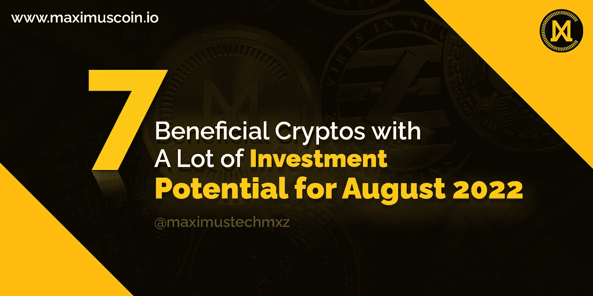

# 2022 年 8 月 7 个具有很大投资潜力的有益密码

> 原文：<https://medium.com/coinmonks/7-beneficial-cryptos-with-a-lot-of-investment-potential-for-august-2022-5bd4fdd78874?source=collection_archive---------7----------------------->

**7 Beneficial Cryptos with A Lot of Investment Potential for August 2022**

近来，长期加密货币投资已被证明是有益的。但是，在做任何这样的投资之前，总是建议研究市场。密码市场是全球增长最快的市场之一。这些天来，每个人都渴望投资加密，开始赚钱，并开始为未来储蓄。对密码日益增长的狂热显示了这个市场的潜在投资能力。

目前市场上有许多知名的加密货币可供投资。随着时间的推移，这些资产的价格大幅上涨。在今天的博客中，我们将讨论 2022 年 8 月你必须投资的 7 种潜力巨大的最佳有益密码。

**1。** [**马克西姆斯币**](https://maximuscoin.io/) **(MXZ):**

Maximus Coin 无疑将是一项值得考虑的长期加密货币投资，因为它计划创造一系列区块链支持的分散商品。Maximus coin 为创建最大的区块链支持的 web3.0 互联网基础设施而设计的路径是加密货币投资者在进行投资时应该考虑的主要因素。

Maximus Coin $MXZ 将在更名后很快在 Coinsbit 和 P2PB2B 交易所重新上市。

**2。** [**卡丹诺**](https://cardano.org/) **:**

在不远的将来，它可能会从 dApps 的创造中获益。在一个至关重要的领域，这种加密货币超越了行业领导者。卡尔达诺的发展战略应该是建立一个消费者可以信赖的可靠网络。2022 年 8 月购买的最好的加密货币之一就是这种。

**3。******:****

**一个名为 Polkadot 的尖端系统试图提供区块链之间的互操作性。目前，大多数区块链都是独立运行的，这使得与其他平台的数据共享变得非常困难。使用 Polkadot 的并行处理方法，区块链可以在系统中充当“副链”,从而显著提高可扩展性。2022 年 8 月，它无疑将成为购买和持有的最佳加密货币之一。**

****4。******:******

****一个名为 XRP 的区块链网络被创建，以方便用户向海外汇款。任何加密货币都可以扮演这一角色，但 Ripple 从竞争中脱颖而出，因为它的可扩展性以及与在金融领域使用其技术的企业的实际合作。****

****此外，Ripple 的创建者运营着 RippleNet 企业区块链网络，该网络与全球 100 多家金融机构合作。****

******5。** [**柴犬**](https://shibatoken.com/)[https://ethereum.org/en/](https://ethereum.org/en/)**:******

****Dogecoin 最初是一种迷因，但很快发展成为一种可以聚集大量忠实追随者的东西。SHIB 有着强大的销售因素，尽管它的起源很奇怪，但它已经成为市场上最受欢迎的加密货币之一。2021 年，该社区还开发了一个关于 SHIB 的 NFT 项目，这有助于吸引更多的加密货币投资者。****

******6。** [**以太坊**](https://ethereum.org/en/) **:******

****以太坊 2.0 解决了以太坊 1.0 的缺点，成为第二受欢迎的加密货币。开源的区块链有助于快速推进潜在的应用。以太坊经常被开发者利用，但是一些人也投资加密货币，因为它们的未来价值。****

******7。******:********

****这是一种实用硬币，在币安交易所用作交易费用的支付选项。在所有加密货币中市值排名第三。对于那些使用代币支付交易费用的人来说，交易可以打折进行。****

******包装完毕******

****这篇博客讨论了 8 月份可以购买的最佳加密货币，概述了名单上每种货币的基本情况，包括可能的上涨和潜在的下跌。然而，在做出任何投资选择之前，进行自己的研究或咨询顾问总是明智的。****

****关注我们的[脸书](https://www.facebook.com/maximustechmxz)推特****

****加入我们的[t.me/maximustechmxz](http://t.me/maximustechmxz)****

> ****交易新手？试试[加密交易机器人](/coinmonks/crypto-trading-bot-c2ffce8acb2a)或者[复制交易](/coinmonks/top-10-crypto-copy-trading-platforms-for-beginners-d0c37c7d698c)****