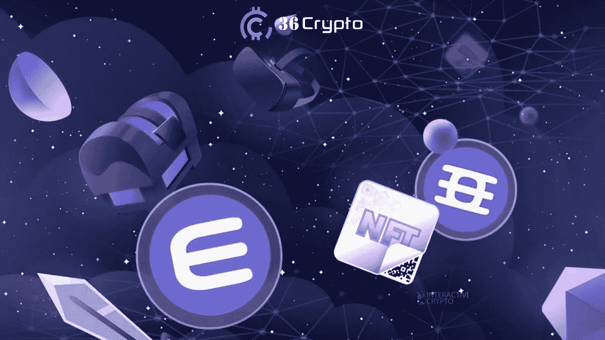
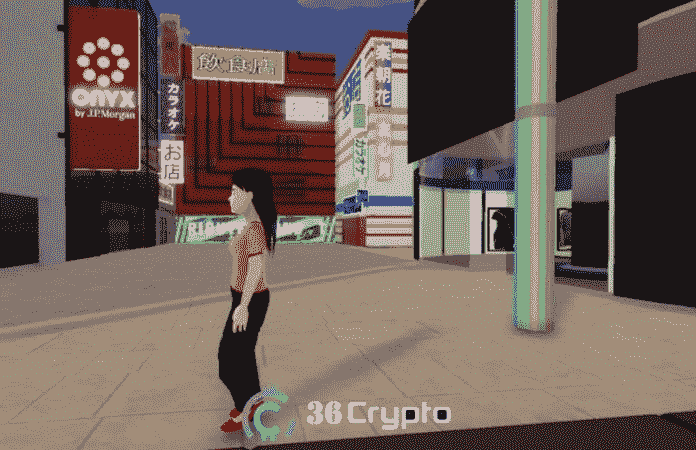
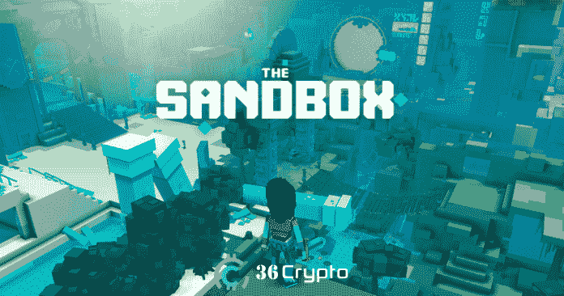
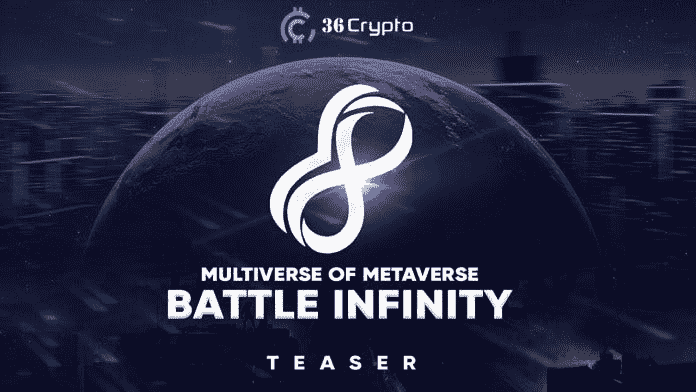
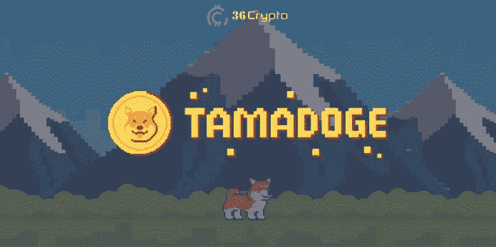

# 2022 年 10 月将购买的 7 个最佳元宇宙加密项目–36 Crypto

> 原文：<https://medium.com/coinmonks/7-best-metaverse-crypto-projects-to-buy-in-october-2022-36crypto-f314d79aa558?source=collection_archive---------2----------------------->

元宇宙在现实世界和虚拟世界之间架起了一座桥梁。近年来，人们对新兴技术的兴趣与日俱增，与之相关的**加密硬币**也是如此。在本帖中，我们将关注 2022 年 10 月的[最佳投资硬币](https://36crypto.com/top-metaverse-coins-to-invest-in/)。

与 2021 年相比，今年对[加密市场](https://36crypto.com/understanding-crypto-market-cap-how-is-it-calculated/)并不完全有利，2021 年大多数加密货币的市场都很乐观。例如，比特币升至 68000 美元的历史高点，以太坊也升至 4800 美元的新高。

可悲的是，2022 年迎来了熊市，投资者一直在寻找投资的替代品。元宇宙预计将在未来几年快速增长，因此，明智的做法是扩大您的投资组合，并在您的钱包中添加一些相关的代币。

如果你不太熟悉什么是**元宇宙**，或者也许你有一点想法但仍然困惑，在下一节我将简要解释它是什么以及为什么它越来越受欢迎。

# 深入浅出地理解元宇宙

想象一个你可以足不出户就能生活、工作、与他人交流的世界。正如我们之前所说，元宇宙是一种连接现实世界和虚拟世界的桥梁。

你一定在电影中看过一些元宇宙的例子，在那里你看到一个戴着某种眼镜的人在一个房间里，被传送到另一个世界。这是对元宇宙的概述。

简单来说，*元宇宙是一个由* ***3D 虚拟世界*** *组成的网络，专注于社交联系。*根据 Wired.com[网站](https://www.wired.com/story/what-is-the-metaverse/)上的一篇帖子，元宇宙可以被视为*一种结合了数字世界和物理世界的增强现实。*

元宇宙的概念仍然不完全清楚，这可能是因为该技术仍在建设中，可能太新，不能完全包含它的全部含义。

在脸书更名为 Meta 后，人们对元宇宙的关注和兴趣增加了，这表明他们将把虚拟现实世界融入其社交媒体平台。此外，与元宇宙相关的硬币的使用案例经历了一个上升轨迹，投资者开始寻找一些最好的元宇宙硬币进行投资。

在下一部分，我们将会看到一些你应该关注的硬币。

# 2022 年 10 月最佳元宇宙加密硬币投资

**元宇宙是下一代技术**，也是 Web 3.0 的核心特性。Web 3.0 是下一代互联网，将使用区块链和开放标准构建。在之前的帖子中，我们谈到了投资的[最佳 Web 3.0 加密货币，其中包括像氦网络、以太坊、Uniswap 和 Polkadot 这样的硬币。](https://36crypto.com/7-best-web-3-0-cryptocurrencies-to-invest-in-right-now/)

市场上有很多**元宇宙加密硬币**可供你投资，但这里有 2022 年 10 月你可以投资的前 7 个具有良好[市值](https://36crypto.com/understanding-crypto-market-cap-how-is-it-calculated/)。

排名不分先后:

# 1.分散地(法力)。市值 19.2 亿美元

分散货币已经发展成为市场上最受欢迎的元宇宙加密硬币之一，难怪它开始成为我们的[顶级元宇宙硬币](https://36crypto.com/top-metaverse-coins-to-invest-in/)投资对象。它的开发始于 2015 年，由阿根廷人 Ari Meilich 和 Esteban Ordano 于 2017 年推出。

这是一个运行在以太网上的软件，它旨在奖励全球用户在虚拟世界中运行的大型网络。分散土地拥有土地[不可替代的令牌](https://36crypto.com/6-cheapest-nft-projects-to-invest-in-october-2022/) (NFT)，用于显示数字房地产的所有权。查看我们的[2022 年 10 月要购买的 NFT 顶级项目](https://36crypto.com/6-cheapest-nft-projects-to-invest-in-october-2022/)。

**分散地的原生令牌是法力**。它用于促进交易，如购买土地，以及分散土地上使用的商品和服务。

分散土地允许购买虚拟资产，如数字房地产，同时与虚拟世界互动。持有原生法力令牌的参与者还可以参与基于[区块链](https://36crypto.com/blockchain-definition-what-is-blockchain-technology-and-how-does-it-work/)的[智能合约](https://36crypto.com/what-are-smart-contracts-on-blockchain-technology-and-why-are-they-so-important/)的政策更新。

在我写这篇文章的时候，分散土地的[市值](https://36crypto.com/understanding-crypto-market-cap-how-is-it-calculated/)为 19.2 亿美元，售价为每股 0.64 美元。

# 2.沙箱(沙子)。市值 11 亿美元

在市场普遍崩溃的情况下，沙盒仍然是最赚钱的加密游戏之一。它最初开始于 2012 年，是一个在移动平台上运行的 2D 项目。展望 2018 年，该项目的新版本正在开发中，将它变成一个 3D 多人游戏平台，在 [**以太坊区块链**](https://36crypto.com/top-7-cryptocurrencies-to-buy-post-ethereum-merge/) 上运行。

沙盒提供了一个虚拟世界，玩家可以在其中建立和货币化他们的游戏体验。它与分散的元宇宙直接竞争，也是十月份 [**最有利可图的投资之一。**](https://36crypto.com/6-cheapest-nft-projects-to-invest-in-october-2022/)

沙盒上的资产以后可以在公开市场上出售。沙盒项目的原生加密货币是 SAND。与市场上的另一种加密技术一起，SAND 在 2021 年 11 月达到了历史最高水平，当时达到了 8.44 美元，这表明一年内上涨了 16，000%。

来自 [CoinMarketCap](https://coinmarketcap.com/currencies/the-sandbox/) 的实时数据显示**沙盒的市值为 11 亿美元**，每枚代币售价为 0.75 美元。

# 3.战斗无限(IBAT)。市值 1100 万美元

《战斗无限》于 2022 年由苏雷什·乔希和贾吉特·耶拿创作。这是一个多基础的玩赚元宇宙游戏。该项目奖励其熟练的球员与 IBAT，这是该平台的原生令牌。

他们自诩为第一个去中心化的元宇宙游戏平台。在战斗无限世界中，玩家可以享受元宇宙体验，在那里他们可以互动和观看战斗竞技场，也可以玩游戏和赚钱。

在《无限战争》中，虚拟土地的地块也可以购买，并可以通过广告变现。正如你所看到的，有几种方法可以从战斗无限项目中获利。

在《战斗无限》上赚钱的其他方式包括通过参加内置的幻想体育联盟和赌注机制获得奖励。由于大众的需求，Battle Infinity 在短短 24 天内售罄了其 IBAT 预售款，后来在 PancakeSwap 和 LBanki 上市后，价格飙升。

根据来自 [CoinMarketCap](https://coinmarketcap.com/currencies/battle-infinity/) 的实时数据，Battle Infinity 的市值为 1100 万美元，IBAT 的售价为 0.0036 美元。

# 4.塔马多吉(TAMA)。市值 3400 万美元

Tamadoge 是一种**通货紧缩的加密货币**，于 2022 年 7 月推出，玩家通过赚取 Dogepoints 分阶段战斗和前进。该项目融合了 P2E 游戏和 NFTs 的特点。

在 Tamadoge 中，用户可以创造和繁殖 Tamadoge 宠物，也可以将这些宠物作为铸造的 NFT 进行交易。TAMA 令牌是该平台的原生加密货币，可以用来进行交易，购买宠物，也可以在 Tamaverse 上进行交易。

宠物的成长暗示了玩家在排行榜上的成长。TAMA 代币的最大供应量为 200 万美元，这使它与 Dogecoin 等其他迷因硬币有所不同。然而，从长远来看，这一数额将会减少。

在 OKX、BitMart 和 Uniswap 上市后，它引发了令牌价格的上涨。它在发布时的初始价格是 0.01 美元，此后一直增长到 0.159 美元的历史高点，比初始价格增长了约 1，490%。

来自 [CoinMarketCap](https://coinmarketcap.com/currencies/tamadoge/) 的实时数据显示，Tamadoge 的市值为 3400 万美元，交易价格为 0.03 美元。

## [此处继续阅读](https://36crypto.com/top-7-metaverse-crypto-coins-to-invest-in-october-2022/)

**我希望你在这篇内容中发现了价值。请帮助在社交媒体上分享，并与你认为可能对此类帖子感兴趣的朋友分享。**

*免责声明:这不是财务建议。本文中表达的观点和意见仅代表作者，绝不是建议。建议您在投资任何加密货币之前做好自己的研究。*

你喜欢阅读我们带给你的内容吗？如果是，请点击“**拍手**按钮，增加其他人看到此贴并了解此贴的机会。

你最多可以鼓掌 50 次。你还在等什么？马上按下那个按钮。感谢您的阅读。

*原载于 2022 年 10 月 17 日*[*【https://36crypto.com】*](https://36crypto.com/top-7-metaverse-crypto-coins-to-invest-in-october-2022/)*。*

> 交易新手？尝试[加密交易机器人](/coinmonks/crypto-trading-bot-c2ffce8acb2a)或[复制交易](/coinmonks/top-10-crypto-copy-trading-platforms-for-beginners-d0c37c7d698c)