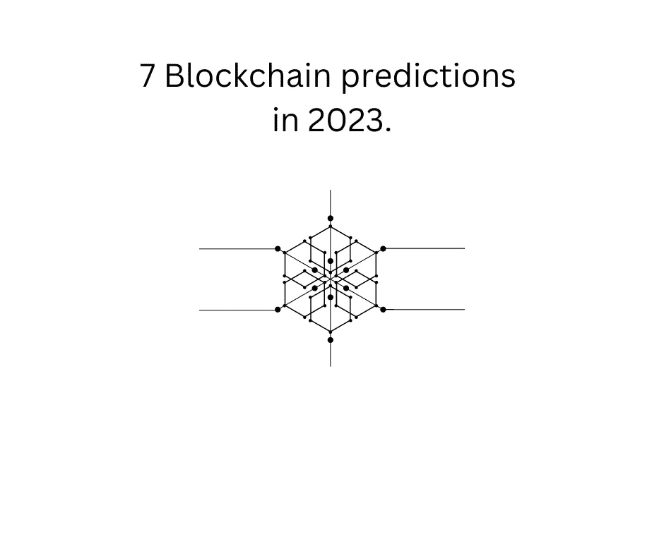

# 2023 年 7 个区块链预测

> 原文：<https://medium.com/coinmonks/7-blockchain-predictions-in-2023-9b25c99ab267?source=collection_archive---------18----------------------->

7 2023 年区块链预测。

7 Blockchain prediction in 2023.

区块链技术有可能彻底改变广泛的行业，包括金融、供应链管理、医疗保健和许多其他行业。这是一个分散的分布式分类账，可以安全透明地记录交易。

> 交易新手？在[最佳密码交易所](/coinmonks/crypto-exchange-dd2f9d6f3769)上尝试[密码交易机器人](/coinmonks/crypto-trading-bot-c2ffce8acb2a)或[复制交易](/coinmonks/top-10-crypto-copy-trading-platforms-for-beginners-d0c37c7d698c)

> 预测未来是不可能的，但是你可以通过观察周围，研究过去，提出一些论点。

*预测 1:* 在 2023 年，区块链技术将继续获得广泛的采用和使用。随着越来越多的组织和个人意识到使用区块链的好处，我们很可能会看到使用它的应用程序和平台数量的增加。

*预测 2:* 我们将看到智能合同的使用增加，这是一种自动执行的合同，买卖双方之间的协议条款直接写入代码行。建筑商正在建设的最重要的网络是以太坊，它也支持智能合同。智能合同具有显著简化和自动化许多业务流程的潜力，并且我们很可能会在未来几年看到越来越多的组织使用它们。

*预测 3:* 持续增长和采用在企业环境中，我们很可能会看到区块链技术在一系列行业中的持续增长和采用。随着越来越多的组织意识到使用区块链的好处，我们可能会看到使用它的应用程序和平台数量的增加。

*预测 4:* 更加关注安全性和可扩展性。随着区块链技术被越来越广泛地采用，人们可能会更加关注确保区块链网络的安全性和可扩展性。这可能需要开发新的协议和技术来解决这些问题。

*预测 5:* 与其他技术更好的集成。我们可能会看到区块链技术和其他新兴技术之间的更大融合，如人工智能和物联网(IoT)。这可能会为区块链带来新的创新应用和使用案例的开发。

*预测 6:* 我们将看到分散金融(DeFi)平台的使用增加，这些平台使用区块链技术提供不受任何中央机构控制的金融服务。DeFi 有可能使金融服务的获取民主化，将来我们很可能会看到越来越多的人使用这些平台。集中式实体的悲剧使得分散式应用程序的空间比以往任何时候都更加重要。

*预测 7:* NFT 项目将实施更多的公用事业。在过去的两年中，我们看到了 NFT 空间的增长。最近，我们看到许多项目失败了，这是因为他们是在快速盈利的想法下建造的。NFT 技术的真正价值来自于嵌入在每个特定 NFT 中的效用。为了长期生存，许多项目都将重点放在增加实用程序上。

总的来说，很难(也不可能)准确预测区块链科技的未来。然而，很明显，它有可能极大地扰乱和改变广泛的行业，并且我们很可能会在未来几年看到该领域的持续增长和创新。

大家 2023 快乐！

*本文中没有任何内容是财务建议，并且这仅用于教育目的。

如果你喜欢阅读并学到了一些东西——关注更多！

你可以在推特上找到我——https://twitter.com/pinadefi

子栈—[https://pinadefi.substack.com/](https://pinadefi.substack.com/)

出版 0x—[https://www.publish0x.com/@Pina-DeFi](https://www.publish0x.com/@Pina-DeFi)

> *加入 Coinmonks* [*电报频道*](https://t.me/coincodecap) *和* [*Youtube 频道*](https://www.youtube.com/c/coinmonks/videos) *了解加密交易和投资*

# 另外，阅读

*   [Bookmap 评论](https://coincodecap.com/bookmap-review-2021-best-trading-software) | [美国 5 大最佳加密交易所](https://coincodecap.com/crypto-exchange-usa)
*   [加密交易机器人](/coinmonks/crypto-trading-bot-c2ffce8acb2a) | [造币评论](https://coincodecap.com/coingate-review)
*   最佳加密[硬件钱包](/coinmonks/hardware-wallets-dfa1211730c6) | [Bitbns 评论](/coinmonks/bitbns-review-38256a07e161)
*   [新加坡十大最佳密码交易所](https://coincodecap.com/crypto-exchange-in-singapore) | [收购 AXS](https://coincodecap.com/buy-axs-token)