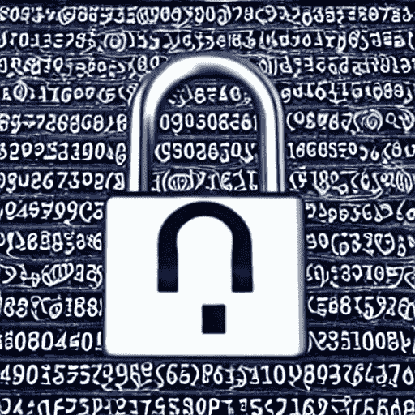

# 2023 年值得关注的 7 项区块链技术

> 原文：<https://medium.com/coinmonks/7-blockchain-technologies-to-look-out-for-in-2023-c62541dac8c4?source=collection_archive---------0----------------------->

Narratives for the next bull run

自十多年前推出以来，区块链已经走过了漫长的道路。近年来，我们看到区块链的应用和使用案例越来越多，包括游戏、金融和艺术行业。

> 本文将探讨 2023 年区块链领域的主要趋势，包括 web3 游戏、零知识证明和第 2 层协议。

尽管我们已经正式进入熊市，并且 crypto Twitter 上的许多权威人士预测 2023 年将是该行业“困难”的一年，但区块链科技本身不会停止增长！它会不断发展壮大，不管发生什么，建造者都会继续建造！

web3 gaming

# Web3 游戏

区块链领域最大的趋势之一是 web3 游戏的崛起。Web3 gaming 指的是基于区块链技术的新一代在线游戏。这允许更分散和透明的游戏体验，使玩家能够在区块链上拥有和交易游戏中的资产。这一趋势不仅改变了人们玩游戏的方式，还将数百万新用户引入了区块链科技的世界。

虽然我们看到了 2021 年和 2022 年玩赚游戏(P2E)的兴起和衰落，但塑造下一轮牛市的叙事将略有不同。虽然我们仍然会看到锦标赛和通过游戏和游戏内资产赚钱的潜力，但现有的 P2E 模式很快就会失去玩家的青睐！明年推出的游戏必须首先关注游戏的趣味性，然后加入区块链和收入的元素。

> 我们看到的大多数游戏都是用行业标准技术构建的，如 Unity 和虚幻引擎 5，然后这些游戏增加了一层 NFTs 和 web 3——最好的例子是[亡灵区块](https://www.undeadblocks.com/)、[猴子帝国](https://monkeyempire.net/)和[oxia Origin](https://www.oxyaorigin.com/)。

另一个有趣的事实是, [ImmutableX](https://www.immutable.com/) 区块链吸引了很多游戏，它可能会成为 web3 游戏的区块链。话虽如此，我们不能忽视 [Polygon](https://polygon.technology/) ，它也盯上了这个利润丰厚的市场，并通过[行业合作伙伴关系](https://polygon.technology/blog/polygon-and-earn-alliance-partner-to-bring-next-100-million-gamers-to-web3)取得进展。

Zero-knowledge proofs

# 零知识证明

今年在区块链领域获得关注的另一个趋势(明年更是如此)是对零知识证明的新兴趣。[零知识证明](https://www.forbes.com/sites/forbestechcouncil/2022/02/03/zero-knowledge-proofprotecting-your-personal-information-without-sacrificing-open-data/)是一种加密技术，允许一方向另一方证明他们知道某条信息，而无需实际披露信息本身。这种技术已经存在了一段时间，但我们现在看到在区块链领域各种协议和应用程序的使用越来越多。

零知识证明被广泛使用的一个领域是以隐私为中心的加密货币领域。这些加密货币使用零知识证明来验证交易，而不会泄露交易的细节，从而为用户提供了更高水平的隐私。

> 很多二层汇总使用零知识证明，比如 [zkSync](https://zksync.io/) ，Polygon 的 [zkEVM](https://polygon.technology/solutions/polygon-zkevm/) 等等。

Optimism Layer 2 network

# 第二层——乐观

区块链领域的另一个趋势是第 2 层协议的兴起。第 2 层协议构建在第 1 层区块链网络之上，为区块链应用提供额外的可扩展性和功能。这一点很重要，因为许多区块链网络，如以太网，目前在每秒可处理的交易数量方面受到限制。

第 2 层协议通过允许离线交易来帮助解决这个问题，离线交易可以比在线交易处理得更快，成本更低。这使得大量分散金融(DeFi)和不可替代令牌(NFT)应用程序可以在区块链网络上顺利运行。

[乐观](https://www.optimism.io/)就是这样一个领先的第二层网络，每天的交易量几乎达到 500，000 笔！随着交易数量的增加，它已经跨越了网络上的 200 万个唯一地址。

> 对于那些想在 2023 年及以后坚持以太坊生态系统的人来说，乐观可能是首选之一。

Arbitrum Layer 2 network

# 第 2 层— Arbitrum

以太坊区块链的另一个领先的二层网络 Arbitrum 也是乐观的最大竞争对手。虽然这两个第 2 层网络并驾齐驱，但 Arbitrum 稍有优势，单日记录了约 575，000 笔交易和 225 万个唯一地址。

虽然 Arbitrum 和乐观都是第 2 层汇总，并且都使用“欺诈证据”技术来验证发送到 L1 以太坊连锁店的交易的真实性，但它们也有一些不同之处。主要区别在于防欺诈验证的确切机制和执行环境。虽然乐观使用以太坊虚拟机(EVM)，但 Arbitrum 有自己的环境，称为 Arbitrum 虚拟机(AVM)。

> 此外，Atrbitrum 似乎也更受 DeFi 的欢迎，在上一次牛市中，它为 DeFi 应用程序锁定了更多的总价值(TVL)。

DeFi

# 挑战

DeFi 指的是建立在区块链技术基础上的金融应用程序，它正在区块链领域重新崛起。最近，有人对一些集中交易所(CEXes)的不正当做法表示担忧，这导致对 Defi 应用的兴趣重新抬头。这些应用程序为传统金融服务提供了一种更加透明和分散的替代方式，在个人和机构投资者中越来越受欢迎。

NFT art

# NFTs

[NFT](https://ethereum.org/en/nft/)不仅在加密行业获得了牵引力，而且主流观众也在慢慢接受这项技术。NFT 或不可替代令牌是基于区块链技术构建的独特数字资产。它们通常用于表示游戏中的物品、艺术品或其他有价值的数字资产。这项技术在游戏、艺术和元宇宙行业特别受欢迎，我们预计在未来几年将会看到这一领域的持续增长和创新。非功能性测试很可能成为未来几年内主流采用区块链的催化剂之一。

Metaverse

# 虚拟空间

Web3 metaverses 通常被视为身临其境、高度互动的虚拟环境，用户可以在其中以分散和安全的方式彼此互动，并与虚拟对象和体验互动。这些虚拟世界可以通过网络浏览器或专门的应用程序访问，允许用户以各种方式与彼此和数字资产进行交互，例如买卖虚拟财产，创建和共享内容，以及参与游戏和其他活动。

虽然像[沙盒](https://sandbox.game/)和[分散化](https://decentraland.org/)这样的项目在用例数量和用户数量上处于领先地位，但其他像[体素](https://voxels.com/)、 [Somnium space](https://somniumspace.com/) 和 [Nifty Island](https://niftyisland.com/) 这样的项目正在快速追赶！web3 元诗句的酷之处在于，几个元诗句迎合了特定的小众受众。他们有机会继续这样做，我们将在下一轮牛市中看到更多的元诗句出现！话虽如此，但不会只有一个元宇宙来统治它们，而是一个多元宇宙！像 [Metalinq](https://metalinq.io) 这样的项目正试图将各种 Metaverse 互联起来，而像元宇宙标准论坛这样的行业组织已经在为这一未来奠定基础。

> 如果你正在为你的下一个区块链项目寻找专家建议，或者聪明的合同顾问，请访问我的网站。

## 放弃

这不是理财建议！

本文所述观点均为作者观点。作者没有直接或间接暗示任何与这些技术相关的代币价值或加密货币价格。作者也不征求或推荐任何加密货币投资。

> *交易新手？试试***或者* [*复制交易*](/coinmonks/top-10-crypto-copy-trading-platforms-for-beginners-d0c37c7d698c)*
> 
> **分散密码持有量，了解* [*币安替代品*](https://coincodecap.com/binance-alternatives)*
> 
> **加入 Coinmonks* [*电报频道*](https://t.me/coincodecap) *和* [*Youtube 频道*](https://www.youtube.com/c/coinmonks/videos) *获取每日* [*加密新闻*](http://coincodecap.com/)*

# *另外，阅读*

*   *[复制交易](/coinmonks/top-10-crypto-copy-trading-platforms-for-beginners-d0c37c7d698c) | [加密税务软件](/coinmonks/crypto-tax-software-ed4b4810e338)*
*   *[网格交易](https://coincodecap.com/grid-trading) | [加密硬件钱包](/coinmonks/the-best-cryptocurrency-hardware-wallets-of-2020-e28b1c124069)*
*   *[密码电报信号](/coinmonks/top-3-telegram-channels-for-crypto-traders-in-2021-8385f4411ff4) | [密码交易机器人](/coinmonks/crypto-trading-bot-c2ffce8acb2a)*
*   *[最佳加密交易所](/coinmonks/crypto-exchange-dd2f9d6f3769) | [印度最佳加密交易所](/coinmonks/bitcoin-exchange-in-india-7f1fe79715c9)*
*   *[开发人员的最佳加密 API](/coinmonks/best-crypto-apis-for-developers-5efe3a597a9f)*
*   *最佳[密码借贷平台](/coinmonks/top-5-crypto-lending-platforms-in-2020-that-you-need-to-know-a1b675cec3fa)*
*   *[免费加密信号](/coinmonks/free-crypto-signals-48b25e61a8da) | [加密交易机器人](/coinmonks/crypto-trading-bot-c2ffce8acb2a)*
*   *杠杆代币的终极指南*