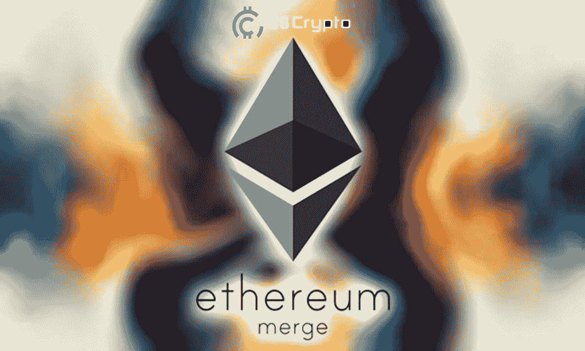
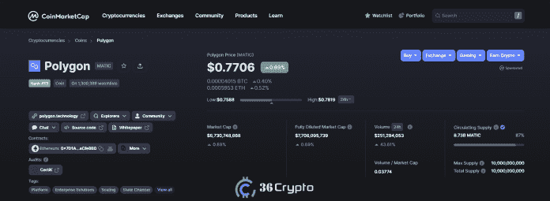
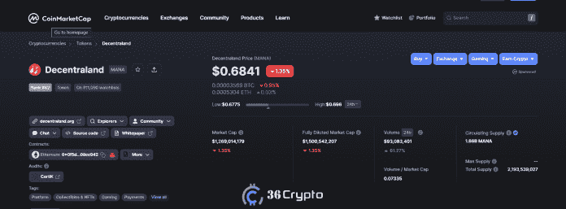
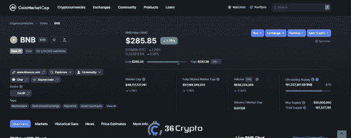

# 以太坊合并后购买 7 种加密货币— 36Crypto

> 原文：<https://medium.com/coinmonks/7-cryptocurrencies-to-buy-post-ethereum-merge-36crypto-2abad6bd0852?source=collection_archive---------9----------------------->

以太坊是今年吸引人的焦点，尤其是在下半年合并的预期中。许多加密货币预计将从合并中受益，这给投资者带来了乐观的希望。

不幸的是，期望并没有实现，事实上，以太坊合并后的 Eth 价格已经大幅下跌了 15%左右。尽管如此，预期仍然很高，投资者仍然看好它，密切关注今年将如何结束。

**以太坊合并价格预测**以及其他一些以某种方式与以太坊区块链相关的加密货币都是积极的。你可能会想，如果合并后以太坊仍然是一个很好的购买选择，那么让你知道它被列入我们在合并后购买的**顶级加密货币名单，以及我们在 10 月购买的[8 种顶级加密货币名单，这将是令人平静的。](https://36crypto.com/top-8-cryptocurrencies-to-invest-in-october-2022/)**

如果你仍然觉得[难以理解以太坊合并](https://36crypto.com/understanding-the-ethereum-merge-in-simple-term/)以及它将如何向前发展，请查看[这篇文章](https://36crypto.com/understanding-the-ethereum-merge-in-simple-term/)并获得清晰的图片。从长远来看，以太坊肯定会是一项不错的投资，因为它也是 [Web 3.0 加密货币](https://36crypto.com/7-best-web-3-0-cryptocurrencies-to-invest-in-right-now/)的一个非常好的组成部分。

在市场低迷时期，某些加密货币在加密市场上留下了印记，在这方面，这里有一份**前 7 种加密货币**的列表，可以在[以太坊合并](https://36crypto.com/understanding-the-ethereum-merge-in-simple-term/)后纳入你的投资组合。

# 以太坊合并后最值得购买的 7 种加密货币

排名不分先后，以下是以太坊合并后你应该购买的加密货币列表。

*   多边形(MATIC)。市值 67.21 亿美元
*   分散地(法力)。市值 12.70 亿美元
*   币安硬币(BNB)。市值 460.29 亿美元
*   沙箱(沙子)。市值 12.23 亿美元
*   ApeCoin(猿)。市值 15 亿美元
*   索拉纳(SOL)。市值 114.70 亿美元
*   以太坊(ETH)。市值 1583.08 亿美元

# 1.多边形(MATIC)市值 67.31 亿美元

Polygon 作为第 2 层以太坊扩展解决方案通常很受欢迎。在合并之前，投资者将 Polygon 视为间接受益于以太坊重大升级的项目之一。

人们对该资产的预期一直很高，迄今为止，它仍保持着积极的态势。Polygon 是以太坊网络上最重要的第二层区块链，因此可以肯定地说，围绕以太坊合并的炒作和兴奋将以这样或那样的方式积极影响 MATIC 的价格。

MATIC 是 Polygon 网络的本地令牌，可用于交易的赌注、监管以及支付燃气费。根据今天来自 [CoinMarketCap](https://coinmarketcap.com/currencies/polygon/) 的数据，MATIC 的价格**为 0.7706 美元**，其**市值为 67.21 亿美元**。Polygon 属于[中型加密货币](https://36crypto.com/understanding-crypto-market-cap-how-is-it-calculated/#2-mid-cap-cryptocurrencies)。

# 2.分散地(法力)。市值 12.70 亿美元

自 2017 年创立以来，分散土地获得了很多认可。这是一个元宇宙的项目，绝对是投资[顶级元宇宙硬币中的一个。分散土地允许购买虚拟土地和资产，也创造虚拟游戏和设施。](https://36crypto.com/top-metaverse-coins-to-invest-in/)

是一款在以太坊上运行，以法力为原生令牌的虚拟现实游戏。你也可以购买商品和服务，也可以访问游戏中的其他玩家。由于人们对元宇宙博彩业的兴趣越来越大，在以太坊合并后，分散投资是一项不错的投资。

此外，随着围绕合并的传言，分散的土地将可能是一个积极的受益者。CoinaMarketCap 显示，分散土地的**价格为 0.6851 美元**，市值**为 12.70 亿美元**。

# 3.币安硬币(BNB)。市值 460.29 亿美元

我们已经知道币安是最受欢迎的交易所之一，也是交易量最大的交易所。自 2017 年出现以来，该平台一直在经历巨大的增长。

加密货币交易平台支持 600 多种加密货币，以 BNB(币安硬币)作为本地实用令牌。BNB 支持**币安智能链**，该智能链也包含一系列其他加密货币。

BNB 越来越受欢迎，近年来价格大幅上涨。它已经成为市场上最顶级的加密货币之一。可以[在币安](https://36crypto.com/how-to-buy-binance-coin-bnb-a-step-by-step-guide/)和其他主要[加密货币交易所](https://36crypto.com/top-5-crypto-exchanges-to-earn-good-affiliate-and-referral-income/)购买 BNB。

今天来自 CoinMarketCap 的数据显示，BNB 的价格为 285 美元，市值为 460 亿美元。

# [此处继续阅读](https://36crypto.com/top-7-cryptocurrencies-to-buy-post-ethereum-merge/)

*免责声明:这不是财务建议，在投资任何数字资产之前都要做好研究，因为它们的波动性是众所周知的。*

你喜欢阅读这类内容吗？如果是，请点击“鼓掌”按钮，增加其他人看到这个帖子并了解它的机会。

**最多可以鼓掌 50 次。你还在等什么？马上按下那个按钮。感谢您的阅读。**

*原载于 2022 年 10 月 3 日 https://36crypto.com**T21*[。](https://36crypto.com/top-7-cryptocurrencies-to-buy-post-ethereum-merge/)

> 交易新手？尝试[加密交易机器人](/coinmonks/crypto-trading-bot-c2ffce8acb2a)或[复制交易](/coinmonks/top-10-crypto-copy-trading-platforms-for-beginners-d0c37c7d698c)