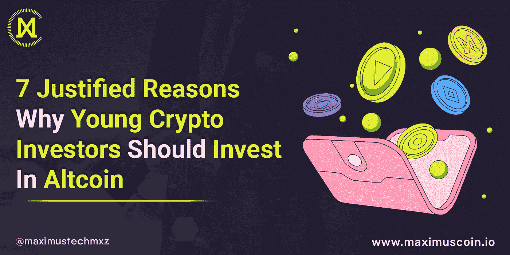

# 年轻加密投资者应该投资 ALTCOIN 的 7 个正当理由

> 原文：<https://medium.com/coinmonks/7-justified-reasons-why-young-crypto-investors-should-invest-in-altcoin-24cae111e313?source=collection_archive---------17----------------------->

**7 JUSTIFIED REASONS WHY YOUNG CRYPTO INVESTORS SHOULD INVEST IN ALTCOIN_Maximus Tech**

## **什么是山寨币？**

术语“ [Altcoin](https://www.investopedia.com/terms/a/altcoin.asp) ”来源于单词“另类”和“硬币”

除了来自比特币，它通常用于指代所有加密货币和代币。它们之所以被命名，是因为它们是比特币和传统法定货币的替代品。

截至 2022 年 3 月，现有超过 18，000 种加密货币，其中大部分是替代货币。

**山寨币是怎么产生的？**

第一种替代货币是 2011 年 4 月推出的[名币](https://en.wikipedia.org/wiki/Namecoin)(密码:NMC)，比比特币推出晚了两年。它类似于比特币，因为它实现了相同的软件，并具有 2100 万个硬币的最大供应量。提供匿名和抗审查的. bit 网络域名被分配给 Namecoin。

## **alt coins 有哪些用途？**

与传统货币相比，代用币可以实现更高级的功能。例如，代币持有者可以通过拥有替代硬币来参与加密货币治理选择。

所有的加密货币都由区块链技术驱动，该技术仍在开发中。技术的早期采用者可以从熟悉区块链技术中受益，特别是随着新的创新和用途不断出现。

## **为什么年轻的加密投资者应该投资 Altcoin？**

以下是年轻的加密投资者应该投资替代硬币的 7 个正当理由:

*   **山寨币比比特币便宜**:

许多替代币要便宜得多，普通投资者更容易买到。随着加密货币越来越受欢迎，投资者正在寻找新的替代货币选项，因为它们价格低廉，具有最大的上涨潜力。

*   **加密货币投资的基础正在发展**:

每种加密货币都有一个独特的协议或一套指导原则来管理网络的功能。每种替代货币都有一个独特的协议，决定了区块链的组织方式。某个协议的流行度和活跃度决定了给定硬币的价值。替代币的可靠用例可能表明它们有强大的基础，可以承受比特币行业的激烈竞争。具有可靠区块链的加密功能可能会导致更高的采用率。

*   **“山寨币季”可能即将到来**:

术语“替代硬币季节”描述了一个或多个替代替代硬币有望超过比特币的时期。根据加密公司联合创始人兼首席执行官 Ron Levy 的说法，这种“轻率”是不可避免的。有各种不同用途的加密货币，但比特币是其中一种突出的货币。“这不仅仅是以太坊；现在有数以千计的(替代硬币)即将到来，”他解释道。

*   **山寨币不断进化:**

比特币的缺陷可以被山寨币利用。例如，以太坊支持各种区块链基础设施功能，包括自动化和更一般的网络交互。XRP 是一种另类硬币，其货币开采远比比特币简单。sola(SOL)的开发是为了提供比比特币和以太坊更便宜、更可扩展、更安全的软件。专家表示，比特币的需求肯定会受到新替代币的发展的影响，这些替代币解决了当前加密货币和区块链的缺点。

*   **风险可以用山寨币来管理:**

交易代用币最常见的动机是短期内可能获得更高的回报率。然而，专家认为，替代货币投资者可能会利用代币来限制风险，因为某些廉价货币或举措不需要巨额投资。

*   **机构对山寨币的兴趣正在上升**:

数字资产在机构投资者中越来越受欢迎。因为这些较大的投资者通常有更多的资金可以投资，并且可能愿意承担比普通投资者更多的风险，所以他们能够将资金投入投机性资产，这导致了公众兴趣的上升。

*   替代硬币的应用越来越多:

众多的 altcoins 都有可能应用于加密货币之外的其他领域的技术。区块链技术实现了与各个行业相关的广泛应用，包括 P2P 金融平台、自动化、交易信任和增加的信贷可用性。

## **2022 年投资哪些替代币**

*   **以太坊(ETH):2022 年最值得购买的另类硬币**
*   以太坊无疑是目前最值得购买的加密货币，因为它有巨大的上升潜力。目前，它是最大的智能合约平台，也是托管最多 [DeFi](https://www.coinbase.com/learn/crypto-basics/what-is-defi) 、DApp、元宇宙和 Web3 应用的平台。因此，现在有许多 ETH 令牌的应用程序，在 2021 年底的高峰期，它们的价格上涨了 160 多万%。

> 交易新手？试试[加密交易机器人](/coinmonks/crypto-trading-bot-c2ffce8acb2a)或者[复制交易](/coinmonks/top-10-crypto-copy-trading-platforms-for-beginners-d0c37c7d698c)

-一些研究人员认为，到 2030 年，以太坊将超过比特币，成为最有价值的加密货币。甚至比最初的加密货币更有用，

*   **Solana (SOL):目前最好的智能合约加密货币**

-Solana 是增长最快的智能合约平台。Solana 的目标是成为以太坊，成为最受欢迎的智能合约平台之一。它很快就整合了以太坊上的所有技术。

-从玩到赚的游戏到迷因货币，DeFi rod 应用程序，NFT 到元宇宙，甚至去中心化的交易所。这使得 SOL 令牌保持了上升趋势，并比其 ICO 价格高出 130000%。

*   **卡尔达诺(ADA):2022 年投资最安全的区块链**

- Cardano 是全球最受欢迎的智能合约平台。因为它是第一个同行研究的加密技术，它也多次被加密和金融专业人士评为最安全的区块链之一。

尽管如此，它已经成为十大最有价值的加密资产中近乎永久的固定资产。这是投资者对加密项目信心的巨大见证，也是我们将 ADA 作为 2022 年首选加密货币之一的主要原因之一。

*   **币安币(BNB):最近购买的顶级交易所替代币**

世界上最受欢迎和最具流动性的加密货币交易所使用币安硬币作为其公用令牌。此外，币安智能链，一个发展最快的智能合同平台，使用它作为其本地令牌。这两个网络目前都利用它来收取交易费用，投机性投资者也非常喜欢它。由于这些特点，它一直能够保持上升趋势，跻身前 5 大加密货币之列，并在 2021 年末的高峰期将其初始价格提高了 460000%。

*   **马克西姆斯币(MXZ):2022 年最好买的 Altcoin**

马克西姆斯币(MXZ)是 altcoins 世界里一个越来越大的名字。 [Maximus Coin](https://maximuscoin.io/) 是区块链一个名为 Maximus Tech 的项目的原生代币。Maximus Tech 正在构建世界上第一个由分布式云存储网络支持的分散式生态系统。

Maximus Coin 是 NFT 和云存储市场中最受信任且不断增长的 altcoin 令牌。

**结论**

替代硬币有可能为您的加密投资带来巨大回报。一个人应该抓住机会在他们年轻的时候投资。

然而，在投资任何加密货币之前，总是建议进行彻底的研究。

> 加入 Coinmonks [电报频道](https://t.me/coincodecap)和 [Youtube 频道](https://www.youtube.com/c/coinmonks/videos)了解加密交易和投资

# 另外，阅读

*   [CoinDCX 点评](/coinmonks/coindcx-review-8444db3621a2) | [加密保证金交易交易所](https://coincodecap.com/crypto-margin-trading-exchanges)
*   [红狗赌场评论](https://coincodecap.com/red-dog-casino-review) | [Swyftx 评论](https://coincodecap.com/swyftx-review) | [CoinGate 评论](https://coincodecap.com/coingate-review)
*   [Bookmap 评论](https://coincodecap.com/bookmap-review-2021-best-trading-software) | [美国 5 大最佳加密交易所](https://coincodecap.com/crypto-exchange-usa)
*   [如何在 FTX 交易所交易期货](https://coincodecap.com/ftx-futures-trading) | [OKEx vs 币安](https://coincodecap.com/okex-vs-binance)
*   [CoinLoan 审查](https://coincodecap.com/coinloan-review) | [YouHodler 审查](/coinmonks/youhodler-4-easy-ways-to-make-money-98969b9689f2) | [BlockFi 审查](https://coincodecap.com/blockfi-review)