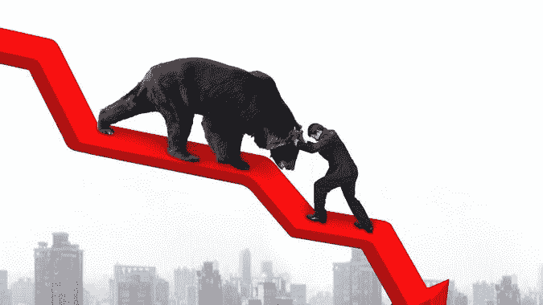
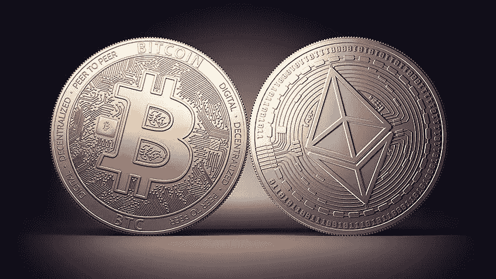
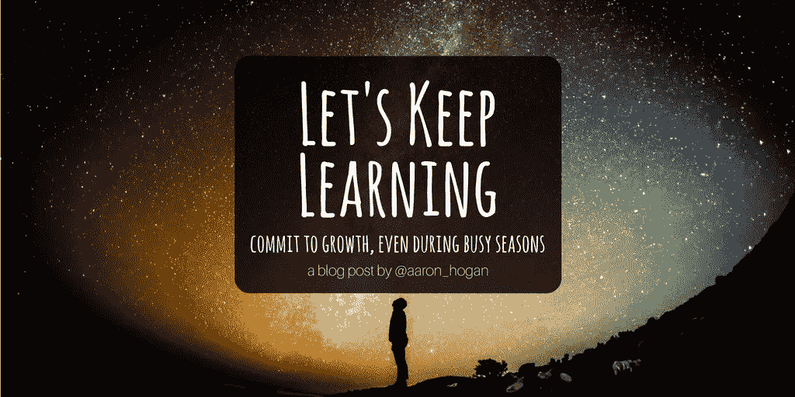
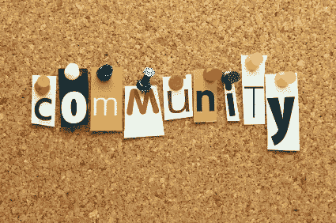

# 熊市生存的 7 条法则

> 原文：<https://medium.com/coinmonks/7-rules-to-survive-in-the-bear-market-29f7b9c77d2f?source=collection_archive---------18----------------------->

目前的币圈已经进入熊市。大家都在担心这波熊市会持续多久。

先来看看大图。就在几天前，美联储开始加息，这是自 1994 年以来最大的一次加息。它已经开始实施。

除了利率上升的预期，我们还面临着持续的战争，后疫情时代，以及加密货币中项目的不断出击，还有大量项目在熊市中出逃。我们必须准备好一起度过这个漫长的冬天。

本文将与你分享一些熊市中的生存法则。这些规则并不一定意味着你会在熊市中赚钱。但是它可以帮助你在熊市中生存，它可以帮助你在每次牛熊转换中增加你的资产。

但都不是投资建议。加密投资有风险。建议你自己做研究。

> 交易新手？试试[加密交易机器人](/coinmonks/crypto-trading-bot-c2ffce8acb2a)或者[复制交易](/coinmonks/top-10-crypto-copy-trading-platforms-for-beginners-d0c37c7d698c)

# **规则一:在底部分批买入**

谁也看不到底。就算你能读懂 k 线和数据，就算是萨尔瓦多总统马斯克这样的人也没有办法触底。

如果你真的想在这波熊市中抄底，建议你整理一下自己的资产。可以把多余的 USDT 或者没有投入的外部资金分成几份，然后找到某个币的币价的几个支撑点，在这些点上开限价单。这样你虽然没有触底，但是平均持有成本大大降低。

另外，如果不想手动买，不知道 k 线，不知道支撑点在哪里。建议大家参考 **Vtrading 超级马丁加密交易机器人**。总投资分成几份，可能是 10 份，也可能是 15 份。如果货币价格下降了固定的百分比，系统会自动为你买入。

# 规则 2:尽可能多地持有蓝筹股

我们知道在牛市中，任何一种屎币都能涨到天上去。但是在熊市中，正如我们所说，在退潮之前，你不知道谁在裸泳。就在熊市来袭的时候，你会知道哪些项目经得起考验，哪些项目容易归零。

在目前的大趋势下，如果你没有能力分辨哪个项目可以去长线，建议你持有蓝筹股，比如比特币、以太坊，这些都是非常好的投资，可以帮助我们规避风险，度过熊市。

如果有一些加密货币投资经验，可以选择一些有自己生态的。做了很久的相对是基建，项目方还在熊市里做事。也可以投资这类项目。

当然，这意味着你要阅读大量的白皮书，有一定的加密货币投资经验。

刚才提到的这些蓝筹项目，那就是即使在熊市跌了 80–90%，只要牛市来了，肯定还会再涨。但也有一些你不知道的抄袭项目。

大家一定要按照刚才说的去研究，看看这个项目是否还在熊市，项目方是否还在做事，是否还有新的动态发布。如果觉得有风险，一定要及时止损，然后止损这部分资金的损失。一定要想办法投资蓝筹币，不然真的亏了。如果你把这部分亏损拿出来投资到其他蓝筹币上，你只是浮亏，未来还会涨回来。

# 规则 3:多看少做，精简职位

多看少做，就是多收集信息，多学习。但是不要频繁调仓，熊市我们极有可能追涨杀跌。其实有了这些大蓝筹，就没必要做这么频繁的买卖交易了。

精简头寸指的是你持有的非蓝筹股项目。可以看看自己目前持有的仓位。有些投资是有利可图的，你需要在更好的时机套现

例如，其他投资损失了约 20%。比如我自己投资，我就把所有的亏损都止损。但是如果有一些项目已经亏了八七成，那就放在那里吧，因为已经亏了这么多了，怎么可能亏的更多？

所以你投资的每一个货币，每一个项目，你现在一定要仔细看，看你有没有信心让他在熊市中活下来，在牛市中重新崛起。

# 规则 4:不断学习

牛市中，新项目非常活跃，尤其是抄袭项目，成交也非常活跃。但是在熊市，项目的速度会慢很多。我们只是想利用熊市让自己静下心来学习，在熊市中不断给自己充电。一旦牛市出现一些好的项目，你就可以有眼光去甄别。

有人说我该从哪里学，有那么多知识？

比如可以了解一下前 4 次熊市前后币圈发生了什么？哪些项目最后存活下来了？哪些项目脱颖而出？哪些项目死了？

去搜索一下当时的新闻，比如之前的熊市和大的经济环境有什么关系。

制定计划，比如学习一些 Defi 投资，NFT 或者期权交易

这就是我们在熊市中能够实现的。

# 规则 5:稳定圈的标桩

那些朋友说不要碰 stablecoins，因为卢娜和 UST 之间的事件吓坏了每个人。但是你必须学习更多关于稳定的硬币

其实有很多种。UST 稳定币是一种算法稳定币。它没有一对一的美元背书。一旦其算法出现漏洞，就会陷入死亡螺旋。但不一定是坏事。UST 归零的死亡螺旋可以给其他稳定的国家敲响警钟。

具体的实现方式有很多，很多平台都提供稳定的币质押。

例如，在币安上，你可以质押 BUSD，也可以在最大的稳定货币质押平台 Curve 上质押。

# 规则 6:找到下一个会爆炸的轨道

熊市其实是一个非常好的学习机会。建议大家都去看看之前热门过的项目。比如像之前理发的寿司复合曲线项目，包括最近的游戏赛道 Axie infinity，StepN，它们为什么受欢迎？为什么有些项目能存活下来？有些项目就这么夭折了吗？

看过大量的项目后，你会对不同的板块有自己的感受，会有自己独立的判断。未来一旦有新项目出来，你就知道如何看待这个项目，这个项目处于生命周期的哪个阶段，这个项目能走多远。

在加密货币投资中，你需要看到大量的信息，但你必须有自己的投资思路和逻辑。

# 规则 7:在项目早期进入社区

因为在牛市中赚钱是非常容易的，这些项目可以在短时间内聚集大量资本，也可以招到大量高端人才。所以他们在招聘的时候，对招聘的要求是很高的。熊市就不一样了。在大环境不景气的情况下，他别无选择。只要你愿意帮忙，他可能会要你。

你可以选择这些公司中的一两家或两三家来帮助他们的社区。在整个帮扶过程中可以学到很多东西，也绝对可以获得很多空仓。一旦牛市来了，项目火爆起来，你就很有可能成为他团队的一员，你就能得到团队应得的令牌。