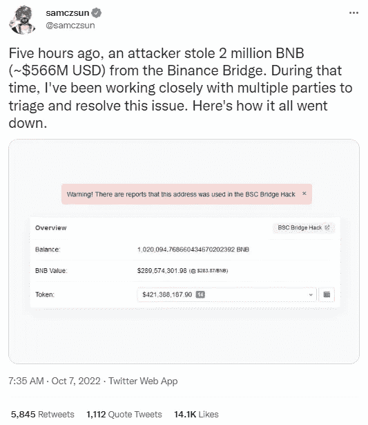
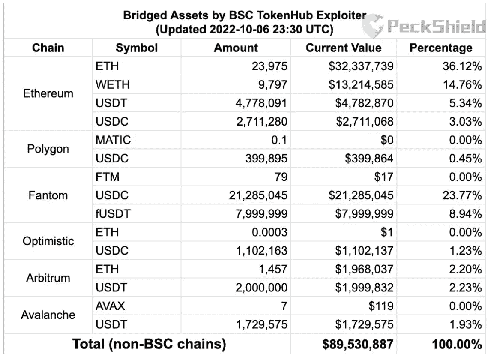
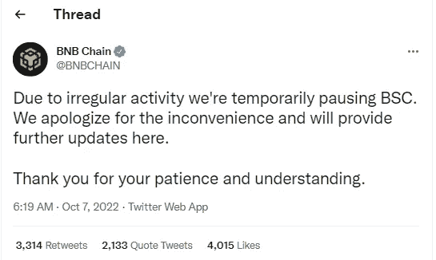
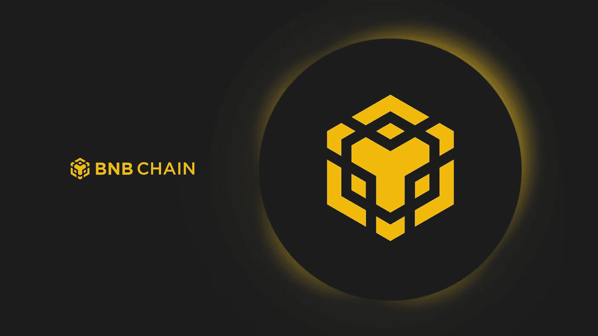
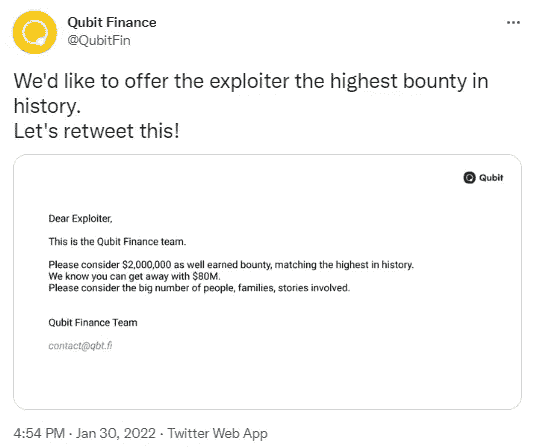
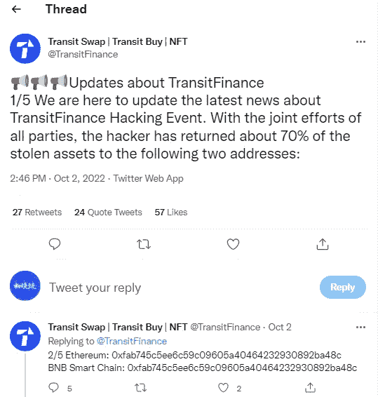

# 从 BNB 连锁店偷了 7.18 亿美元。分权是一个错误的提议吗？

> 原文：<https://medium.com/coinmonks/718-million-stolen-from-bnb-chain-is-decentralization-a-false-proposition-2b86e211c5f4?source=collection_archive---------4----------------------->

在过去的一周，黑客在加密领域一直很猖獗，每三天就有一次被盗和黑客攻击的重大事件。

10 月 7 日，BNB 连锁店被黑了。攻击者从币安大桥偷走了 200 万 BNB，约 5.66 亿美元，以及大量的 venusBNB 和 BUSD，总计 7.18 亿美元。

这是有史以来最大的连锁攻击。

$718 million stolen from BNB chain

BNB 链攻击者从攻击中向其他链转移了约 8，950 万美元的资金，其中约 58%被转移到 Ethereum，约 33%被转移到 Fantom，约 4.5%被转移到 Arbitrum。

转移到雪崩链(1，729，320 USDT)的地址可能已被列入黑名单，但转移到阿比鲁姆(2，000，000 USDT)的地址暂时未被列入黑名单。

目前，BNB 链上的服务已经暂停，链上的操作不再可能。超过 6 亿美元仍在 BNB 链上。我不知道官员会怎么做。有人说交易可能会被撤销，有人说交易可能会被销毁，但具体的解决方案还在等待进一步的官方宣布。

More than $89 million was moved to other networks

BNB 链受到了攻击，允许用户重新讨论集权和分权的问题。

集中式平台遭到黑客攻击，所有节点被拦截，使得黑客窃取的资产无法流通和实现，相对保证了资产的安全。即使黑客通过漏洞攻击额外发行了 200 万 BNB，他也无法完全逃脱，被盗资产也不会被收回。

在分散的平台中，如果黑客发现了系统漏洞，就很容易窃取链上的资产。通过密炼机，再也不可能追踪到被盗资产的下落。

BNB Chain Network Suspension Announcement

例如，BNB 链上的量子位金融项目去年遭到黑客攻击，206，809 个 bnb 被盗，总值超过 8000 万美元。

黑客穿过了#BNB 和#BUSD，在此期间，被盗用户请求 BNB 链冻结黑客地址，但只收到了 BNB chain 被分散管理且无能为力的回复。

Is BNB Chain centralized or decentralized?

结果，被盗的用户看着他们的资金通过链转移出去，黑客等了 2 天才收到被盗的跨链资产。

虽然量子位项目遭到黑客攻击，无法恢复，但该项目也停滞不前。

Hackers steal $80 million from Qubit

分散化意味着知道它是一个黑客，但不干预来阻止它。但是今天，币安桥被黑了，BNB 链在几分钟内被停止，权力下放成了一个错误的提议。

然而，也是集中处理阻止了黑客大规模影响整个密码市场，BNB 没有暴跌。

看似用户资金安全相对有保障，但同时 BNB 网络暂停，链上普通玩家存放的资产无法转让或交易，钱包也不再是自己的了。

您保存了助记符，但是抱歉，链现在不起作用！

What are the pros and cons of centralization and decentralization?

10 月 2 日，Tokenpocket 钱包推荐的 Transit 闪汇平台也遭到黑客攻击。黑客窃取钱包资产与 Transit 进行了交互，被盗资金累计超过 1800 万美元。

通过项目方和黑客的多次来回沟通，黑客表示返还 70%的资产，并预留 10000 BNB 作为发现项目漏洞的赏金奖励。目前，转运小组已经开始了归还被盗资产的工作。此次被盗的用户可以根据官方公告认领被盗资产。

有用户评论说，黑客这次能够归还大部分资产，但愿意配合，因为安全团队锁定了 IP、邮箱和设备等信息。

去中心化平台和中心化平台的结合，促成了黑客返还大部分资产的结果，使得被盗用户的资产得以追回。

Transit recovers 70% of stolen assets

作为密码市场的零售玩家，初晓链确实不太关注集权和分权的命题，更关注资产安全和盈利机会。

但是，每一个玩家都在整个市场中，不可能是一个人。去中心化的黑客无处不在，中心化的弊端也往往发生在身边。加密市场要玩，要珍惜。时刻注意钱包和平台的安全。

以上只是我个人的看法和总结，不含投资建议，读者的任何投资行为与作者无关。

我是褚小莲，我在了解区块链，关注元宇宙和 NFT，关注 web3。

> 交易新手？试试[加密交易机器人](/coinmonks/crypto-trading-bot-c2ffce8acb2a)或者[复制交易](/coinmonks/top-10-crypto-copy-trading-platforms-for-beginners-d0c37c7d698c)